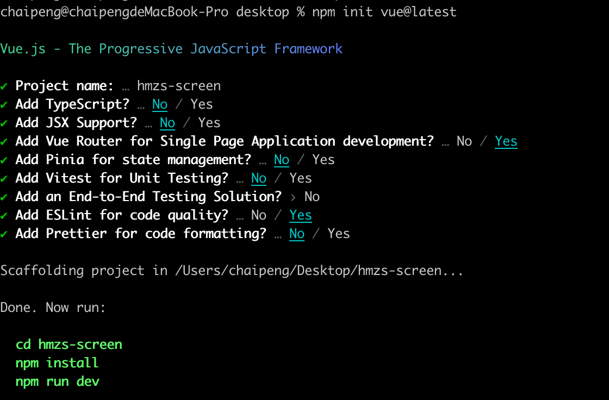

# 使用create-vue初始化项目
```bash
npm init vue@latest
```

# 准备utils模块
> 业务背景：大屏项目属于后台项目的一个子项目，用户的token是共享的，所以大屏项目以同样的方式去cookie中获取token

## 封装cookies存取模块
```bash
npm i js-cookie
```

```javascript
import Cookies from 'js-cookie'

const KEY = 'token_key'

export function getCookie () {
  return Cookies.get(KEY)
}

export function setCookie (value) {
  Cookies.set(KEY, value)
}

export function removeCookie () {
  Cookies.remove(KEY)
}
```
## 封装request请求模块
```bash
npm i axios
```

```javascript
import axios from 'axios'
import { getCookie } from './cookie'
const service = axios.create({
  baseURL: 'https://api-hmzs.itheima.net/v1',
  timeout: 5000 // request timeout
})

// 请求拦截器
service.interceptors.request.use(
  config => {
    const token = getCookie()
    if (token) {
      config.headers.Authorization = token
    }
    return config
  },
  error => {
    return Promise.reject(error)
  }
)

// 响应拦截器
service.interceptors.response.use(
  response => {
    return response.data
  },
  error => {
    return Promise.reject(error)
  }
)

export default service
```
# 路由搭建
## 创建路由组件
```vue
<script setup>

</script>


<template>
  <div>我是大屏显示组件</div>
</template>
```

## 绑定路由
```javascript
// createRouter: 创建路由实例对象
// createWebHistory: 创建history模式的路由（hash / history）

import { createRouter, createWebHistory } from 'vue-router'

// 导入路由级别的组件
import HomeView from '../views/HomeView.vue'
import BigScreenView from '../views/BigScreenView.vue'

const router = createRouter({
  // 类似于mode:history 指定路由为history模式
  history: createWebHistory(import.meta.env.BASE_URL),
  // 配置路由path和component对应关系
  routes: [
    {
      path: '/',
      redirect: '/big-screen',
      name: 'home',
      component: HomeView,
    },
    {
      path: '/big-screen',
      name: 'big-screen',
      component: BigScreenView
    }
  ]
})

export default router
```
# 初始化样式
## 准备初始化文件
```css
html,
body,
#app {
  height: 100vh;
  overflow: hidden;
}

* {
  margin: 0;
  padding: 0;
  box-sizing: border-box;
}
```
## 安装sass
> create-vue创建的项目默认不支持scss语法，需要我们手动安装sass

```bash
npm i sass
```
