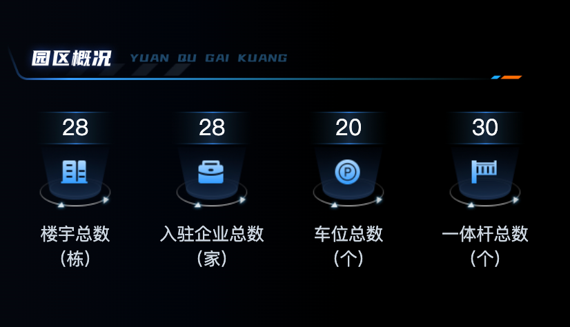
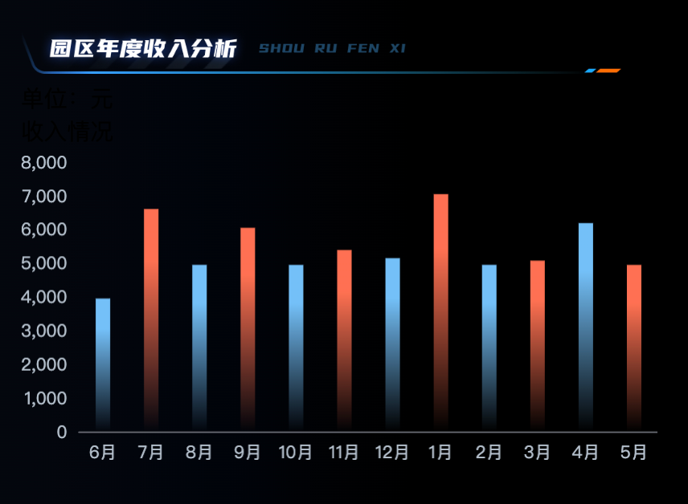
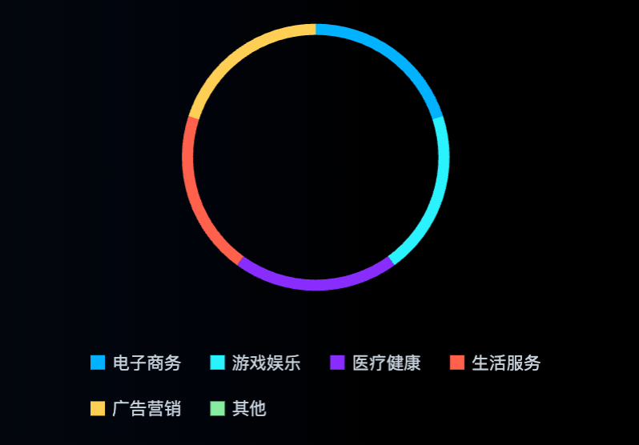
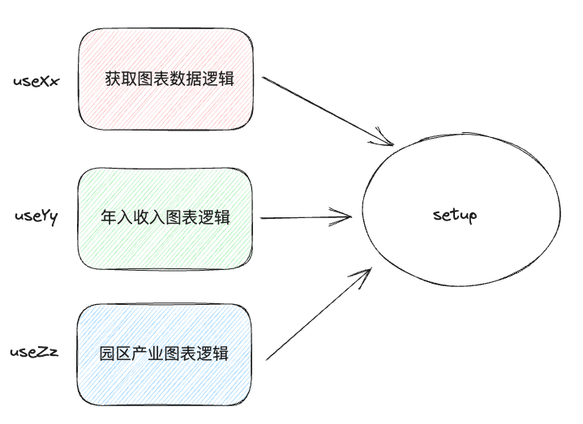

# 园区概况

> cookie共享问题
> 1. 前提  cookie / ls / session 本身会有跨域问题 不同域下的cookie信息是不共享的
> 2. 在主域名一致的情况下，可以让cookie信息实现共享
> 3. 把后台项目启动起来登录一下，把token存入本地cookie，然后把子项目的地址换成
> 
 `http://localhost:端口` 和主项目保持主域一致

## 准备静态模版
```vue
<template>
  <div class="all-charts">
    <!-- 园区概况 -->
    <div class="section-one">
      
      <div class="icons-container">
        <div class="item">
          <div class="icons-item building-icon">
            <span class="number">
              {{ 28 }}
            </span>
          </div>
          <span class="title">楼宇总数</span>
          <span class="unity">（栋）</span>
        </div>
        <div class="item">
          <div class="icons-item enterprise-icon">
            <span class="number">
              {{ 28 }}
            </span>
          </div>
          <span class="title">入驻企业总数</span>
          <span class="unity">（家）</span>
        </div>
        <div class="item">
          <div class="icons-item car-icon">
            <span class="number">
              {{ 20 }}
            </span>
          </div>
          <span class="title">车位总数</span>
          <span class="unity">（个）</span>
        </div>
        <div class="item">
          <div class="icons-item rod-icon">
            <span class="number">
              {{ 30 }}
            </span>
          </div>
          <span class="title">一体杆总数</span>
          <span class="unity">（个）</span>
        </div>
      </div>
    </div>
  </div>
</template>

<style>
 .all-charts {
    position: absolute;
    top: 0;
    left: 0;
    width: 480px;
    height: 100vh;
    padding: 20px;
    display: flex;
    flex-direction: column;
    justify-content: space-between;
    background: linear-gradient(to left, rgba(0, 6, 15, 0.00) 0%, rgba(0, 6, 15, 0.00) 20%, rgba(0, 0, 0, 0.40) 30%, rgba(0, 0, 0, 0.60) 40%, rgba(1, 4, 11, 1) 70%, #04070d 100%);

    .img-header {
      height: 30px;
    }
  }

  .section-one {
    flex-basis: 25%;
    .icons-container {
      display: flex;
      justify-content: space-between;
      padding: 20px 0;

      .item {
        text-align: center;
        display: flex;
        flex-direction: column;
        flex: 1;

        .icons-item {
          height: 80px;
          position: relative;

          .number {
            position: absolute;
            left: 50%;
            transform: translateX(-50%);
            font-size: 18px;
            font-family: FontquanXinYiGuanHeiTi, FontquanXinYiGuanHeiTi-Regular;
            color: #ffffff;
          }
        }

        .building-icon {
          background: url('@/assets/building-icon.png') no-repeat 50% 0 / contain;
        }

        .enterprise-icon {
          background: url('@/assets/enterprise-icon.png') no-repeat 50% 0 / contain;
        }

        .rod-icon {
          background: url('@/assets/rod-icon.png') no-repeat 50% 0 / contain;
        }

        .car-icon {
          background: url('@/assets/car-icon.png') no-repeat 50% 0 / contain;
        }

        .title,
        .unity {
          font-size: 14px;
          color: #cdd7e1;
        }

        .title {
          margin-top: 8px;
        }
      }
    }
  }
</style>
```

## 封装接口并渲染数据
```javascript
// 获取园区信息

import request from '@/utils/request'

/**
 * 获取园区信息
 * @returns 
 */
export function getParkInfoAPI () {
  return request({
    url: "/park/statistics/info"
  })
}
```

```vue
<script setup>
  import { ref } from 'vue'
  import { getParkInfoAPI } from '@/apis/park'
  const parkInfo = ref({})
  const getParkInfo = async () => {
    const res = await getParkInfoAPI()
    parkInfo.value = res.data
  }
  getParkInfo()
</script>

<template>
  <div class="all-charts">
    <!-- 园区概况 -->
    <div class="section-one">
      
      <div class="icons-container">
        <div class="item">
          <div class="icons-item building-icon">
            <span class="number">
              <!-- 
                首次渲染（后端数据没有返回）
                parkInfo - {} - {}.base -> undefined -> undefined.buidingTotal
                
                二次渲染（后端数据返回之后 响应式状态发生变化 再次引起模版渲染）

                场景：访问一个空对象多层次的属性
                解决办法：可选链?.   保证必须前面有值才会继续往后进行点运算
               -->
              {{ parkInfo.base?.buildingTotal }}
            </span>
          </div>
          <span class="title">楼宇总数</span>
          <span class="unity">（栋）</span>
        </div>
        <div class="item">
          <div class="icons-item enterprise-icon">
            <span class="number">
              {{ parkInfo.base?.enterpriseTotal }}
            </span>
          </div>
          <span class="title">入驻企业总数</span>
          <span class="unity">（家）</span>
        </div>
        <div class="item">
          <div class="icons-item car-icon">
            <span class="number">
              {{ parkInfo.base?.parkingTotal }}
            </span>
          </div>
          <span class="title">车位总数</span>
          <span class="unity">（个）</span>
        </div>
        <div class="item">
          <div class="icons-item rod-icon">
            <span class="number">
              {{ parkInfo.base?.chargePoleTotal }}
            </span>
          </div>
          <span class="title">一体杆总数</span>
          <span class="unity">（个）</span>
        </div>
      </div>
    </div>
  </div>
</template>
```
# 园区年度收入分析

## 准备静态模版
```vue
<template>
  <!-- 园区年度收入分析 -->
  <div class="section-two">
    
    <div class="bar-chart-titile">
      <span>单位：元</span>
      <div>
        <span class="bar-icon blue-bar-icon"></span>
        <span class="bar-icon red-bar-icon"></span>
        收入情况
      </div>
    </div>
    <div class="bar-chart" ref="barChart"></div>
  </div>
</template>

<style>
  .section-two {
    flex-basis: 35%;
    margin-top: 50px;

    .bar-chart {
      width: 100%;
      height: calc(100% - 90px);
    }
  }
</style>
```
## 渲染图表
1- 安装echarts
```bash
npm install echarts
```

2- 封装初始化方法并在mounted中执行
```javascript
import * as echarts from 'echarts'
// 渲染年度收入分析图表
const initBarChart = () => {
  // 1. 解构图表数据
  const { parkIncome } = parkInfo.value
  // 2. 准备options数据
  const barOptions = {
    tooltip: {
      trigger: 'axis',
      axisPointer: {
        type: 'shadow',
      },
    },
    grid: {
      // 让图表占满容器
      top: '10px',
      left: '0px',
      right: '0px',
      bottom: '0px',
      containLabel: true,
    },
    xAxis: [
      {
        type: 'category',
        axisTick: {
          alignWithLabel: true,
          show: false,
        },
        data: parkIncome.xMonth,
      },
    ],
    yAxis: [
      {
        type: 'value',
        splitLine: {
          show: false,
        },
      },
    ],
    series: [
      {
        name: '园区年度收入',
        type: 'bar',
        barWidth: '10px',
        data: parkIncome.yIncome.map((item, index) => {
          const color =
            index % 2 === 0
              ? new echarts.graphic.LinearGradient(0, 0, 0, 1, [
                { offset: 0.23, color: '#74c0f8' },
                { offset: 1, color: 'rgba(116,192,248,0.00)' },
              ])
              : new echarts.graphic.LinearGradient(0, 0, 0, 1, [
                { offset: 0.23, color: '#ff7152' },
                { offset: 1, color: 'rgba(255,113,82,0.00)' },
              ])
          return { value: item, itemStyle: { color } }
        }),
      },
    ],
    textStyle: {
      color: '#B4C0CC',
    },
  }
  // 3. 渲染图表
  const myBarChart = echarts.init(barChart.value)
  myBarChart.setOption(barOptions)
}
```
# 园区产业分布

## 准备静态模版
```vue
<template>
<!-- 园区产业分布 -->
<div class="section-three">
  
  <div class="pie-chart" ref="pieChart"></div>
</div>
</template>

<style>
  .section-two {
    flex-basis: 35%;
    .bar-chart {
      width: 100%;
      height: calc(100% - 90px);
    }
  }
  .section-three {
    flex-basis: 40%;

    .pie-chart {
      position: relative;
      margin: 0 auto;
      padding-bottom: 20px;
      width: 80%;
      height: calc(100% - 40px);
    }
  }
</style>
```
## 渲染图表
```javascript
// 渲染园区产业分布图表
const pieChart = ref(null)
const initPieChart = () => {
  const { parkIndustry } = parkInfo.value
  const pieOption = {
    color: [
      '#00B2FF', '#2CF2FF', '#892CFF', '#FF624D', '#FFCF54', '#86ECA2'],
    legend: {
      itemGap: 20,
      bottom: '0',
      icon: 'rect',
      itemHeight: 10, // 图例icon高度
      itemWidth: 10, // 图例icon宽度
      textStyle: {
        color: '#c6d1db',
      },
    },
    tooltip: {
      trigger: 'item'
    },
    series: [
      {
        name: '园区产业分析',
        type: 'pie',
        radius: ['55%', '60%'], // 设置内圈与外圈的半径使其呈现为环形
        center: ['50%', '40%'], // 圆心位置， 用于调整整个图的位置
        tooltip: {
          trigger: 'item',
          formatter: (params) => {
            return `${params.seriesName}</br><div style='display:flex;justify-content: space-between;'><div>${params.marker}${params.name}</div><div>${params.percent}%</div></div>`
          }
        },
        label: {
          show: false,
          position: 'center',
        },
        data: parkIndustry,
      },
    ],

  }
  const myPieChart = echarts.init(pieChart.value)
  myPieChart.setOption(pieOption)
}
```

# 基于逻辑拆分优化
> 基于组件的拆分：
> 1. 增加复用性 - elementUI  el-button
> 2. 增加可维护性 - 把一个大的组件.vue 拆分几个小的.vue
> 
组件到底是啥：JS + template + style  - 1. 细粒度的纯js的逻辑拆分 2. 组件通信成本的增加
> 拆分逻辑：把属于同一个业务的相关js代码放到一个小函数中维护，然后把数据和方法return出来给组件使用


## 抽象可视化数据逻辑
```javascript
import { ref } from 'vue'
import { getParkInfoAPI } from '@/apis/park'
function useInitParkInfo () {
  const parkInfo = ref({})
  const getParkInfo = async () => {
    const res = await getParkInfoAPI()
    parkInfo.value = res.data
  }
  return {
    parkInfo,
    getParkInfo
  }
}

export { useInitParkInfo }
```

## 抽象年入收入图表逻辑
```javascript
import * as echarts from 'echarts'
import { ref } from 'vue'

function useInitBartChart (parkInfo) {
  const barChart = ref(null)
  // 渲染年度收入2d分析图表
  const initBarChart = () => {
    const { parkIncome } = parkInfo.value
    const barOptions = {
      tooltip: {
        trigger: 'axis',
        axisPointer: {
          type: 'shadow',
        },
      },
      grid: {
        // 让图表占满容器
        top: '10px',
        left: '0px',
        right: '0px',
        bottom: '0px',
        containLabel: true,
      },
      xAxis: [
        {
          type: 'category',
          axisTick: {
            alignWithLabel: true,
            show: false,
          },
          data: parkIncome.xMonth,
        },
      ],
      yAxis: [
        {
          type: 'value',
          splitLine: {
            show: false,
          },
        },
      ],
      series: [
        {
          name: '园区年度收入',
          type: 'bar',
          barWidth: '10px',
          data: parkIncome.yIncome.map((item, index) => {
            const color =
              index % 2 === 0
                ? new echarts.graphic.LinearGradient(0, 0, 0, 1, [
                  { offset: 0.23, color: '#74c0f8' },
                  { offset: 1, color: 'rgba(116,192,248,0.00)' },
                ])
                : new echarts.graphic.LinearGradient(0, 0, 0, 1, [
                  { offset: 0.23, color: '#ff7152' },
                  { offset: 1, color: 'rgba(255,113,82,0.00)' },
                ])
            return { value: item, itemStyle: { color } }
          }),
        },
      ],
      textStyle: {
        color: '#B4C0CC',
      },
    }
    const myBarChart = echarts.init(barChart.value)
    myBarChart.setOption(barOptions)
    window.addEventListener('resize', () => {
      myBarChart.resize()
    })
  }
  return {
    barChart,
    initBarChart
  }
}

export { useInitBartChart }
```

## 抽象园区产业逻辑
```javascript
import { ref } from 'vue'
import * as echarts from 'echarts'

function useInitPieChart (parkInfo) {
  // 渲染园区产业2d分布图表
  const pieChart = ref(null)
  const initPieChart = () => {
    const { parkIndustry } = parkInfo.value
    const pieOption = {
      color: [
        '#00B2FF', '#2CF2FF', '#892CFF', '#FF624D', '#FFCF54', '#86ECA2'],
      legend: {
        itemGap: 20,
        bottom: '0',
        icon: 'rect',
        itemHeight: 10, // 图例icon高度
        itemWidth: 10, // 图例icon宽度
        textStyle: {
          color: '#c6d1db',
        },
      },
      tooltip: {
        trigger: 'item'
      },
      series: [
        {
          name: '园区产业分析',
          type: 'pie',
          radius: ['55%', '60%'], // 设置内圈与外圈的半径使其呈现为环形
          center: ['50%', '40%'], // 圆心位置， 用于调整整个图的位置
          tooltip: {
            trigger: 'item',
            formatter: (params) => {
              return `${params.seriesName}</br><div style='display:flex;justify-content: space-between;'><div>${params.marker}${params.name}</div><div>${params.percent}%</div></div>`

            }
          },
          label: {
            show: false,
            position: 'center',
          },
          data: parkIndustry,
        },
      ],

    }
    const myPieChart = echarts.init(pieChart.value)
    myPieChart.setOption(pieOption)
    window.addEventListener('resize', () => {
      myPieChart.resize()
    })
  }
  return {
    pieChart,
    initPieChart
  }
}

export { useInitPieChart }
```
## 组合业务逻辑
```javascript
<script setup>
import { onMounted } from 'vue'

import { useInitParkInfo, useInitBartChart, useInitPieChart, useInit3d } from './composiables'
// 获取园区数据
const { parkInfo, getParkInfo } = useInitParkInfo()

// 渲染年度收入分析2d图表
const { initBarChart, barChart } = useInitBartChart(parkInfo)

// 渲染园区产业分布2d图标
const { initPieChart, pieChart } = useInitPieChart(parkInfo)


// 调度图表渲染
onMounted(async () => {
  // 保证数据先回来
  await getParkInfo()
  initBarChart()
  initPieChart()
})
```
## 拆分优化对比

1. 基于组件拆分
   1. 解决什么问题：复用 + 增加可维护性
   2. 拆分的是什么：.vue = HTML + JS + CSS
   3. 带来问题：一旦组件从一个变成了多个 必定形成嵌套关系 增加通信成本
2. 基于逻辑拆分
   1. 解决什么问题：复用(逻辑) + 增加可维护性
   2. 拆分的是什么: 拆分的只有js
   3. 带来的问题：对原生js函数的理解要求高了 
3. 基于逻辑的通用拆分思想
   1. 找到组件中属于同一个业务逻辑的所有代码（响应式数据 + 修改数据的方法）
   2. 定义一个以 `use` 打头的方法，把第一步所有的业务逻辑代码都放入
   3. 在use函数内部，把组件中要用到的数据或者方法以对象的方式导出
   4. 在组件的setup语法糖中，通过调用函数配合解构赋值把函数内部的数据和方法在组件中可用

      

