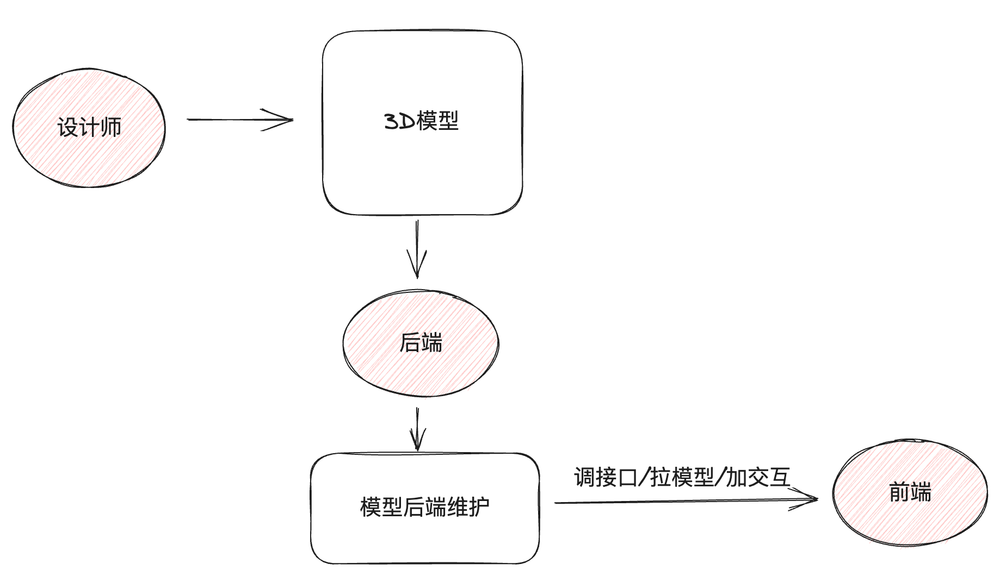
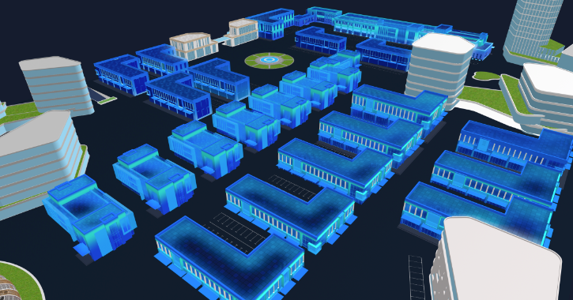

# 3D可视化的搭建流程说明

# 前端加载3D模型
> 需求：在浏览器中渲染出来3D模型



## 下载模型解析包
> 说明：模型解析包和制作3D的软件是配套的

```bash
npm i @splinetool/runtime
```
## 拉取模型并渲染
> 说明：spline实例既可以拉取模型同时拉取完毕之后会在canvas节点上渲染画布

```vue
<script setup>
// 导入模型解析构造函数
import { Application } from '@splinetool/runtime'
import { onMounted, ref } from 'vue'

// 初始化3d模型
const ref3d = ref(null)
const init3dModel = () => {
  // 实例化解析器实例
  let spline = new Application(ref3d.value)
  // 拉取模型
  spline.load('https://fe-hmzs.itheima.net/scene.splinecode').then(() => {
    console.log('3D模型加载并渲染完毕')
  })
}
// dom节点渲染完毕再加载
onMounted(() => {
  init3dModel()
})

</script>

<template>
  <div class="model-container">
    <!-- 准备3D渲染节点 -->
    <canvas class="canvas-3d" ref="ref3d" />
  </div>
</template>


<style scoped lang="scss">
.model-container {
  height: 100%;
  background-color: black;
  width: 100%;
  flex-shrink: 0;
}
</style>
```
## 添加进入条

> 纯展示类组件，只需要设计一个参数，显示隐藏
> loading prop  true 显示  false 隐藏

1- 封装组件
```vue
<script setup>
defineProps({
  loading: {
    type: Boolean,
    default: false
  }
})
</script>

<template>
  <div v-if="loading" class="loading">
    <p class="text">园区资源加载中…</p>
    <div class="loading-process">
      <div class="process-wrapper"></div>
    </div>
  </div>
</template>

<style lang="scss">
.loading {
  position: absolute;
  left: 66%;
  top: 40%;
  transform: translateX(-50%);
  text-align: center;

  .text {
    font-size: 14px;
    color: #909399;
    margin-bottom: 16px;
  }

  .loading-process {
    width: 280px;
    height: 4px;
    background: rgba(255, 255, 255, 0.16);
    border-radius: 20px;
    overflow: hidden;
  }

  .process-wrapper {
    height: 100%;
    width: 5%;
    background: linear-gradient(90deg, #48ffff 0%, #3656ff 100%);
    animation-duration: 1000s;
    animation-name: loading;
  }

  @keyframes loading {
    0% {
      transform: scaleX(1);
    }

    1% {
      transform: scaleX(38);
    }

    100% {
      transform: scaleX(40);
    }
  }
}
</style>

```

2- 导入loading根据状态控制显示
```vue
<script setup>
import { onMounted, ref } from 'vue'
// 导入模型解析构造函数
import { Application } from '@splinetool/runtime'
// 导入loading组件
import LoadingComponent from '@/components/LoadingComponent.vue'


// 调用接口拉取3d模型 渲染视图中
const publisPath = 'https://fe-hmzs.itheima.net'
const ref3d = ref(null)
const showLoading = ref(false)
const init3dModel = () => {
  // 开启loading 
  showLoading.value = true
  // 1. 实例解析器对象(传入模型将来渲染的节点对象)
  const spline = new Application(ref3d.value)
  // 2. 使用对象load方法去拉取3大模型资源
  spline.load(`${publisPath}/scene.splinecode`).then(() => {
    showLoading.value = false
    // 模型渲染完毕之后后续的逻辑操作
    // 3. 拉取资源之后.then方法中可以做后续的逻辑操作
  })
}

onMounted(async () => {
  // 获取原生的dom对象
  // 这个方法执行的时候 虽然在mounted中执行的 但是不能保证依赖的数据已经通过接口返回了
  // 解决方案：等到数据返回之后才进行初始化操作
  await getParkInfo()
  initBarChart()
  initPieChart()
  init3dModel()
})

</script>


<template>
  <!-- 3d模型渲染节点 -->
  <div class="model-container">
    <!-- 进度条 -->
    <LoadingComponent :loading="showLoading" />
    <!-- 准备3D渲染节点 -->
    <canvas class="canvas-3d" ref="ref3d" />
  </div>
</template>

```

# 

