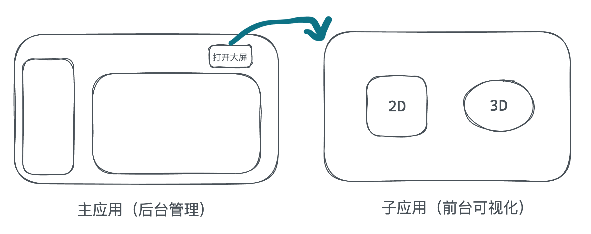
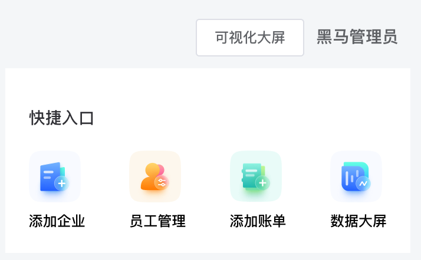

项目背景说明

1. 后台管理部分使用的技术栈是Vue2，前台可视化部分使用的技术栈是Vue3
2. 前台可视化项目不是独立存在，而是和后台管理项目共享同一个登录页面
# 微前端的好处
微前端是一种前端架构模式，它将大型单体应用程序分解为小的、松散耦合的部分，每个部分都可以独立开发、测试和部署。微前端的好处如下：

1. 增强团队独立性
2. 提高可维护性
3. 提高性能

总之，微前端使开发人员可以更容易地构建、维护和扩展大型单体应用程序，从而提高了应用程序的质量和可靠性
# 乾坤方案改造
[qiankun - qiankun](https://qiankun.umijs.org/zh)


## 主应用改造（后台管理）
1- 安装乾坤
```bash
npm i qiankun
```
2- 新增配置文件
```javascript
import { registerMicroApps, start } from 'qiankun'

registerMicroApps([
  {
    name: 'hmzs-big-screen', // 子应用名称
    entry: '//localhost:5173', // 子应用运行服务地址（就是npm run dev时的那个地址）
    container: '#container', // 挂载容器（id=container）
    activeRule: '/big-screen' // 激活路由(在哪个路由下加载子应用,需要和子应用的路由名称对应)
  }
])

start()
```
3- 入口文件启动
```javascript
// 启动微前端配置
import './registerMicroApp'
```
4- 配置子应用渲染的位置
```vue
<template>
  <div id="app">
    <router-view />
    <!-- 子应用挂载节点 -->
    <div id="container" />
  </div>
</template>

<script>
export default {
  name: 'App'
}
</script>
```
## 子应用改造（前台可视化）
> 说明: qiankun默认不支持vite项目作为子应用，需要借助 `vite-qiankun` 插件进行支持

1- 配置vite-qiankun插件
```bash
npm i vite-plugin-qiankun -D
```
```javascript
import { fileURLToPath, URL } from 'node:url'
import { defineConfig } from 'vite'
import vue from '@vitejs/plugin-vue'
import qiankun from 'vite-plugin-qiankun'


export default defineConfig({
  base: '/',
  plugins: [
    vue(), 
    // 这里的名称要和主应用改造是配置项中的name保持一致
    qiankun('hmzs-big-screen', {
      useDevMode: true
    })
  ],
  server: {
    // 防止开发阶段的assets 静态资源加载问题
    origin: '//localhost:5173'
  },
  resolve: {
    alias: {
      '@': fileURLToPath(new URL('./src', import.meta.url)),
    }
  }
})
```
2- 入口文件改造
```javascript
import { createApp } from 'vue'
import App from './App.vue'
import router from './router'
import { renderWithQiankun, qiankunWindow } from 'vite-plugin-qiankun/dist/helper'

import './styles/common.scss'


// 使用乾坤渲染
renderWithQiankun({
  // 挂载时
  mount (props) {
    console.log('mount')
    render(props)
  },
  bootstrap () {
    console.log('bootstrap')
  },
  unmount (props) {
    console.log('unmount', props)
  },
})

if (!qiankunWindow.__POWERED_BY_QIANKUN__) {
  render({})
}

function render (props = {}) {
  const { container } = props
  const app = createApp(App)
  app.use(router)
  app.mount(container ? container.querySelector("#app") : "#app")
}
```
## 大屏按钮跳转 



```vue
<div class="avatar-wrapper">
  <el-button size="small" plain 
    @click="$router.push('/big-screen')">可视化大屏</el-button>
  <!-- 用户名称 -->
  <span class="name">黑马管理员</span>
</div>
```


# 微前端配置易错点

## 1. 保证子应用已经运行

1. 测试时需要保证子应用项目已经run了起来，因为主应用需要从子应用的服务拉取资源
2. 子应用run的服务地址要和主应用中的 `entry` 选项要严格保持一致（注意端口号）

## 2. 准备好挂载容器

作为子应用的挂载节点 也就是 `container` 容器要准备好，否则没有挂载的位置

## 3. 开发环境修复静态资源的路径

子应用里需要配置一下server选项的origin选项，否则加载assets文件夹中的资源会默认寻找主应用下的assets文件夹

```json
server: {
    // 防止开发阶段的assets 静态资源加载问题
    origin: '//localhost:5173'
}
```

# 乾坤基础原理说明（直接观看拓展视频）

## 1. 基础运行原理

1. 监听路由变化
2. 匹配子应用
3. 加载子应用
4. 渲染子应用

## 2. 核心代码实现

```javascript
// 用来加载子应用html并解析
import importHTML from 'import-html-entry'

// 重新路由
function rewriteRouter () {
  // 针对 go/back
  window.addEventListener('popstate', () => {
    loadMicroApp()
  })
  // 针对pushState
  const rawPushState = window.history.pushState
  window.history.pushState = async (...rest) => {
    rawPushState.apply(window.history, rest)
    console.log('监听到 pushState 方法')
    // 加载子应用
    loadMicroApp()
  }
}


// 加载子应用资源
let _activeMicroApp = null
function loadMicroApp () {
  // 1. 匹配激活路由 并加载子应用html
  const path = window.location.pathname
  const microApps = getMicroApp()
  const microAppConfig = microApps.find(app => app.activeRule === path)
  _activeMicroApp = _activeMicroApp || microAppConfig
  console.log('当前配置', microAppConfig)
  if (microAppConfig) {
    // 挂载
    importHTML(microAppConfig.entry).then(async res => {
      // 2. 获取模版
      const template = res.template
      const container = document.querySelector(microAppConfig.container)
      container.innerHTML = template
      // 2. 获取脚本并执行
      await res.execScripts()
      window.__qiankunMount()
    })
  } else {
    // 卸载
    const container = document.querySelector(_activeMicroApp.container)
    container.innerHTML = ''
    _activeMicroApp = null
    window.__qiankunUnMount()
  }
}


// 注册子应用配置
let microApps = []
function registerMicroApp (configArr) {
  microApps = configArr
}
function getMicroApp () {
  return microApps
}


// 启动方法
function start () {
  rewriteRouter()
}

// 导出通用方法
export {
  registerMicroApp,
  start
}
```

## 3. 测试使用

主应用配置

```javascript
// 注册微应用配置
registerMicroApp([
  {
    name: 'big-screen',
    entry: '//127.0.0.1:5500/',
    container: '#container',
    activeRule: '/big-screen'
  }
])

start()
```


子应用配置

```html
<!DOCTYPE html>
<html lang="en">

<head>
  <meta charset="UTF-8">
  <meta http-equiv="X-UA-Compatible" content="IE=edge">
  <meta name="viewport" content="width=device-width, initial-scale=1.0">
  <title>我是子应用</title>
  <style>
    #root {
      width: 500px;
      height: 400px;
      background-color: royalblue;
      color: #fff;
    }
  </style>

</head>

<body>
  <div id="root">
    <button id="btn">toggleColor</button>
  </div>
  <script>
    const btn = document.querySelector('#btn')
    const root = document.querySelector('#root')
    btn.addEventListener('click', () => {
      root.style.backgroundColor = 'red'
    })

    // 模拟生命周期函数
    function mount () {
      console.log('mount by 乾坤')
    }

    function unMount () {
      console.log('unMount by 乾坤')
    }

    window.__qiankunMount = mount
    window.__qiankunUnMount = unMount
  </script>
</body>

</html>
```

