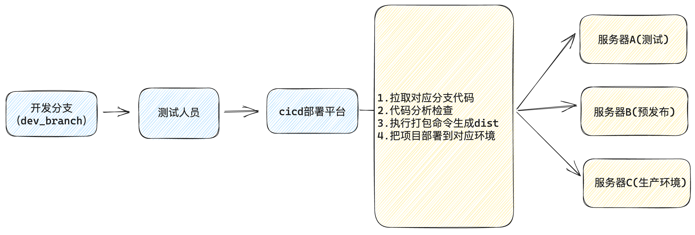
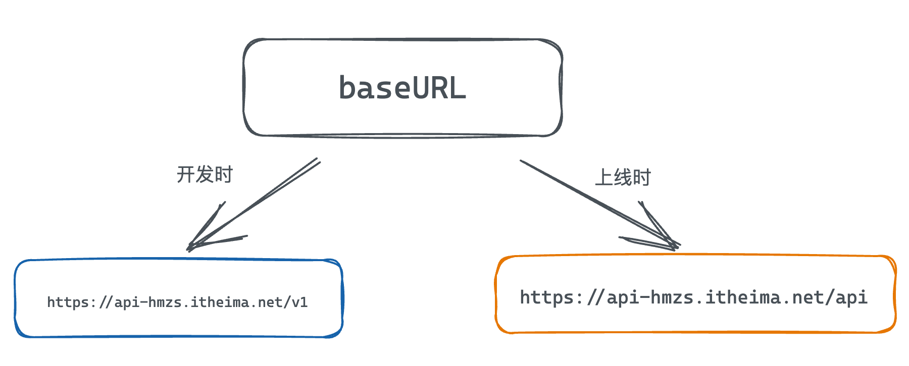
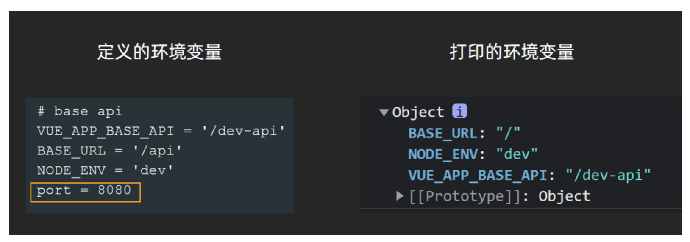
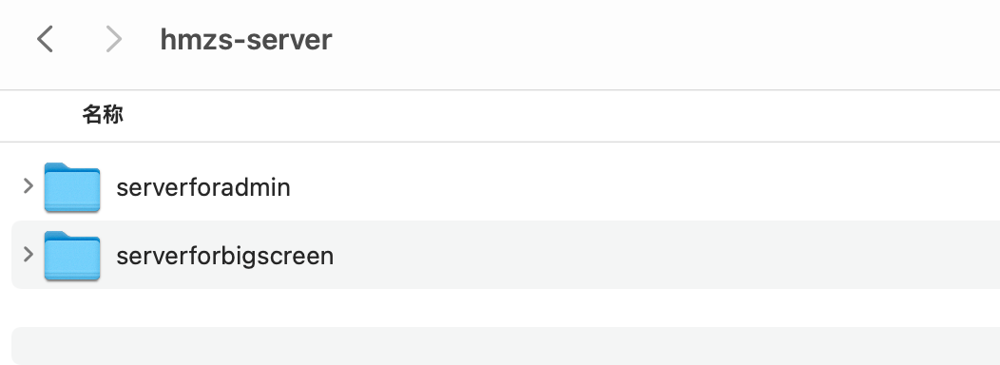
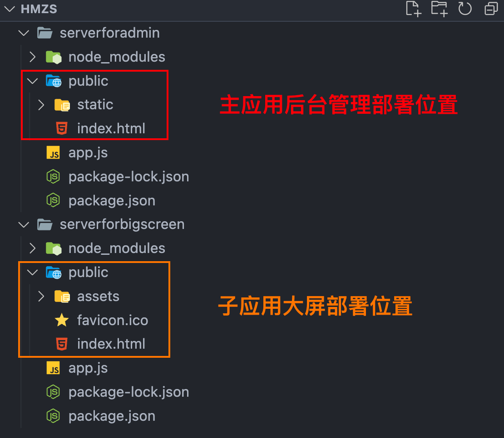
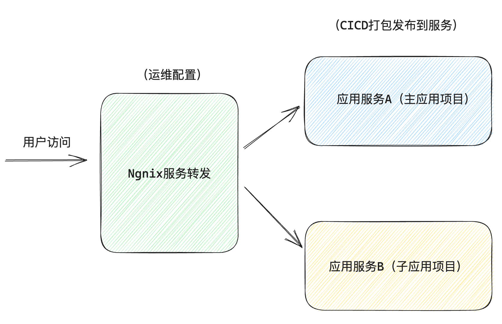

# 实际上线的流程说明


说明：前端需要做的事情就是配合发布

1. 确保提交的分支正确，分支代码里没有非常明显的错误，如代码冲突
2. 因为部署平台要执行打包命令，这个打包命令是前端提供的，这里要对接好，并且打包时的优化要前端自己做
# 配置环境变量
## 认识环境变量
**概念：同一个**`**'变量'**`**的值可以根据不同的环境自动切换与环境相对应的值，这样的变量就称之为环境变量**


> 场景：项目上线时，我们的接口基地址发生了变化
> 由 '[https://api-hmzs.itheima.net/v1](https://api-hmzs.itheima.net/v1)' 变成了 `[https://api-hmzs.itheima.net/api](https://api-hmzs.itheima.net/api)`  
> 如果适配开发阶段和上线之后的不同的接口基地址呢？答案就是使用环境变量，它可以做到在开发环境时接口走接口A，在上线之后走接口B

## 环境变量的定义和使用
### 定义位置和运行机制
| **对应环境** | **文件** | **说明** |
| --- | --- | --- |
| 开发环境 | .env.development | 当运行`vue-cli-service serve`
 的时候会以此文件为配置文件，这个文件中可以定义针对开发环境的环境变量 |
| 生产环境 | .env.production | 当运行`vue-cli-service build`
 的时候会以此文件为配置文件，这个文件中可以定义针对生产环境的环境变量 |

### 定义环境变量
定义环境变量采用 `key = value`  的语法进行定义，其中key表示环境变量名称   value表示环境变量值
```json
# just a flag
ENV = 'development'
# base api
VUE_APP_BASE_API = 'https://api-hmzs.itheima.net/v1'
```
### 使用环境变量
使用环境变量采用固定的前缀 `process.env.环境变量名`，环境变量名要与定义时的保持一致
```javascript
process.env.VUE_APP_BASE_API
```

### 配置开发和生产环境下的baseURL
```json
# just a flag
ENV = 'development'

VUE_APP_BASE_URL = 'https://api-hmzs.itheima.net/v1'
```

```json
# just a flag
ENV = 'production'

# base api
VUE_APP_BASE_URL= 'https://api-hmzs.itheima.net/api'
```

## 客户端环境变量的注意事项

1. 客户端代码其实就是我们的`src目录`，如果在这个目录下使用环境变量，只能识别 `NODE_ENV`  `BASE_URL` 和以 `VUE_APP_`  打头的环境变量，其它变量不可识别，非客户端代码没有此要求。其中`NODE_ENV`  可以自定义覆盖， BASE_URL 覆盖不了
2. 为避免记忆负担，在业务中自定义环境变量的时候，推荐采用严格的 `VUE_APP`变量前缀打头



# 微前端项目部署（了解）
## 服务器环境准备
我们在本地使用Node准备好了两台服务器，如下图所示：


1. serverforadmin为服务器A，是后台管理项目部署的位置，服务地址为 `http://localhost:8086` 
2. serverforbigscreen为服务B，是前台可视化项目部署位置, 服务地址为`http://localhost:8089`
3. 每一个服务中都有一个`public文件夹`，它是静态服务文件夹，是放置我们打包之后的代码的
4. 对俩个项目分别进行打包，然后把生成的dist目录下的文件放到对应的服务器的public文件夹中
## 根据环境切换加载子应用的地址
> 子应用大屏项目在开发时的服务地址为 `http://localhost:5173/big-screen`，在上线之后变成了`http://localhost:5173/big-screen`，为了适配上线之后的解析路径，我们根据当年所处的环境适配一下加载子应用的地址
> process.env.NODE_ENV  可以拿到当前运行的环境，是生产还是开发  development为开发环境

```vue
import { registerMicroApps, start } from 'qiankun'

const isDev = process.env.NODE_ENV === 'development'

registerMicroApps([
  {
    name: 'hmzs-big-screen',
    entry: `${isDev ? '//localhost:5173' : '//localhost:8089'}`,
    container: '#container',
    activeRule: '/big-screen'
  }
])

start()

```

## 更改子应用的base配置
> vite.config.js中的配置项里有一个base配置，它决定了项目启动时的静态资源，比如js，css从哪个服务器下去获取，因为上线之后，子应用大屏项目的服务器地址变成了 `http://localhost:8089` ，所以把base配置为 `http://localhost:8089` 

```javascript
import { fileURLToPath, URL } from 'node:url'
import { defineConfig } from 'vite'
import vue from '@vitejs/plugin-vue'
import qiankun from 'vite-plugin-qiankun'


export default defineConfig({
  base: 'http://localhost:8089/',
  plugins: [vue(), qiankun('hmzs-big-screen', {
    useDevMode: true
  })],
  server: {
    // 解决开发环境下的静态资源访问问题
    origin: '//127.0.0.1:5173'
  },
  resolve: {
    alias: {
      '@': fileURLToPath(new URL('./src', import.meta.url)),
    }
  }
})
```
## 更改子应用的路由
```javascript
import { createRouter, createWebHistory } from 'vue-router'
import HomeView from '../views/HomeView.vue'

const router = createRouter({
  history: createWebHistory()
})

export default router
```
## 打包独立部署到服务器
> 在俩个项目中分别执行打包命令，生成打包文件之后，把打包文件手动拷贝到对应的服务器的public文件夹里
> 执行 `node app.js` 启动对应的服务器


### Ngnix配置



