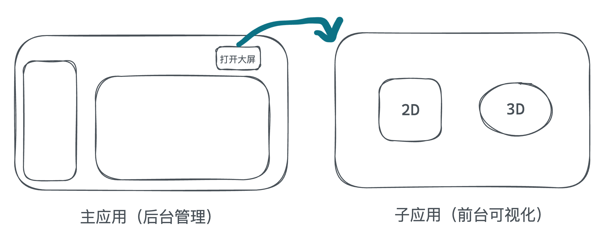

# 项目概述
## 1. 项目简介
黑马智数是一个数字化园区管理项目，包括后台管理和可视化大屏两个部分，实现对园区内的楼宇、企业、员工、车辆和一体杆等进行数字化管理，以及通过园区3D模型实时展示园区概况。

## 2. 核心业务闭环
后台管理系统负责园区内各项数据的管理，前台可视化项目负责重点园区数据的展现
参考在线预览地址：[https://fe-hmzs.itheima.net/workbench](https://fe-hmzs.itheima.net/workbench)   
## 3. 项目周期
后台部分 8 天 + 可视化前台部分 3 天 = 11天
## 4. 项目技术栈
后台管理平台 

1. Vue2.6 
2. Vue-admin-template
3. Vuex
4. ElementUI
5. js-cookie
6. dayjs

前台可视化

1. Vue3
2. Echarts
3. Spline
4. VScaleScreen

微前端接入 - qiankun
# 项目环境要求
注意：node版本不能低于8.9、不能高于17
可以使用 `n` 模块进行node版本切换

- 全局安装 n  `npm install -g n`
- 查看服务器上可用的版本 `n ls-remote --all`
- 安装最新版node  `n latest`
- 安装某个具体版本  `n 16.18.0`
- 查看已经安装过的node版本  `n ls`
- 删除14.13.1版本 `n rm 14.13.1`

# 接口文档
[文档补充说明 - 传智教育-黑马智数·智慧园区-teach](https://apifox.com/apidoc/shared-056d7c04-303c-43cb-9b42-8e3d457844f5)

# 上一压一模式

1. 白天上智慧园区，晚上和休息日自学人资项目
2. 优先搞定智慧园区课上内容，学有余力往前推进人资项目

