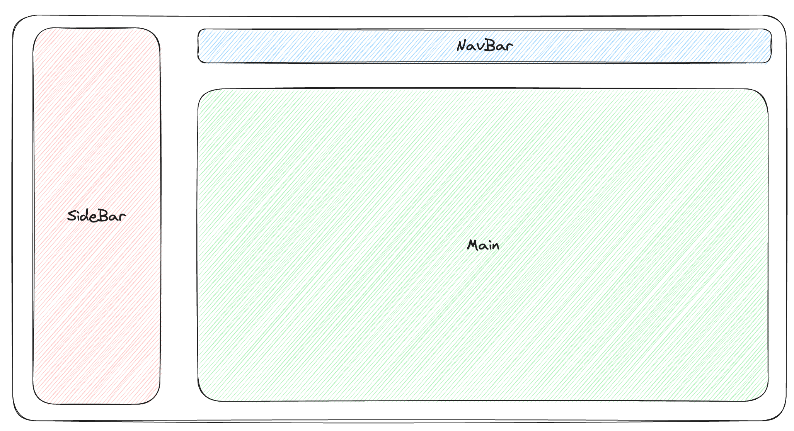
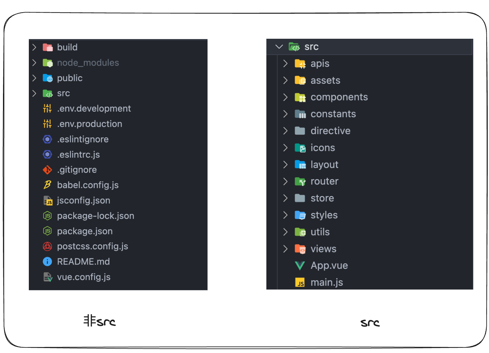
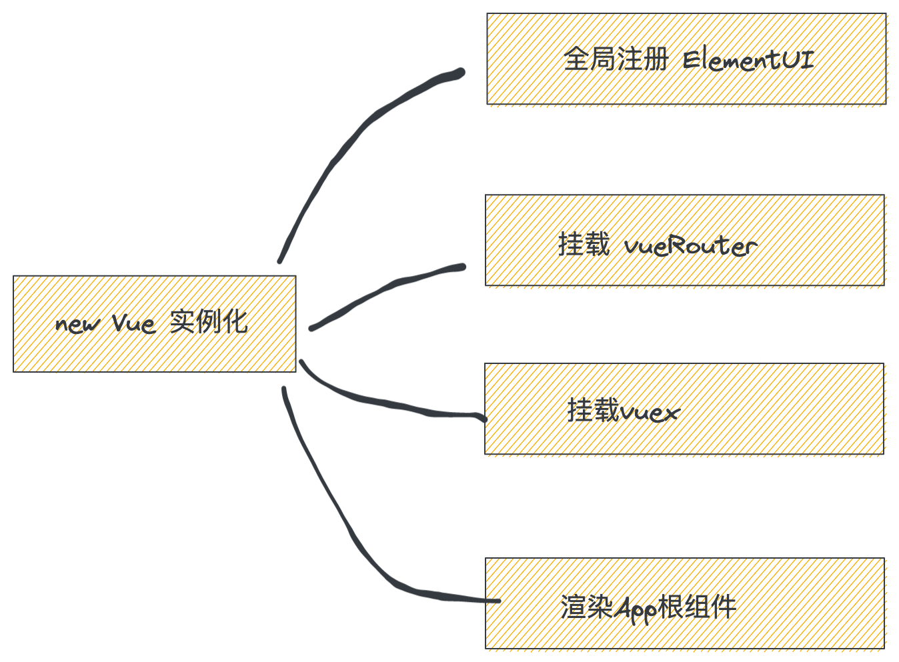
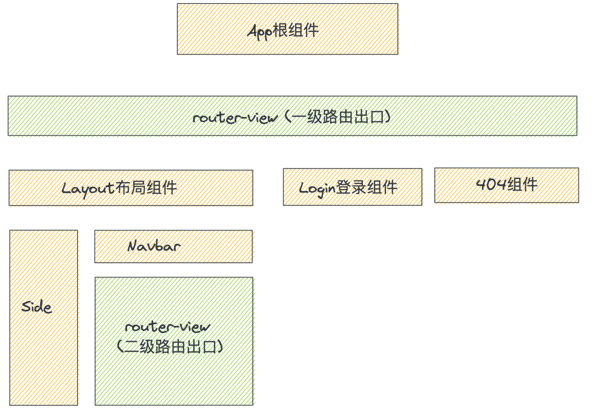
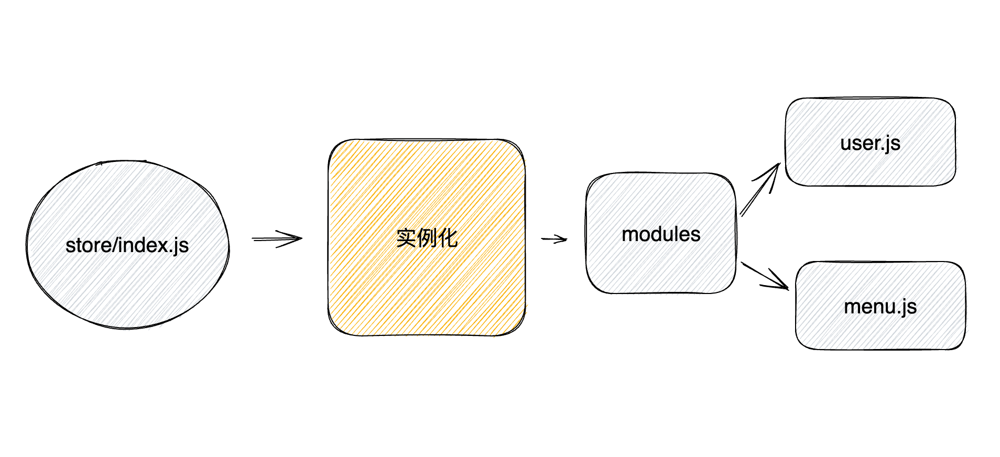
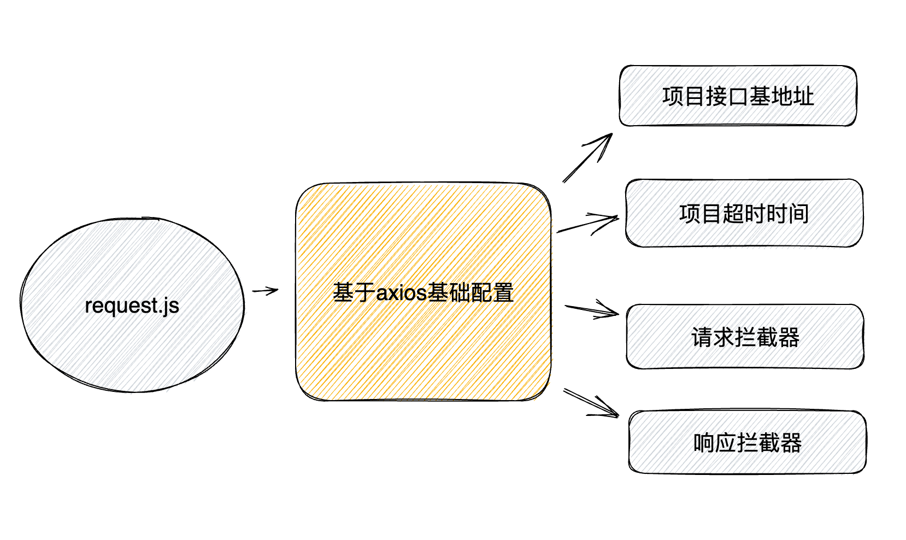
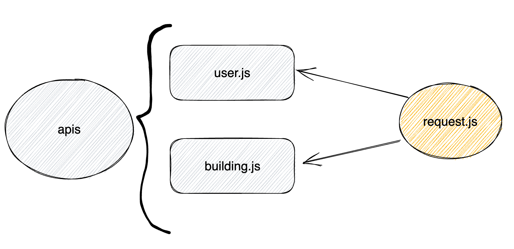
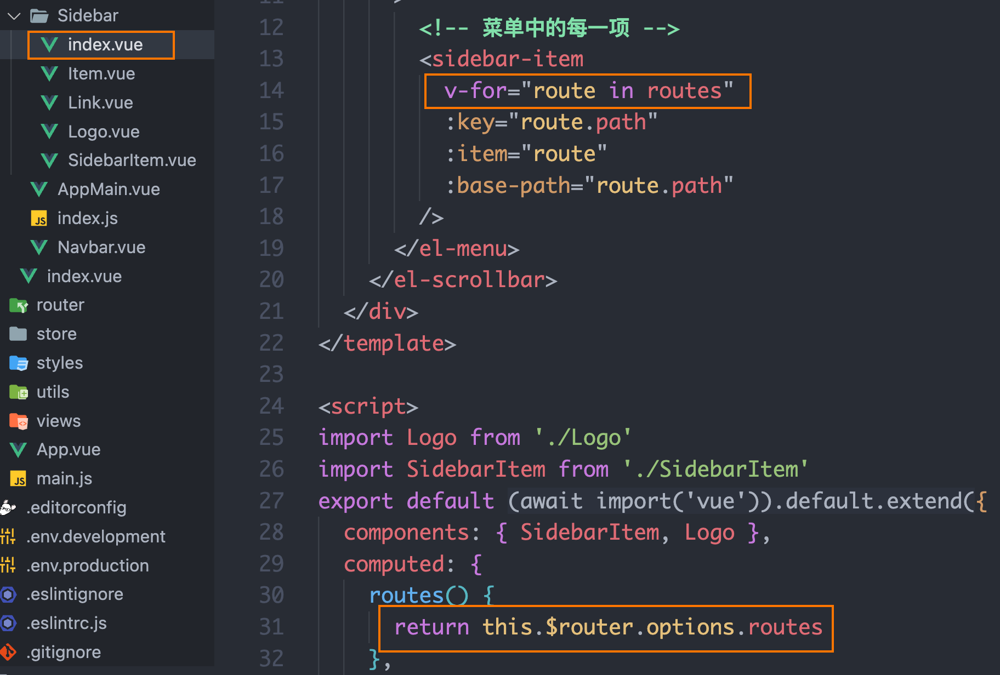
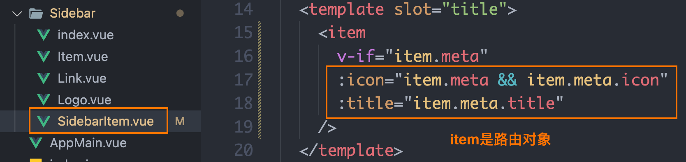

# 认识vue-admin
`**核心交付:**` 为什么要基于现成架子二次开发
## 1. 背景知识

后台管理系统是一种最常见的应用模式，不同的管理系统之间有很多相似的地方，比如：

1. 页面整体结构相似（Sidebar + Navbar + Main经典布局）
2. 技术选型相似 （Vue.js + VueRouter + Vuex + Axios...）
3. 业务类型相似 （CRUD + 导入导出 + 权限管理...）

既然这么多一样的地方，有必要每次开发后台管理系统，都重新创建一套吗？
## 2. vue-admin
> vue-admin是基于[vue-admin-template](https://gitee.com/panjiachen/vue-admin-template?_from=gitee_search)做了一些升级和改版之后的后台管理系统脚手架，内置了必要的安装包、目录结构划分、路由表设计等等，方便做`二次开发`，我们需要做的大部分是 `填空题` ，架子搭建部分工作通常由团队Leader来做 

执行下面命令，克隆脚手架到本地，并安装依赖运行
```bash
# 克隆项目
git clone http://git.itcast.cn/heimaqianduan/vue-admin.git

# 安装依赖
npm i

# 启动项目
npm run start
```
# 熟悉项目目录
`**核心交付:**` 熟悉项目的目录结构设计

说明：

1. `src` 目录指的是源代码（source code）目录，存放项目应用的源代码，包含项目的逻辑和功能实现，实际上线之后在浏览器中跑的代码就是它们
   1. apis - 业务接口
   2. assets - 静态资源 （图片）
   3. components - 组件 公共组件
   4. constants  - 常量 （不需要变动的数据）
   5. directive - 全局指令
   6. icons  - 图标 （png  svg 字体图标）
   7. Layout - 搭建项目的架子
   8. utils - 工具函数 （转化函数 校验函数 请求request）
   9. views - 页面级组件 路由级别组件  业务组件

    好处：1. 维护方便 2. 语义化

2. `src` 之外的目录和文件多数是项目的配置文件，包括babel配置，脚手架配置，环境变量配置等等
# 熟悉项目关键文件
## 1. 包文件 - package.json
`**核心交付:**` 拿到一个新项目之后，重点关注包文件中的哪些东西
> 项目包管理文件，我们重点关注 `项目依赖` 和 `可执行命令` 两部分

```json
  "scripts": {
    "dev": "vue-cli-service serve",
    "build": "vue-cli-service build",
    "report": "vue-cli-service build --report"
  },
  "dependencies": {
    "axios": "^0.18.1",
    "core-js": "^3.30.0",
    "element-ui": "2.13.2",
    "js-cookie": "^2.2.0",
    "normalize.css": "7.0.0",
    "vue": "2.6.10",
    "vue-router": "^3.6.5",
    "vuex": "3.1.0"
  },
  "devDependencies": {
    "@vue/cli-plugin-babel": "4.4.4",
    "@vue/cli-plugin-eslint": "4.4.4",
    "@vue/cli-service": "4.4.4",
    "autoprefixer": "9.5.1",
    "babel-eslint": "10.1.0",
    "babel-plugin-dynamic-import-node": "2.3.3",
    "chalk": "2.4.2",
    "connect": "3.6.6",
    "eslint": "6.7.2",
    "eslint-plugin-vue": "6.2.2",
    "html-webpack-plugin": "3.2.0",
    "runjs": "4.3.2",
    "sass": "^1.49.10",
    "sass-loader": "10",
    "script-ext-html-webpack-plugin": "2.1.3",
    "serve-static": "1.13.2",
    "svg-sprite-loader": "^6.0.11",
    "vue-template-compiler": "2.6.10"
  }
```

说明：

1. 可执行命令配置 `script`中包含了所有可执行的项目命令，包括启动开发服务，打包等等，这些命令可以定制
2. **依赖项（dependencies ） 对比  开发依赖项（devDependencies）在开发时注意要把当前包安装到对应的依赖项中**
| 
 | npm下载方式 | 作用 |
| --- | --- | --- |
| 依赖项（dependencies ） | npm i dayjs | 和业务代码相关，参与打包 |
| 开发依赖（devDependencies） | npm i sass -D | 提供开发环境下的工程化支持，不参与打包 |

为什么要把包添加到依赖项里面？
> 协同开发的时候保证团队里的所有人用到包都是一致的

## 2. 应用入口 - main.js
`**核心交付:**` 知道入口文件中都做了哪些重要的事情


## 3. 组件树 - App.vue
`**核心交付:**` 能够从组件树的角度理清楚各级组件是如何渲染出来的


## 4. 路由文件 - vueRouter
`**核心交付:**` 能够理清楚一级和二级路由的不同配置写法，能够自己新增路由

**只有一级路由的配置写法**

```javascript
  {
    path: '/workbench',
    component: Layout,
    children: [{
      path: '', // 地址为空
      name: 'workbench',
      component: () => import('@/views/workbench/index'),
      meta: { title: '工作台', icon: 'el-icon-eleme' }
    }]
  }
```

**同时拥有一级和二级路由的配置写法**

```javascript
{
    path: '/park',
    component: Layout,
    name: 'park',
    meta: { title: '园区管理', icon: 'el-icon-office-building' },
    children: [{
      path: 'building',
      name: 'building',
      meta: { title: '楼宇管理' },
      component: () => import('@/views/Park/Building/index')
    },
    {
      path: 'enterprise',
      name: 'enterprise',
      meta: { title: '企业管理' },
      component: () => import('@/views/Park/Enterprise/index')
    }]
  }
```


**路由配置练习**
> 配置要求：
> 1. icon  `el-icon-wallet`
> 2. title名称  `物业费管理`

## 5. 状态管理 - Vuex
`**核心交付:**` 能够知道基于模块化管理的集中状态管理


# 请求模块说明
## request.js模块说明
`**核心交付:**` 基于axios的基础封装都做了什么


```javascript
import axios from 'axios'
const service = axios.create({
  baseURL: 'https://api-hmzs.itheima.net/v1',
  timeout: 5000 // request timeout
})
// 请求拦截器
service.interceptors.request.use(
  config => {
    return config
  },
  error => {
    return Promise.reject(error)
  }
)

// 响应拦截器
service.interceptors.response.use(
  response => {
    return response.data
  },
  error => {
    return Promise.reject(error)
  }
)

export default service
```

**总结说明：**

1. 一般项目中多数的接口使用的配置是相似的，所以需要统一配置一次
2. 请求拦截器主要做的事情是在请求发送之前，针对请求参数对象做一些事情（比如添加鉴权Token）
3. 响应拦截器主要做的事情是在响应数据返回到业务方之前，针对响应对象做一些事情（比如简化data，错误处理等）
## apis模块说明
`**核心交付:**` 能够知道APIS模块里的业务接口函数是如何封装以及如何使用
**1- 按业务模块划分**


**2- 基础封装逻辑**
```javascript
import request from '@/utils/request'

// 登录函数
/**
 * @description: 登录函数
 * @param {*} data { mobile,password}
 * @return {*} promise
 */
export function login({ mobile, password }) {
  return request({
    url: '/sys/login',
    method: 'POST',
    data: {
      mobile,
      password
    }
  })
}

```

**总结说明：**

1. apis中的所有业务函数都采用同样的封装逻辑（**参数格式/返回值格式**），方便维护
2. apis中的所有业务函数内部都采用request.js中统一导出的axios实例达到配置一次，管控所有接口的目的
# 路由和菜单的关系
## 路由表是菜单的数据支撑

## 路由对象的属性和菜单显示对应


**说明：**

1. 菜单通过遍历路由表来显示，路由表作为数据来源
2. 路由对象meta属性中的icon决定了显示的图表，title决定了要显示的标题
# 使用Git管理项目
`**核心交付:**` 养成git管理项目的习惯

1. 删除原有的.git文件，切断和原本远程仓库的链接
2. 重新执行 `git init .` 命令, 初始化本地仓库
3. 在gitee上新增远程仓库
4. 关联远程仓库到本地
5. 推送本地到远程
6. 后续日常提交  `git add .` ` git commit -m "提交说明"`


