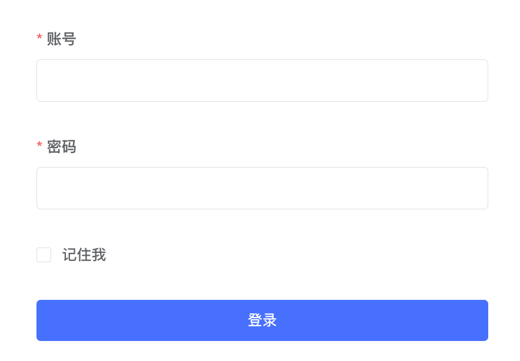
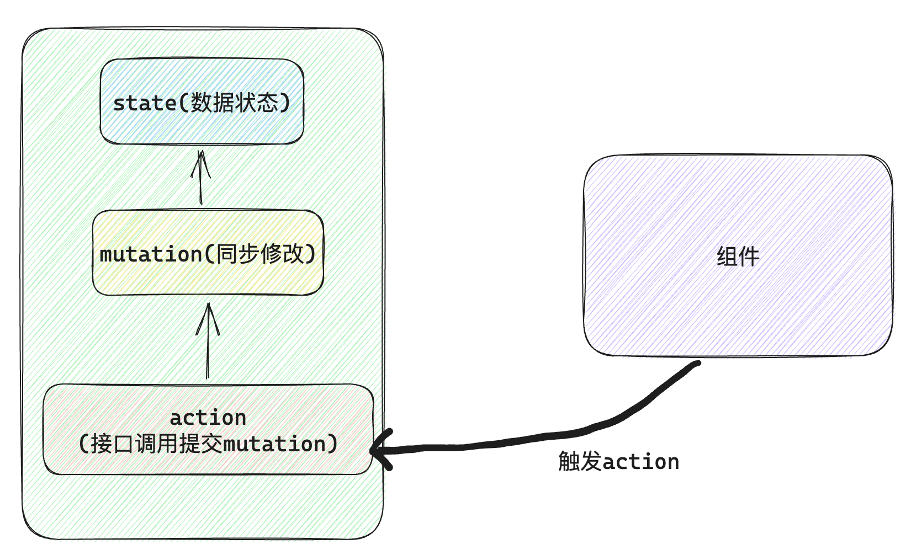
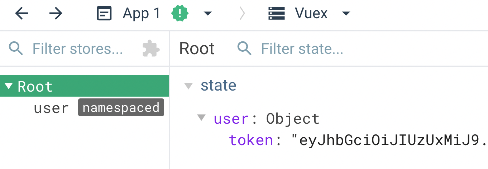
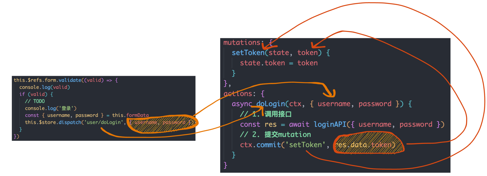
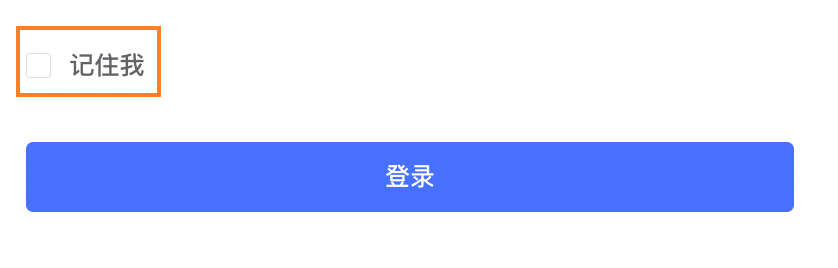
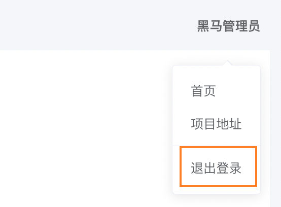
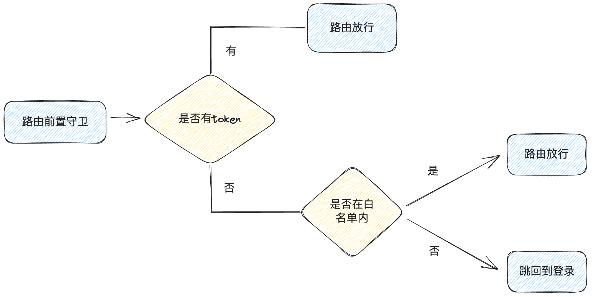

# 登录演示和功能拆解

# 表单基础校验实现 
## 1. 基础双向绑定
```vue
<template>
    <el-form>
      <el-form-item label="账号">
        <el-input v-model="formData.username" />
      </el-form-item>

      <el-form-item label="密码">
        <el-input v-model="formData.password" />
      </el-form-item>

      <el-form-item>
        <el-checkbox v-model="formData.remember">记住我</el-checkbox>
      </el-form-item>

      <el-form-item>
        <el-button type="primary" class="login_btn">登录</el-button>
      </el-form-item>
    </el-form>
</template>

<script>
export default {
  name: 'Login',
  data() {
    return {
      formData: {
        username: '',
        password: '',
        remember: ''
      }
    }
  }
}

</script>
```

## 2. 表单校验配置

1. **按照业务要求编写校验规则对象（rules）**
2. **el-form组件绑定表单对象（model）和规则对象（rules）**
3. **el-form-item组件通过prop属性指定要使用的校验规则**


```vue
<template>
    <el-form :model="formData" :rules="rules">
      <el-form-item
        label="账号"
        prop="username"
      >
        <el-input v-model="formData.username" />
      </el-form-item>

      <el-form-item
        label="密码"
        prop="password"
      >
        <el-input v-model="formData.password" />
      </el-form-item>

      <el-form-item prop="remember">
        <el-checkbox v-model="formData.remember">记住我</el-checkbox>
      </el-form-item>

      <el-form-item>
        <el-button type="primary" class="login_btn">登录</el-button>
      </el-form-item>
    </el-form>
</template>

<script>
export default {
  name: 'Login',
  data() {
    return {
      formData: {
        username: '',
        password: '',
        remember: ''
      },
      rules: {
        username: [
          { required: true, message: '请输入账号', trigger: 'blur' }
        ],
        password: [
          { required: true, message: '请输入密码', trigger: 'blur' }
        ]
      }
    }
  }
}

</script>
```

# 表单统一校验实现
> 业务背景：表单校验部分的触发条件是失焦事件，如果用户打开界面后直接点击登录按钮，校验将失效，所有需要在点击登录按钮时统一对所有表单进行校验
> 实现思路：通过调用form组件实例对象的validate方法


```vue
<template>
  <el-form ref="form">
    <el-form-item>
      <el-button type="primary" class="login_btn" @click="doLogin()">登录</el-button>
    </el-form-item>
  </el-form>
</template>

<script>
export default {
  name: 'Login',
  methods: {
    doLogin() {
      this.$refs.form.validate((valid) => {
        if (valid) {
          // TODO
          console.log('登录')
        }
      })
    }
  }
}
</script>
```
# Vuex管理用户Token
> 业务背景：由于用户数据的特殊性，可能需要在多个模块中进行使用，适合使用Vuex集中管理

开发模式：有关token的所有操作都放到Vuex中做，组件只做一个事儿就是触发action函数

实现步骤：

1. 根据接口文档封装登录接口
2. 在vuex中编写user模块的相关代码
3. 组件中表单校验通过之后提交action
## 1. 封装登录接口
`src/apis/user.js`
```javascript
import request from '@/utils/request'

// 登录函数
/**
 * @description: 登录函数
 * @param {*} data { mobile,password}
 * @return {*} promise
 */
export function loginAPI({ username, password }) {
  return request({
    url: '/park/login',
    method: 'POST',
    data: {
      username,
      password
    }
  })
}
```
`utils/request.js`
```javascript
const service = axios.create({
  baseURL: 'https://api-hmzs.itheima.net/v1',
  timeout: 5000 // request timeout
})
```
## 2. 编写Vuex相关代码
`src/store/modules/user.js`
```javascript
import { loginAPI } from '@/apis/user'
export default {
  namespaced: true,
  state: () => {
    return {
      token: ''
    }
  },
  mutations: {
    setToken(state, token) {
      state.token = token
    }
  },
  actions: {
    async doLogin(ctx, { username, password }) {
      // 1. 调用接口
      const res = await loginAPI({ username, password })
      // 2. 提交mutation
      ctx.commit('setToken', res.data.token)
    }
  }
}
```
## 3. 组件中提交action
```javascript
doLogin() {
  this.$refs.form.validate(async(valid) => {
    console.log(valid)
    if (valid) {
      // TODO
      console.log('登录')
      const { username, password } = this.formData
      await this.$store.dispatch('user/doLogin', { username, password })
      this.$router.push('/')
    }
  })
}
```



## 4. 更改流程图
> 思想：数据操作的逻辑都由Vuex维护，组件只负责把action函数触发起来即可



# 用户Token持久化
> 业务背景：Token的有效期会持续一段时间，在这段时间内没有必要重复请求token，但是Vuex本身是基于内存的管理方式，刷新浏览器Token会丢失，为了避免丢失需要配置持久化进行缓存
> 基础思路：
> 1. 存Token数据时，一份存入vuex，一份存入cookie
> 2. vuex中初始化Token时，优先从本地cookie取，取不到再初始化为空串儿

## 1. 基于js-cookie封装存取方法
```javascript
// 专门用来操作cookie的方法包
// 内部封装了繁琐的操作方法 参数处理 暴露三个函数 get,set,remove
import Cookies from 'js-cookie'
import { TOKEN_KEY } from '@/constants/KEY'
// 获取token的方法
export function getToken() {
  return Cookies.get(TOKEN_KEY)
}

// 设置方法
export function setToken(token) {
  return Cookies.set(TOKEN_KEY, token)
}

// 删除方法
export function removeToken() {
  return Cookies.remove(TOKEN_KEY)
}

```
## 2. store中的核心逻辑
```javascript
export const TOKEN_KEY = 'token_key'
```
```javascript
import { loginAPI } from '@/apis/user'
import { getToken, setToken } from '@/utils/auth'

export default {
  namespaced: true,
  state: () => {
    return {
      // 优先从本地取
      token: getToken() || ''
    }
  },
  mutations: {
    setToken(state, token) {
      state.token = token
      // 本地存一份
      setToken(token)
    }
  }
}
```
## 3. 为什么要使用Vuex+Cookies
> 俩种存储方式的优势都想要
> 1. vuex  基于内存  存取快  但是刷新就丢失
> 2. ls/cookie  基于磁盘  存取速度稍慢  刷新不丢失(持久化)
> 
因为我们既可以享受vuex速度优势封装优势 同时保持持久化

## 4. cookie  vs  ls

1. 存数据的空间大小

ls  5M    cookie kb

2. 是否允许后端操作

ls 纯前端操作   cookie 前端可操作 后端也可操作(占多数)

3. 是否跟随接口发送

cookie 
# Axios请求头中添加Token
> 1. 为什么要添加Token到请求头？

点击查看答案接口需要做鉴权，只有token有效，才能返回正常数据，token就是后端用来做判断的标识

> 2. 为什么要在axios中加？

点击查看答案项目中有很多接口都需要加鉴权功能，axios请求拦截器可以同一控制，一次添加，多个接口生效

```javascript
// 请求拦截器
service.interceptors.request.use(
  config => {
    const token = getToken()
    if (token) {
      config.headers.Authorization = token
    }
    return config
  },
  error => {
    return Promise.reject(error)
  }
)
```

# 记住我功能实现

**交互表现：**

1. 如果当前用户选中了checkbox，点击登录之后，再次回到登录，应该把之前输入的用户名和密码回填到输入框里面；
2. 如果当前用户取消了checkbox，点击登录之后，再次回到登录，应该把之前存到本地的数据清除掉

**实现思路：**

1. 完成选择框的双向绑定 得到一个true或者false的选中状态
2. 如果当前为true，点击登录时，表示要记住，把当前的用户名和密码存入本地
3. 组件初始化的时候，从本地取账号和密码，把账号密码存入用来双向绑定的form身上
4. 如果当前用户没有记住，状态为false，点击登录的时候要把之前的数据清空
```vue
<script>
  const FORMDATA_KEY = 'form_key'
  export default {
    name: 'Login',
    mounted() {
      const cacheFormStr = localStorage.getItem(FORMDATA_KEY)
      if (cacheFormStr) {
        const cacheFormData = JSON.parse(cacheFormStr)
        this.formData.username = cacheFormData.username
        this.formData.password = cacheFormData.password
      }
    },
    methods: {
      doLogin() {
        this.$refs.form.validate((valid) => {
          console.log(valid)
          if (valid) {
            // TODO
            console.log('登录')
            const { username, password, remember } = this.formData
            this.$store.dispatch('user/doLogin', { username, password })

            // 补充remeber逻辑
            if (remember) {
              localStorage.setItem(FORMDATA_KEY, JSON.stringify({ username, password }))
            } else {
              localStorage.removeItem(FORMDATA_KEY)
            }
          }
        })
      }
    }
  }

</script>
```

# 退出登录功能实现

> 询问用户是否真的要退出 -> 实现退出登录逻辑 （ 1. 清空当前用户的所有信息  2. 调回到登录页 ）

## 1. 编写清除用户信息mutation
```javascript
  mutations: {
    clearUserInfo(state) {
      // 清除Token
      state.token = ''
      removeToken(TOKEN_KEY)
    }
  },
```
## 2. 提交mutation跳回到登录页
```javascript
 methods: {
    // 退出登录
    logout() {
      this.$store.commit('user/clearUserInfo')
      this.$router.push('/login')
    }
}
```

# Token控制路由跳转
> 业务背景：如果用户没有登录，不让用户进入到页面中，所以需要通过`token的有无`来控制路由的跳转


说明：白名单指的是不需要用户登录就可以看到的路由，比如`/loigin`

## 编写权限控制逻辑
```javascript
// 权限控制
import router from './router'
import { getToken } from './utils/auth'

const WHITE_LIST = ['/login', '/404']
router.beforeEach((to, from, next) => {
  const token = getToken()
  // 有token
  if (token) {
    next()
  } else {
    // 没有token
    if (WHITE_LIST.includes(to.path)) {
      next()
    } else {
      next('/login')
    }
  }
})
```

## 在入口文件引入生效
```javascript
// 在router引入之后引入
import './permission'
```

# 接口错误统一处理
> 背景：
> 1. 接口报错的时候提示用户到底是哪里错误
> 2. 接口数量很多 统一管控  不管哪个接口报错了 都能监控到 而且给出提示

```javascript
import { Message } from 'element-ui'

// 响应拦截器
service.interceptors.response.use(
  response => {
    return response.data
  },
  error => {
    // 错误统一处理
    Message.error(error.response.data.msg)
    return Promise.reject(error)
  }
)

export default service
```

# Token失效处理
> 业务背景：Token存在一定的有效时间，如果长时间不进行接口访问，Token有可能就失效了，需要我们做统一控制
> 核心思路：因为我们不知道到底用户实在访问哪个接口的时候发生了Token失效访问，所以需要通过拦截器来做
> 1. 跳转到登录页
> 2. 清除掉过期Token


```javascript
// 响应拦截器
service.interceptors.response.use(
  response => {
    return response.data
  },
  error => {
    // Token 401处理
    console.dir(error.response.status)
    if (error.response.status === 401) {
      // 1. 跳转到登录
      router.push('/login')
      // 2. 清空用户数据
      store.commit('user/clearUserInfo')
    }
    return Promise.reject(error)
  }
)
```

