# 功能说明并准备静态结构
```vue
<template>
  <div class="card-container">
    <!-- 搜索区域 -->
    <div class="search-container">
      <span class="search-label">车牌号码：</span>
      <el-input clearable placeholder="请输入内容" class="search-main" />
      <span class="search-label">车主姓名：</span>
      <el-input clearable placeholder="请输入内容" class="search-main" />
      <span class="search-label">状态：</span>
      <el-select>
        <el-option v-for="item in []" :key="item.id" />
      </el-select>
      <el-button type="primary" class="search-btn">查询</el-button>
    </div>
    <!-- 新增删除操作区域 -->
    <div class="create-container">
      <el-button type="primary">添加月卡</el-button>
      <el-button>批量删除</el-button>
    </div>
    <!-- 表格区域 -->
    <div class="table">
      <el-table style="width: 100%" :data="[]">
        <el-table-column type="index" label="序号" />
        <el-table-column label="车主名称" />
        <el-table-column label="联系方式" />
        <el-table-column label="车牌号码" />
        <el-table-column label="车辆品牌" />
        <el-table-column label="剩余有效天数" />
        <el-table-column label="操作" fixed="right" width="180">
          <template #default="scope">
            <el-button size="mini" type="text">续费</el-button>
            <el-button size="mini" type="text">查看</el-button>
            <el-button size="mini" type="text">编辑</el-button>
            <el-button size="mini" type="text">删除</el-button>
          </template>
        </el-table-column>
      </el-table>
    </div>
    <div class="page-container">
      <el-pagination
        layout="total, prev, pager, next"
        :total="0"
      />
    </div>
    <!-- 添加楼宇 -->
    <el-dialog
      title="添加楼宇"
      width="580px"
    >
      <!-- 表单接口 -->
      <div class="form-container">
        <!-- <el-form ref="addForm" :model="addForm" :rules="addFormRules">
          <el-form-item label="楼宇名称" prop="name">
            <el-input v-model="addForm.name" />
          </el-form-item>
          <el-form-item label="楼宇层数" prop="floors">
            <el-input v-model="addForm.floors" />
          </el-form-item>
          <el-form-item label="在管面积" prop="area">
            <el-input v-model="addForm.area" />
          </el-form-item>
          <el-form-item label="物业费" prop="propertyFeePrice">
            <el-input v-model="addForm.propertyFeePrice" />
          </el-form-item>
        </el-form> -->
      </div>
      <template #footer>
        <el-button size="mini">取 消</el-button>
        <el-button size="mini" type="primary">确 定</el-button>
      </template>
    </el-dialog>
  </div>
</template>


<script>
export default {


}
</script>


<style lang="scss" scoped>
.card-container {
  padding: 20px;
  background-color: #fff;
}


.search-container {
  display: flex;
  align-items: center;
  border-bottom: 1px solid rgb(237, 237, 237, .9);
  padding-bottom: 20px;
  .search-main {
    width: 220px;
    margin-right: 10px;
  }
  .search-btn{
    margin-left:20px;
  }
}
.create-container{
  margin: 10px 0px;
}
.page-container{
  padding:4px 0px;
  text-align: right;
}
.form-container{
  padding:0px 80px;
}
</style>
```
# 渲染基础Table列表
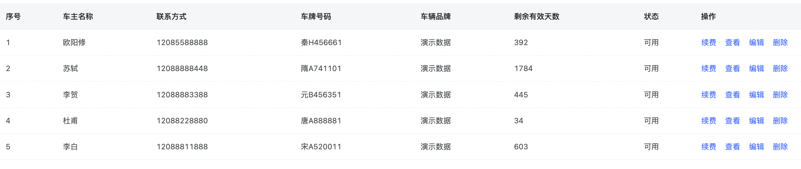
## 实现思路分析
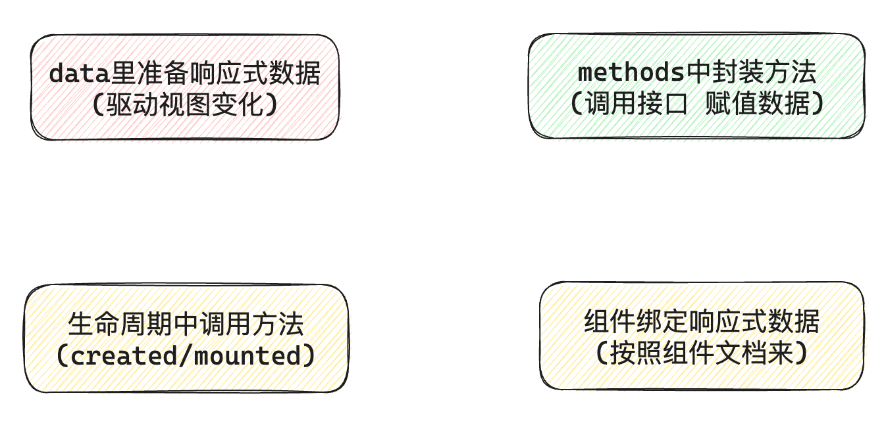
## 代码实现
**1- 接口封装**
```javascript
import request from '@/utils/request'

/**
 * 获取楼宇列表
 * @param { page, pageSize} params
 * @returns
 */
export function getCardListAPI(params) {
  return request({
    url: '/parking/card/list',
    params
  })
}
```
**2- 代码实现**
```vue
<script>
  import { getCardListAPI } from '@/apis/card'
  export default {
    data() {
      return {
        // 请求参数
        params: {
          page: 1,
          pageSize: 10
        },
        // 月卡列表
        cardList: []
      }
    },
    mounted() {
      this.getCardList()
    },
    methods: {
      async getCardList() {
        const res = await getCardListAPI(this.params)
        this.cardList = res.data.rows
      }
    }
  }
</script

<template>
  <el-table style="width: 100%" :data="cardList">
    <el-table-column type="index" label="序号" />
    <el-table-column label="车主名称" prop="personName" />
    <el-table-column label="联系方式" prop="phoneNumber" />
    <el-table-column label="车牌号码" prop="carNumber" />
    <el-table-column label="车辆品牌" prop="carBrand" />
    <el-table-column label="剩余有效天数" prop="totalEffectiveDate" />
    <el-table-column label="操作" fixed="right" width="180">
      <template #default="scope">
        <el-button size="mini" type="text">续费</el-button>
        <el-button size="mini" type="text">查看</el-button>
        <el-button size="mini" type="text">编辑</el-button>
        <el-button size="mini" type="text">删除</el-button>
      </template>
    </el-table-column>
  </el-table>
</template>
```

# 适配状态显示
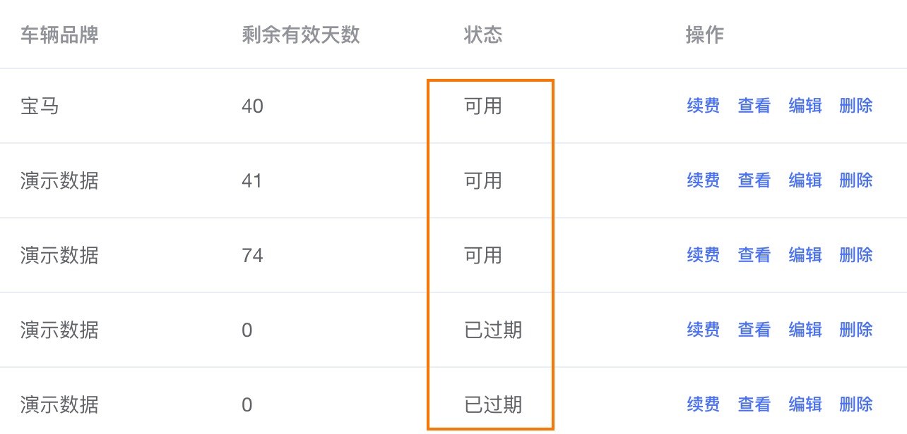
```vue
<el-table-column label="状态" prop="cardStatus" :formatter="formatStatus" />

formatStatus(row) {
  const MAP = {
    0: '可用',
    1: '已过期'
  }
  return MAP[row.cardStatus]
}
```
# 分页功能实现
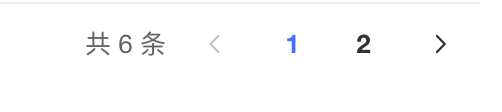
## 分出页数
> 分页公式：页数 = 总条数 / 每页条数

```vue
<el-pagination
  layout="total, prev, pager, next"
  :page-size="params.pageSize"
  :total="total"
/>


<script>
import { getCardListAPI } from '@/apis/card'
export default {
  data() {
    return {
      // 请求参数
      params: {
        page: 1,
        pageSize: 2
      },
      total: 0,
      // 月卡列表
      cardList: []
    }
  },
  mounted() {
    this.getCardList()
  },
  methods: {
    async getCardList() {
      const res = await getCardListAPI(this.params)
      this.cardList = res.data.rows
      this.total = res.data.total
    }
  }
}
</script>
```
## 实现点击切换
> 实现步骤：
> 1. 拿到当前点击了第几页
> 2. 使用当前点击的页数去和后端要数据

```vue
<el-pagination
  layout="total, prev, pager, next"
  :page-size="params.pageSize"
  :total="total"
  @current-change="pageChange"
/>


methods: {
  async getCardList() {
    const res = await getCardListAPI(this.params)
    this.cardList = res.data.rows
    this.total = res.data.total
  },
  pageChange(page) {
    // 把点击的页数赋值给请求参数页数
    this.params.page = page
    // 使用最新的请求参数获取列表数据
    this.getCardList()
  }
}
```

# 搜索功能实现

## 收集查询字段数据
```vue
<!-- 搜索区域 -->
<div class="search-container">
  <span class="search-label">车牌号码：</span>
  <el-input v-model="params.carNumber" clearable placeholder="请输入内容" class="search-main" />
  <span class="search-label">车主姓名：</span>
  <el-input v-model="params.personName" clearable placeholder="请输入内容" class="search-main" />
  <span class="search-label">状态：</span>
  <el-select v-model="params.cardStatus">
    <el-option
      v-for="item in cardStatusList"
      :key="item.id"
      :value="item.id"
      :label="item.name"
    />
  </el-select>
  <el-button type="primary" class="search-btn" @click="doSearch">查询</el-button>
</div

data() {
    return {
      // 请求参数
      params: {
        page: 1,
        pageSize: 5,
        carNumber: null,
        personName: null,
        cardStatus: null
      },
      // 月卡状态
      cardStatusList: [
        {
          id: null,
          name: '全部'
        },
        {
          id: 0,
          name: '可用'
        },
        {
          id: 1,
          name: '已过期'
        }
      ]
    }
  }
```
## 调用接口获取数据
```vue
doSearch() {
  // 调用接口之前把页数参数重置为1
  this.params.page = 1
  this.getCardList()
}

<el-button type="primary" class="search-btn" @click="doSearch">查询</el-button>
```

# 新增月卡实现
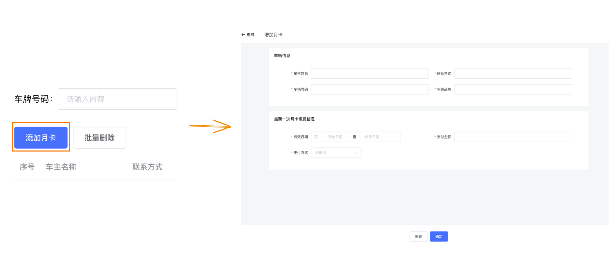
## 配置路由完成跳转
```vue
<template>
  <div class="add-card">
    <header class="add-header">
      <el-page-header content="增加月卡" @back="$router.back()" />
    </header>
    <main class="add-main">
      <div class="form-container">
        <div class="title">车辆信息</div>
        <div class="form">
          <el-form label-width="100px">
            <el-form-item label="车主姓名">
              <el-input />
            </el-form-item>
            <el-form-item label="联系方式">
              <el-input />
            </el-form-item>
            <el-form-item label="车辆号码">
              <el-input />
            </el-form-item>
            <el-form-item label="企业联系人">
              <el-input />
            </el-form-item>
          </el-form>
        </div>
      </div>
      <div class="form-container">
        <div class="title">最新一次月卡缴费信息</div>
        <div class="form">
          <el-form label-width="100px">
            <el-form-item label="有效日期">
              <el-input />
            </el-form-item>
            <el-form-item label="支付金额">
              <el-input />
            </el-form-item>
            <el-form-item label="支付方式">
              <el-select>
                <el-option
                  v-for="item in [{}]"
                  :key="item.industryCode"
                  :value="item.industryCode"
                  :label="item.industryName"
                />
              </el-select>
            </el-form-item>
          </el-form>
        </div>
      </div>

    </main>
    <footer class="add-footer">
      <div class="btn-container">
        <el-button>重置</el-button>
        <el-button type="primary">确定</el-button>
      </div>
    </footer>
  </div>
</template>

<script>
export default {

}
</script>

<style scoped lang="scss">
.add-card {
  background-color: #f4f6f8;
  height: 100vh;

  .add-header {
    display: flex;
    align-items: center;
    padding: 0 20px;
    height: 64px;
    background-color: #fff;

    .left {
      span {
        margin-right: 4px;
      }
      .arrow{
        cursor: pointer;
      }
    }

    .right {
      text-align: right;
    }
  }

  .add-main {
    background: #f4f6f8;
    padding: 20px 130px;

    .form-container {
      background-color: #fff;

      .title {
        height: 60px;
        line-height: 60px;
        padding-left: 20px;
      }

      .form {
        margin-bottom: 20px;
        padding: 20px 65px 24px;

        .el-form {
          display: flex;
          flex-wrap: wrap;

          .el-form-item {
            width: 50%;
          }
        }
      }
    }
    .preview{
      img{
        width: 100px;
      }
    }
  }

  .add-footer {
    position: fixed;
    bottom: 0;
    width: 100%;
    padding: 24px 50px;
    color: #000000d9;
    font-size: 14px;
    background: #fff;
    text-align: center;
  }
}
</style>
```

```javascript
{
  path: '/cardAdd',
  component: () => import('@/views/car/car-card/add-card')
}

```

```vue
<el-button type="primary" @click="$router.push('/cardAdd')">添加月卡</el-button>
```
## 车辆信息表单验证
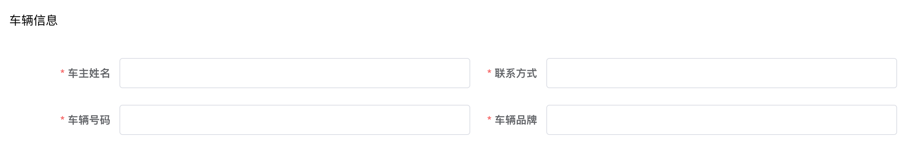
> 其它项做非空校验，车辆号码既做非空校验，也做正则校验

```vue
<el-form :model="carInfoForm" :rules="carInfoRules" label-width="100px">
  <el-form-item label="车主姓名" prop="personName">
    <el-input v-model="carInfoForm.personName" />
  </el-form-item>
  <el-form-item label="联系方式" prop="phoneNumber">
    <el-input v-model="carInfoForm.phoneNumber" />
  </el-form-item>
  <el-form-item label="车辆号码" prop="carNumber">
    <el-input v-model="carInfoForm.carNumber" />
  </el-form-item>
  <el-form-item label="车辆品牌" prop="carBrand">
    <el-input v-model="carInfoForm.carBrand" />
  </el-form-item>
</el-form>

data() {
    return {
      // 车辆信息表单
      carInfoForm: {
        personName: '', // 车主姓名
        phoneNumber: '', // 联系方式
        carNumber: '', // 车牌号码
        carBrand: '' // 车辆品牌
      },
      carInfoRules: {
        personName: [
          {
            required: true, message: '请输入车主姓名', trigger: 'blur'
          }
        ],
        phoneNumber: [
          {
            required: true, message: '请输入联系方式', trigger: 'blur'
          }
        ],
        carNumber: [
          {
            required: true, message: '请输入车辆号码', trigger: 'blur'
          }
        ],
        carBrand: [
          {
            required: true, message: '请输入车辆品牌', trigger: 'blur'
          }
        ]
      }
    }
  }
```

## 车牌号单独校验
> 较复杂的校验可以通过设置一个校验函数来做，给校验选项添加一个validator选项，值为校验函数，在校验函数中编写校验规则

```javascript
 data() {
    const validaeCarNumber = (rule, value, callback) => {
      const plateNumberRegex = /^[\u4E00-\u9FA5][\da-zA-Z]{6}$/
      if (plateNumberRegex.test(value)) {
        callback()
      } else {
        callback(new Error('请输入正确的车牌号'))
      }
    }
    return {
      carInfoRules: {
        carNumber: [
          {
            required: true, message: '请输入车辆号码', trigger: 'blur'
          },
          {
            validator: validaeCarNumber, trigger: 'blur'
          }
        ]
      }
    }
  }
```
## 缴费信息表单校验
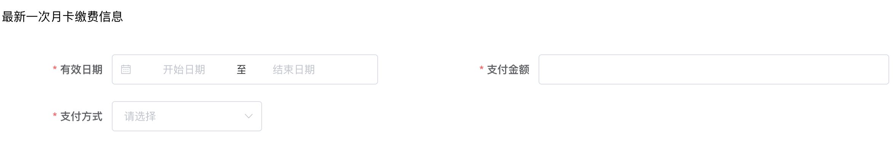
```vue
<el-form :model="feeForm" :rules="feeFormRules" label-width="100px">
    <el-form-item label="有效日期" prop="payTime">
      <el-date-picker
        v-model="feeForm.payTime"
        type="daterange"
        range-separator="至"
        start-placeholder="开始日期"
        end-placeholder="结束日期"
      />
    </el-form-item>
    <el-form-item label="支付金额" prop="paymentAmount">
      <el-input v-model="feeForm.paymentAmount" />
    </el-form-item>
    <el-form-item label="支付方式" prop="paymentMethod">
      <el-select v-model="feeForm.paymentMethod">
        <el-option
          v-for="item in payMethodList"
          :key="item.id"
          :value="item.id"
          :label="item.name"
        />
      </el-select>
    </el-form-item>
  </el-form>


  data() {
    return {
      // 缴费信息表单
      feeForm: {
        payTime: '', // 支付时间
        paymentAmount: null, // 支付金额
        paymentMethod: '' // 支付方式
      },
      // 缴费规则
      feeFormRules: {
        payTime: [
          {
            required: true,
            message: '请选择支付时间'
          }
        ],
        paymentAmount: [
          {
            required: true,
            message: '请输入支付金额',
            trigger: 'blur'
          }
        ],
        paymentMethod: [
          {
            required: true,
            message: '请选择支付方式',
            trigger: 'change'
          }
        ]
      },
      // 支付方式列表
      payMethodList: [
        {
          id: 'Alipay',
          name: '支付宝'
        },
        {
          id: 'WeChat',
          name: '微信'
        },
        {
          id: 'Cash',
          name: '线下'
        }
      ]
    }
  }
```

## 统一校验俩个表单
> 校验方式：表单校验采用串行校验，也就是第一个表单校验通过之后再进行第二个校验

```vue
<el-form ref="carInfoForm"></el-form>
<el-form ref="feeForm"></el-form>


methods: {
  confirmAdd() {
    this.$refs.carInfoForm.validate(valid => {
      if (valid) {
        this.$refs.feeForm.validate(valid => {
          if (valid) {
            // 全部校验通过
            // TODO 确定
          }
        })
      }
    })
  }
}
```
## 收集表单确认提交
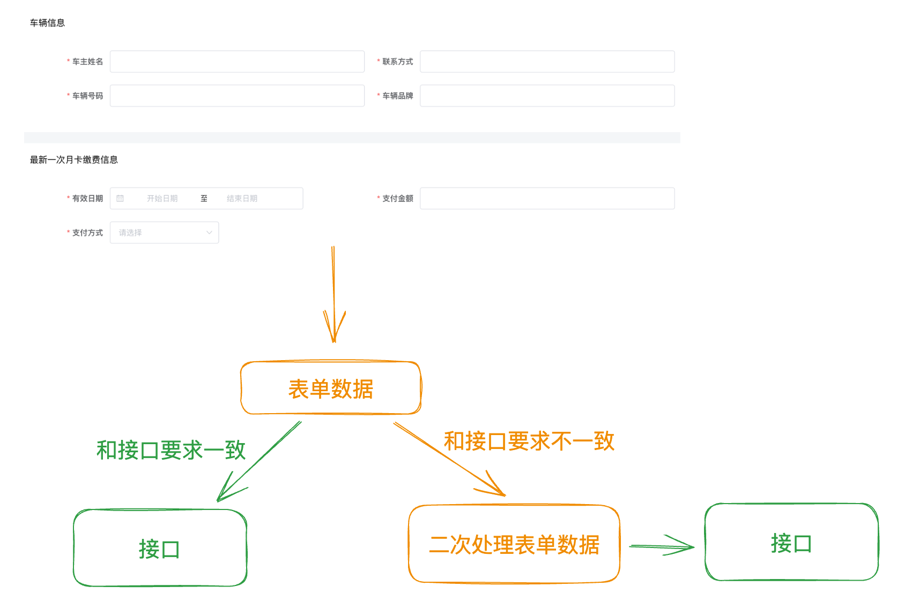
**1-封装接口**

```javascript
/**
 * 新增月卡
 * @data
 * @returns
 */
export function createCardAPI(data) {
  return request({
    url: '/parking/card',
    method: 'POST',
    data
  })
}
```

**2-处理表单数据提交**
```javascript
methods: {
  confirmAdd() {
    this.$refs.carInfoForm.validate(valid => {
      if (valid) {
        this.$refs.feeForm.validate(valid => {
          if (valid) {
            // 全部校验通过
            // TODO 确定
             // 参数处理
            const payload = {
              ...this.feeForm,
              ...this.carInfoForm,
              // 单独处理时间
              cardStartDate: this.feeForm.payTime[0],
              cardEndDate: this.feeForm.payTime[1]
            }
            // 删掉多余字段
            delete payload.payTime
            await createCardAPI(payload)
            this.$router.back()
          }
        })
      }
    })
  }
}
```

## 重置表单
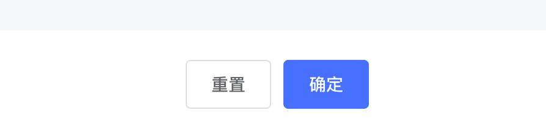
> 重置表单主要做两件事
> 1. 清空输入数据
> 2. 清空校验错误

```javascript
// 重置表单
resetForm() {
  this.$refs.feeForm.resetFields()
  this.$refs.carInfoForm.resetFields()
}
```
# 编辑月卡
## 编辑功能的通用实现流程
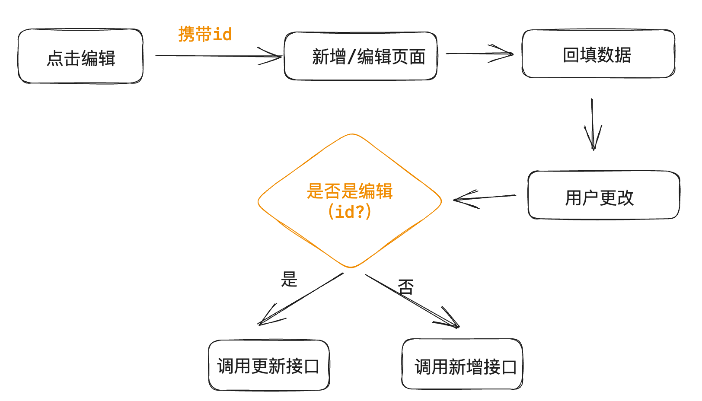
## 携带id跳转并缓存id
```vue
<el-button size="mini" type="text" @click="editCard(scope.row.id)">编辑</el-button>
  
editCard(id) {
  this.$router.push({
    path: '/cardAdd',
    query: {
      id
    }
  })
}
```
## 回填数据
**1- 封装接口**
```javascript
/**
 * 获取月卡详情
 * @data
 * @returns
 */
export function getCardDetailAPI(id) {
  return request({
    url: `/parking/card/detail/${id}`
  })
}
```

**2-根据id获取详情**
```javascript
// 获取详情
async getDetail() {
  const res = await getCardDetailAPI(this.id)
  // 回填车辆信息表单
  const { carInfoId, personName, phoneNumber, carNumber, carBrand } = res.data
  this.carInfoForm = {
    personName, phoneNumber, carNumber, carBrand, carInfoId
  }

  // 回填缴费信息表单
  const { rechargeId, cardStartDate, cardEndDate, paymentAmount, paymentMethod } = res.data
  this.feeForm = {
    rechargeId,
    paymentAmount,
    paymentMethod,
    payTime: [cardStartDate, cardEndDate]
  }
}

mounted() {
  if (this.id) {
    this.getDetail()
  }
}
```
## 根据id做接口适配
```javascript
methods: {
  confirmAdd() {
    this.$refs.carInfoForm.validate(valid => {
      if (valid) {
        this.$refs.feeForm.validate(valid => {
          if (valid) {
            // 全部校验通过
            // TODO 确定
             // 参数处理
            const payload = {
              ...this.feeForm,
              ...this.carInfoForm,
              cardStartDate: this.feeForm.payTime[0],
              cardEndDate: this.feeForm.payTime[1]
            }
            delete payload.payTime
            if (this.id) {
              // 编辑
              await updateCardAPI(payload)
            } else {
              // 新增
              await createCardAPI(payload)
            }
            this.$router.back()
          }
        })
      }
    })
  }
}
```

# 删除功能实现
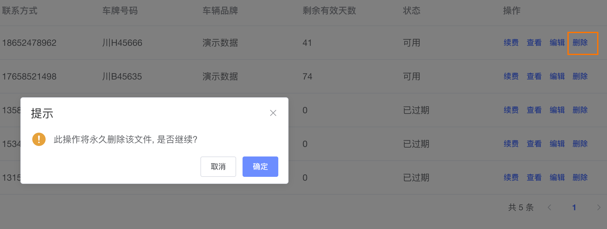
```javascript
/**
 * 删除月卡
 * @param {*} id
 * @returns
 */
export function delCardAPI(id) {
  return request({
    url: `/parking/card/${id}`,
    method: 'DELETE'
  })
}
```

```vue

// 绑定事件
<el-button size="mini" type="text" @click="delCard(scope.row.id)">删除</el-button>

// 导入接口
import { delCardAPI } from '@/apis/card'

// 删除逻辑
delCard(id) {
  this.$confirm('此操作将永久删除该文件, 是否继续?', '提示', {
    confirmButtonText: '确定',
    cancelButtonText: '取消',
    type: 'warning'
  }).then(async() => {
    await delCardAPI(id)
    this.getCardList()
    this.$message({
      type: 'success',
      message: '删除成功!'
    })
  }).catch((error) => {
    console.log(error)
  })
}
```
# 批量删除
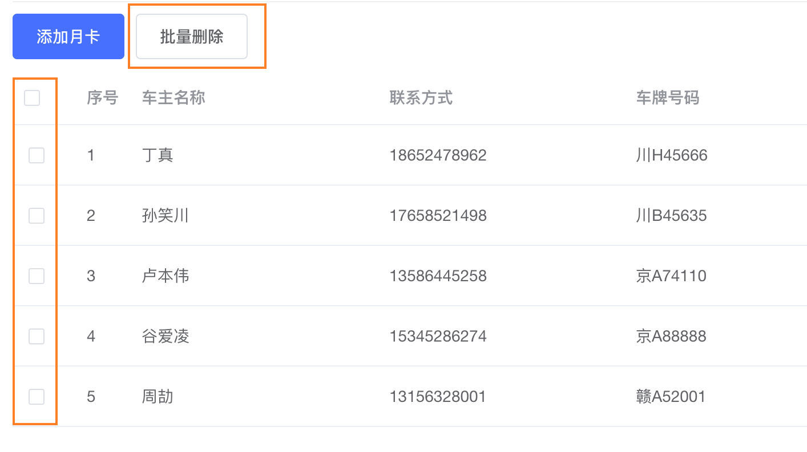
## 收集用户选择行
```vue
<el-table style="width: 100%" 
  :data="cardList" 
  @selection-change="handleSelectionChange">
    <el-table-column
      type="selection"
      width="55"
    />
    <!-- 省略 -->
</el-table>

data() {
  return {
    // 已选择列表
    selectedCarList: []
  }
}

methods:{
  handleSelectionChange(rowList) {
    console.log(rowList)
    this.selectedCarList = rowList
  }
}
```
## 处理数据调用接口
```javascript
/**
 * 删除月卡
 * @param {*} id
 * @returns
 */
export function delCardListAPI(idList) {
  return request({
    url: `/parking/card/${idList.join(',')}`,
    method: 'DELETE'
  })
}


delCartList() {
  this.$confirm('此操作将永久删除选择的月卡, 是否继续?', '提示', {
    confirmButtonText: '确定',
    cancelButtonText: '取消',
    type: 'warning'
  }).then(async() => {
    // 处理id
    await delCardListAPI(this.selectedCarList.map(item => item.id))
    this.getCardList()
    this.$message({
      type: 'success',
      message: '删除成功!'
    })
  }).catch((error) => {
    console.log(error)
  })
}
```

