# 功能演示和模版搭建
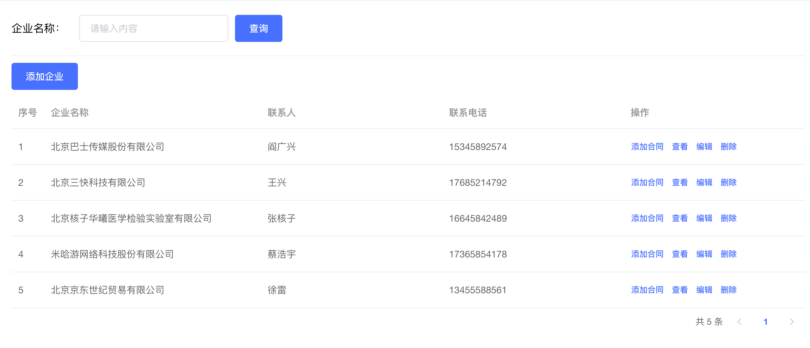
```vue
<template>
  <div class="building-container">
    <!-- 搜索区域 -->
    <div class="search-container">
      <div class="search-label">企业名称：</div>
      <el-input clearable placeholder="请输入内容" class="search-main"/>
      <el-button type="primary">查询</el-button>
    </div>
    <div class="create-container">
      <el-button type="primary" >添加企业</el-button>
    </div>
    <!-- 表格区域 -->
    <div class="table">
      <el-table style="width: 100%" :data="[]">
        <el-table-column type="index" label="序号" />
        <el-table-column label="企业名称" width="320" prop="name" />
        <el-table-column label="联系人" prop="contact" />
        <el-table-column
          label="联系电话"
          prop="contactNumber"
        />
        <el-table-column label="操作">
          <template #default="scope">
            <el-button size="mini" type="text">添加合同</el-button>
            <el-button size="mini" type="text">查看</el-button>
            <el-button size="mini" type="text">编辑</el-button>
            <el-button size="mini" type="text">删除</el-button>
          </template>
        </el-table-column>
      </el-table>
    </div>
    <div class="page-container">
      <el-pagination
        layout="total, prev, pager, next"
      />
    </div>
  </div>
</template>

<style lang="scss" scoped>
.department-container {
  padding: 10px;
}

.search-container {
  display: flex;
  align-items: center;
  border-bottom: 1px solid rgb(237, 237, 237, .9);
  ;
  padding-bottom: 20px;

  .search-label {
    width: 100px;
  }

  .search-main {
    width: 220px;
    margin-right: 10px;
  }
}
.create-container{
  margin: 10px 0px;
}
.page-container{
  padding:4px 0px;
  text-align: right;
}
.form-container{
  padding:0px 80px;
}
</style>

```

# 渲染基础Table列表
## 1. 封装获取企业列表接口
```javascript
import request from '@/utils/request'

/**
 * 获取企业列表
 * @param { page, pageSize} params
 * @returns
 */
export function getEnterpriseListAPI(params) {
  return request({
    url: '/park/enterprise',
    params
  })
}
```
## 2. 组件中获取数据
```vue
<script>
import { getEnterpriseListAPI } from '@/apis/enterprise'
export default {
  name: 'Building',
  data() {
    return {
      exterpriseList: [],
      params: {
        page: 1,
        pageSize: 10
      }
    }
  },
  mounted() {
    this.getExterpriseList()
  },
  methods: {
    async getExterpriseList() {
      const res = await getEnterpriseListAPI(this.params)
      this.exterpriseList = res.data.rows
    }
  }
}
</script>
```
## 3. 绑定模版
> 核心思路：
> 1. 通过data属性给el-table组件绑定数据列表
> 2. 通过prop属性指定当前列要渲染的字段名称（参考接口文档）

```vue
<template>
  <div class="building-container">
    <!-- 表格区域 -->
    <div class="table">
      <el-table style="width: 100%" :data="exterpriseList">
        <el-table-column type="index" label="序号" />
        <el-table-column label="企业名称" width="320" prop="name" />
        <el-table-column label="联系人" prop="contact" />
        <el-table-column
          label="联系电话"
          prop="contactNumber"
        />
        <el-table-column label="操作">
          <template #default="scope">
            <el-button size="mini" type="text">添加合同</el-button>
            <el-button size="mini" type="text">查看</el-button>
            <el-button size="mini" type="text">编辑</el-button>
            <el-button size="mini" type="text">删除</el-button>
          </template>
        </el-table-column>
      </el-table>
    </div>
  </div>
</template>
```
# 分页管理
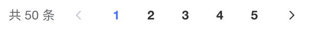
## 1. 渲染分页
> 页数 = 总数 / 每页条数

```jsx
data() {
  return {
    total: 0
  }
}


async getExterpriseList() {
  const res = await getEnterpriseListAPI(this.params)
  this.exterpriseList = res.data.rows
  this.total = res.data.total
}


<el-pagination
  layout="total, prev, pager, next"
  :total="total"
  :page-size="params.pageSize"
/>
```

## 2. 点击实现分页切换
> 实现思路：
> 1. 通过事件拿到当前页数
> 2. 以当前页数作为参数发送数据请求获取当前页数据
> 3. 重新把列表交给buildingList


```jsx
<el-pagination
  @current-change="pageChange"
/>

pageChange(page) {
  // 更改参数
  this.params.page = page
  // 重新获取数据渲染
  this.getExterpriseList()
}
```
# 查询搜索


> 业务背景：
> 1. 用户输入查询内容之后点击查询按钮以当前输入关键词做为参数获取数据
> 2. 点击清空按钮时复原初始数据
> 
思路：作为查询的name其实也是一个接口参数，通过input双向绑定，然后通过它来获取数据重新渲染列表


```jsx
// 增加新的name查询字段
data() {
  return {
    params: {
      page: 1,
      pageSize: 10,
      name: '' // 增加字段name
    }
  }
}

// 绑定查询回调
<div class="search-container">
  <div class="search-label">企业名称：</div>
  <el-input v-model="params.name" clearable placeholder="请输入内容" class="search-main" @clear="doSearch" />
  <el-button type="primary" @click="doSearch">查询</el-button>
</div>

// 准备查询后调方法
doSearch() {
  this.params.page = 1
  this.getExterpriseList()
}
```
# 添加企业
## 1. 功能演示和绑定路由
**准备组件**
```vue
<template>
  <div class="add-enterprise">
    <header class="add-header">
      <div class="left">
        <span class="arrow" @click="$router.back()"><i class="el-icon-arrow-left" />返回</span>
        <span>|</span>
        <span>添加企业</span>
      </div>
      <div class="right">
        黑马程序员
      </div>
    </header>
    <main class="add-main">
      <div class="form-container">
        <div class="title">企业信息</div>
        <div class="form">
          <el-form ref="ruleForm" label-width="100px">
            <el-form-item label="企业名称" prop="name">
              <el-input v-model="addForm.name" />
            </el-form-item>
            <el-form-item label="法人" prop="name">
              <el-input v-model="addForm.legalPerson" />
            </el-form-item>
            <el-form-item label="注册地址" prop="name">
              <el-input v-model="addForm.registeredAddress" />
            </el-form-item>
            <el-form-item label="所在行业" prop="name">
              <el-select v-model="addForm.industryCode" />
            </el-form-item>
            <el-form-item label="企业联系人" prop="name">
              <el-input v-model="addForm.contact" />
            </el-form-item>
            <el-form-item label="联系电话" prop="name">
              <el-input v-model="addForm.contactNumber" />
            </el-form-item>
            <el-form-item label="营业执照" prop="name" />
          </el-form>
        </div>
      </div>
    </main>
    <footer class="add-footer">
      <div class="btn-container">
        <el-button>重置</el-button>
        <el-button type="primary">确定</el-button>
      </div>
    </footer>
  </div>
</template>

<script>
export default {
  data() {
    return {
      addForm: {
        name: '', // 企业名称
        legalPerson: '', // 法人
        registeredAddress: '', // 注册地址
        industryCode: '', // 所在行业
        contact: '', // 企业联系人
        contactNumber: '', // 联系人电话
        businessLicenseUrl: '', // 营业执照url
        businessLicenseId: '' // 营业执照id
      }
    }
  }
}
</script>

<style scoped lang="scss">
.add-enterprise {
  background-color: #f4f6f8;
  height: 100vh;

  .add-header {
    display: flex;
    justify-content: space-between;
    padding: 0 20px;
    height: 64px;
    line-height: 64px;
    font-size: 16px;
    font-weight: bold;
    background-color: #fff;

    .left {
      span {
        margin-right: 4px;
      }
      .arrow{
        cursor: pointer;
      }
    }

    .right {
      text-align: right;
    }
  }

  .add-main {
    background: #f4f6f8;
    padding: 20px 130px;

    .form-container {
      background-color: #fff;
      .title {
        height: 60px;
        line-height: 60px;
        padding-left:20px;
      }
      .form {
        margin-bottom: 20px;
        padding: 20px 65px 24px;
        .el-form{
          display: flex;
          flex-wrap: wrap;
          .el-form-item{
            width: 50%;
          }
        }
      }
    }
  }

  .add-footer {
    position: fixed;
    bottom: 0;
    width: 100%;
    padding: 24px 50px;
    color: #000000d9;
    font-size: 14px;
    background: #fff;
    text-align: center;
  }
}
</style>
```

**绑定路由**
```javascript
 {
    path: '/exterpriseAdd',
    component: () => import('@/views/park/enterprise/Add')
}
```

**路由跳转**
```html
 <el-button type="primary" @click="$router.push('/exterpriseAdd')">添加企业</el-button>
```
## 2. 行业字段渲染
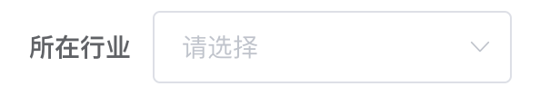
**封装接口**

```javascript
/**
 * 获取行业列表
 * @returns
 */
export function getIndustryListAPI() {
  return request({
    url: '/park/industry'
  })
}
```

**获取数据**
```vue
<script>
import { getIndustryListAPI } from '@/api/enterprise'
export default {
  data() {
    return {
      industryList: [] // 可选行业列表
    }
  },
  mounted() {
    this.getIndustryList()
  },
  methods: {
    async getIndustryList() {
      const res = await getIndustryListAPI()
      this.industryList = res.data
    }
  }
}
</script>
```

**绑定下拉框**
```html
 <el-form-item label="所在行业" prop="name">
    <el-select v-model="addForm.industryCode">
      <el-option
        v-for="item in industryList"
        :key="item.industryCode"
        :value="item.industryCode"
        :label="item.industryName"
      />
    </el-select>
  </el-form-item>
```

**测试效果**
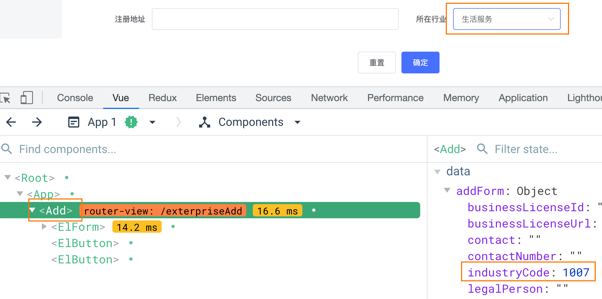


## 3. 营业执照上传基础功能实现
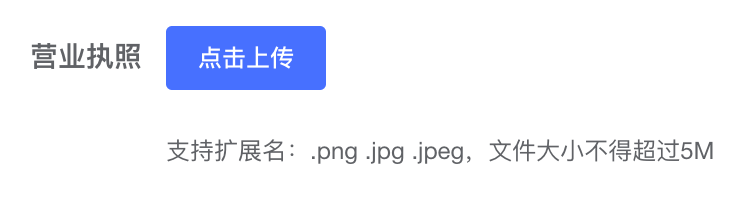

**封装上传接口**

```javascript
/**
 * 上传合同
 * @returns
 */
export function uploadAPI(data) {
  return request({
    url: '/upload',
    method: 'POST',
    data
  })
}

```

**准备自定义**[**上传组件**](https://element.eleme.cn/#/zh-CN/component/upload)
```html
<el-form-item label="营业执照">
    <el-upload
      action="#"
      :http-request="uploadRequest"
    >
      <el-button size="small" type="primary">点击上传</el-button>
      <div slot="tip" class="el-upload__tip">只能上传jpg/png文件，且不超过500kb</div>
    </el-upload>
</el-form-item>
```

**调用接口完成上传**
```vue
import { getIndustryListAPI, uploadAPI } from '@/apis/enterprise'

async uploadRequest(data) {
  const file = data.file

  // 处理formData类型参数
  const formData = new FormData()
  formData.append('file', file)
  formData.append('type', 'businessLicense')
  const res = await uploadAPI(formData)

  // 赋值表单数据
  this.addForm.businessLicenseId = res.data.id
  this.addForm.businessLicenseUrl = res.data.url
}
```

**验证字段覆盖**
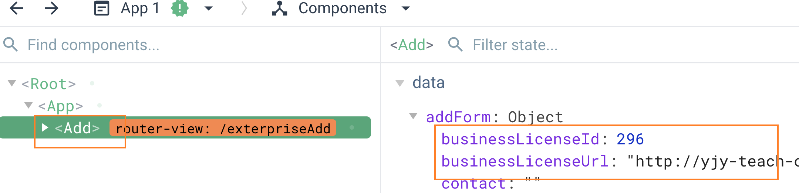

## 4. 上传前验证文件

> 业务背景：通常上传的文件需要我们用程序做一些限制，防止用户选择并不符合要求的文件

```jsx
// 绑定上传前回调
<el-upload
  action="#"
  :http-request="uploadRequest"
  :before-upload="beforeUpload"
  >
  <el-button size="small" type="primary">点击上传</el-button>
  <div slot="tip" class="el-upload__tip">支持扩展名：.png .jpg .jpeg，文件大小不得超过5M</div>
</el-upload>


// 编写校验逻辑
beforeUpload(file) {
  const allowImgType = ['image/jpeg', 'image/png', 'image/jpg'].includes(file.type)
  const isLt5M = file.size / 1024 / 1024 < 5

  if (!allowImgType) {
    this.$message.error('上传合同图片只能是 PNG/JPG/JPEG 格式!')
  }
  if (!isLt5M) {
    this.$message.error('上传合同图片大小不能超过 5MB!')
  }
  return allowImgType && isLt5M
}
```
## 5. 表单校验
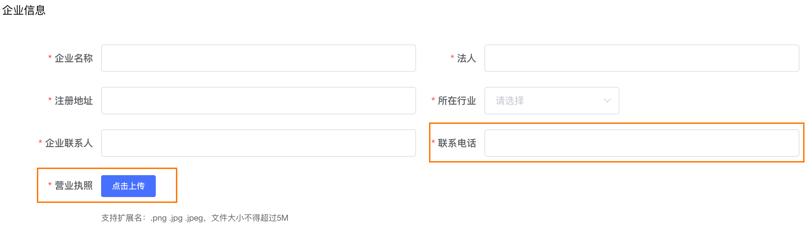
> 业务背景：表单字段可以分为两类：1. 直接通过element默认配置即可解决 2. 需要单独校验的字段

### 1. 表单基础校验
```jsx
// 1. 创建表单规则
data() {
  return {
    addRules: {
      name: [
        { required: true, message: '企业名称为必填', trigger: 'blur' }
      ],
      legalPerson: [
        { required: true, message: '法人为必填', trigger: 'blur' }
      ],
      registeredAddress: [
        { required: true, message: '注册地址为必填', trigger: 'blur' }
      ],
      industryCode: [
        { required: true, message: '所在行业为必填', trigger: 'change' }
      ],
      contact: [
        { required: true, message: '企业联系人为必填', trigger: 'blur' }
      ],
      contactNumber: [
        { required: true, message: '企业联系人电话为必填', trigger: 'blur' }
      ],
      businessLicenseId: [
        { required: true, message: '请上传营业执照', trigger: 'blur' }
      ]
    }
  }
}

// 2. 绑定表单规则
<el-form :model="addForm" :rules="addRules" label-width="100px">
  <el-form-item label="企业名称" prop="name">
    <el-input v-model="addForm.name" />
  </el-form-item>
  <el-form-item label="法人" prop="legalPerson">
    <el-input v-model="addForm.legalPerson" />
  </el-form-item>
  <el-form-item label="注册地址" prop="registeredAddress">
    <el-input v-model="addForm.registeredAddress" />
  </el-form-item>
  <el-form-item label="所在行业" prop="industryCode">
    <el-select v-model="addForm.industryCode">
      <el-option
        v-for="item in industryList"
        :key="item.industryCode"
        :value="item.industryCode"
        :label="item.industryName"
      />
    </el-select>
  </el-form-item>
  <el-form-item label="企业联系人" prop="contact">
    <el-input v-model="addForm.contact" />
  </el-form-item>
  <el-form-item label="联系电话" prop="contactNumber">
    <el-input v-model="addForm.contactNumber" />
  </el-form-item>
  <el-form-item label="营业执照" prop="businessLicenseId">
    <el-upload
      action="#"
      :http-request="uploadRequest"
      :before-upload="beforeUpload"
    >
      <el-button size="small" type="primary">点击上传</el-button>
      <div slot="tip" class="el-upload__tip">支持扩展名：.png .jpg .jpeg，文件大小不得超过5M</div>
    </el-upload>
  </el-form-item>
</el-form>
```

### 2. 统一校验
> 点击确认按钮 统一校验所有项
> 核心：获取到表单组件实例对象  -> 调用实例方法（validate）

```jsx
<el-form ref="ruleForm"></el-form>

<el-button type="primary" @click="confirmSubmit">确定</el-button>

confirmSubmit() {
  this.$refs.ruleForm.validate(valid => {
    console.log(valid)
  })
}
```

### 3. 正则校验手机号
> 场景：复杂的校验场景，默认的那些规则不够用，组件提供了通过自定义校验函数方式

```jsx
const validatePhone = (rule, value, callback) => {
  if (/^1[3-9]\d{9}$/.test(value)) {
    callback()
  } else {
    callback(new Error('请输入正常的手机号'))
  }
}

contactNumber: [
    { required: true, message: '企业联系人电话为必填', trigger: 'blur' },
    { validator: validatePhone, trigger: 'blur' }
]
```
### 4. 上传完毕单独校验营业执照字段
> 业务背景: 上传营业执照完毕之后并不能让校验痕迹消失掉，愿意是因为el-form表单校验系统不能得到上传之后的通知
> 解决办法：在上传完毕之后手动校验营业执照字段

```jsx
async uploadRequest(data) {
    // 上传逻辑...
     
    // 单独校验表单，清除错误信息
    this.$refs.ruleForm.validateField('businessLicenseId')
}
```
### 5. 提交表单
> 收集表单数据 - 调用接口 - 提示用户+返回列表页显示新项

1-封装新增接口
```javascript
/**
 * 创建公司
 * @param {*} data
 * @returns
 */
export function createExterpriseAPI(data) {
  return request({
    url: '/park/enterprise',
    method: 'POST',
    data
  })
}
```
2-点击提交
```javascript
confirmSubmit() {
  this.$refs.ruleForm.validate(async valid => {
    if (!valid) return
    // 1. 调用接口
    await createExterpriseAPI(this.addForm)
    // 2. 返回列表页
    this.$router.back()
  })
}
```
# 编辑企业
> 提供用户二次修改的机会 把一些已经存在的数据进行更新操作
> 编辑和新增：
>  1. 大部分的东西是可以复用的  表单的结构 表单校验逻辑 提交逻辑
>  2. 编辑的时候需要做数据回填 用到当前要编辑谁 把它的id拿过来

## 携带参数跳转编辑页
```vue
<el-button 
  size="mini" 
  type="text" 
  @click="editRent(scope.row.id)"
  >编辑</el-button>
  
editRent(id) {
  this.$router.push({
    path: '/exterpriseAdd',
    query: {
      id
    }
  })
}
```
## 根据id适配文案显示
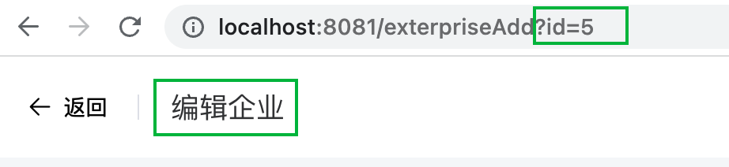
> 如果参数有id代表当前是编辑状态，如果没有则是新增状态

```vue
<el-page-header 
  :content="`${id?'编辑企业':'添加企业'}`" 
  @back="$router.back()" />


computed: {
  id() {
    return this.$route.query.id
  }
}
```
## 回填企业数据
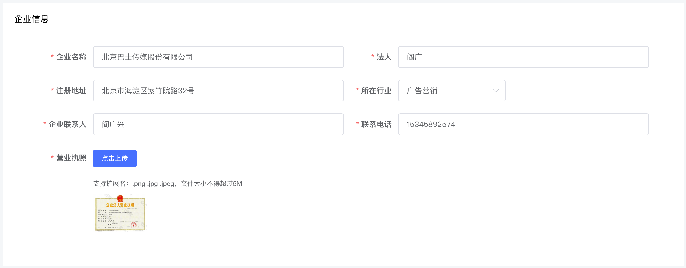
1- 封装接口

```javascript
/**
 * 获取合同详情
 * @param {*} id
 * @returns
 */
export function getEnterpriseDetailAPI(id) {
  return request({
    url: `/park/enterprise/${id}`
  })
}
```

2- 调用接口回填数据
```vue
async getEnterpriseDetail() {
  const res = await getEnterpriseDetailAPI(this.rentId)
  const { businessLicenseId, businessLicenseUrl, contact, contactNumber, industryCode, legalPerson, name, registeredAddress } = res.data
  this.addForm = { businessLicenseId, businessLicenseUrl, contact, contactNumber, industryCode, legalPerson, name, registeredAddress }
}

mounted() {
  // 省略代码 有合同id 调用详情接口
  if (this.Id) {
    this.getEnterpriseDetail()
  }
}
```
## 编辑确认修改
> 根据编辑和新增状态，调用不同借口

1- 封装编辑更新接口
```javascript
/**
 * 更新企业
 * @param {*} data
 * @returns
 */
export function updateExterpriseAPI(data) {
  return request({
    url: '/park/enterprise',
    method: 'PUT',
    data
  })
}

```
2- 区分状态接口提交
```javascript
confirmSubmit() {
  this.$refs.ruleForm.validate(async valid => {
    console.log(valid)
    if (this.id) {
      // 编辑
      await updateExterpriseAPI({
        ...this.addForm,
        id: this.Id
      })
    } else {
      // 新增
      await createExterpriseAPI(this.addForm)
    }
    this.$router.back()
  })
}
```
# 删除功能实现
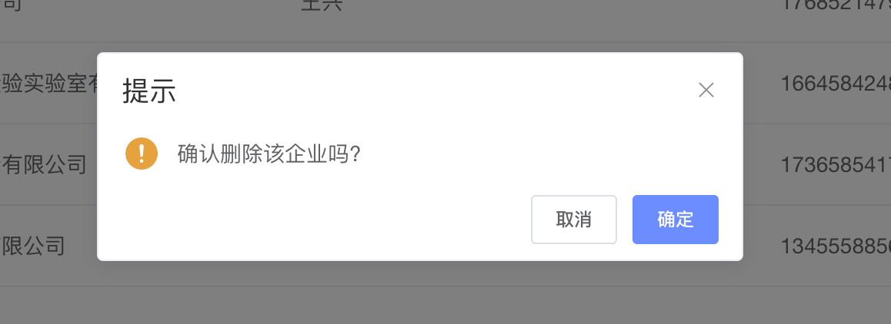
1- 封装接口函数

```vue
/**
 * 删除企业
 * @param {*} id
 * @returns
 */
export function delExterpriseAPI(id) {
  return request({
    url: `/park/enterprise/${id}`,
    method: 'DELETE'
  })
}
```
2- 绑定事件执行删除
```javascript
<el-table-column label="操作">
  <template #default="scope">
    <el-button size="mini" type="text">添加合同</el-button>
    <el-button size="mini" type="text">查看</el-button>
    <el-button size="mini" type="text">编辑</el-button>
    <el-button size="mini" type="text" @click="delExterprise(scope.row.id)">删除</el-button>
  </template>
</el-table-column>

delExterprise(id) {
  this.$confirm('确认删除该企业吗?', '提示', {
    confirmButtonText: '确定',
    cancelButtonText: '取消',
    type: 'warning'
  }).then(async() => {
    await delExterpriseAPI(id)
    this.getExterpriseList()
    this.$message({
      type: 'success',
      message: '删除成功!'
    })
  })
}
```
# 创建合同
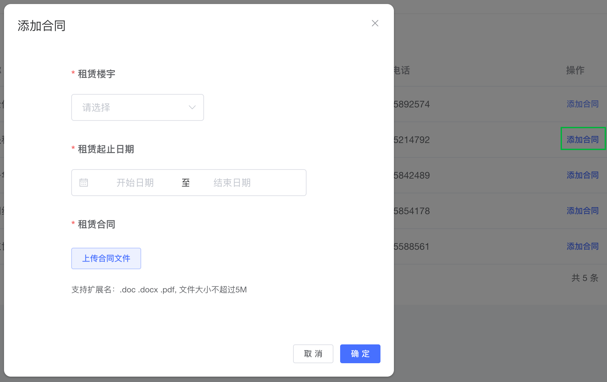
## 控制弹框打开关闭
> 通过 `visible` 属性的true和false切换打开关闭弹框

```vue
<el-button size="mini" type="text" @click="addRent()">添加合同</el-button>


<el-dialog
  title="添加合同"
  :visible="rentDialogVisible"
  width="580px"
  @close="closeDialog"
  >
  <!-- 表单区域 -->
  <div class="form-container">

  </div>
  <template #footer>
    <el-button size="mini" @click="closeDialog">取 消</el-button>
    <el-button size="mini" type="primary">确 定</el-button>
  </template>
</el-dialog>


data(){
  return {
    rentDialogVisible:false
  }
}

methods:{
  // 打开
  addRent(){
    this.rentDialogVisible = true
  },
  // 关闭
  closeDialog(){
    this.rentDialogVisible = false
  }
}
```

## 准备表单
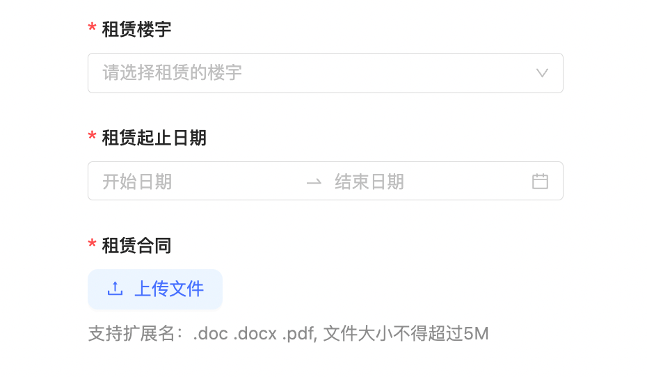
```vue
<!-- 表单模版 -->
<div class="form-container">
  <el-form ref="addForm" :model="rentForm" :rules="rentRules" label-position="top">
    <el-form-item label="租赁楼宇" prop="buildingId">
      <el-select v-model="rentForm.buildingId" placeholder="请选择">
        <el-option
          v-for="item in []"
          :key="item.id"
          :label="item.name"
          :value="item.id"
        />
      </el-select>
    </el-form-item>
    <el-form-item label="租赁起止日期" prop="rentTime">
      <el-date-picker
        v-model="rentForm.rentTime"
        type="daterange"
        range-separator="至"
        start-placeholder="开始日期"
        end-placeholder="结束日期"
        value-format="yyyy-MM-dd"
      />
    </el-form-item>
    <el-form-item label="租赁合同" prop="contractId">
      <el-upload
        action="#"
      >
        <el-button size="small" type="primary" plain>上传合同文件</el-button>
        <div slot="tip" class="el-upload__tip">支持扩展名：.doc .docx .pdf, 文件大小不超过5M</div>
      </el-upload>
    </el-form-item>
  </el-form>
</div>

data(){
  return {
    rentForm: {
        buildingId: null, // 楼宇id
        contractId: null, // 合同id
        contractUrl: '', // 合同Url
        enterpriseId: null, // 企业名称
        type: 0, // 合同类型
        rentTime: [] // 合同时间
    },
    rentRules: {
        buildingId: [
          { required: true, message: '请选择楼宇', trigger: 'change' }
        ],
        rentTime: [
          { required: true, message: '请选择租赁日期', trigger: 'change' }
        ],
        contractId: [
          { required: true, message: '请上传合同文件' }
        ]
    }
  }
}
```
## 获取楼宇下拉框数据
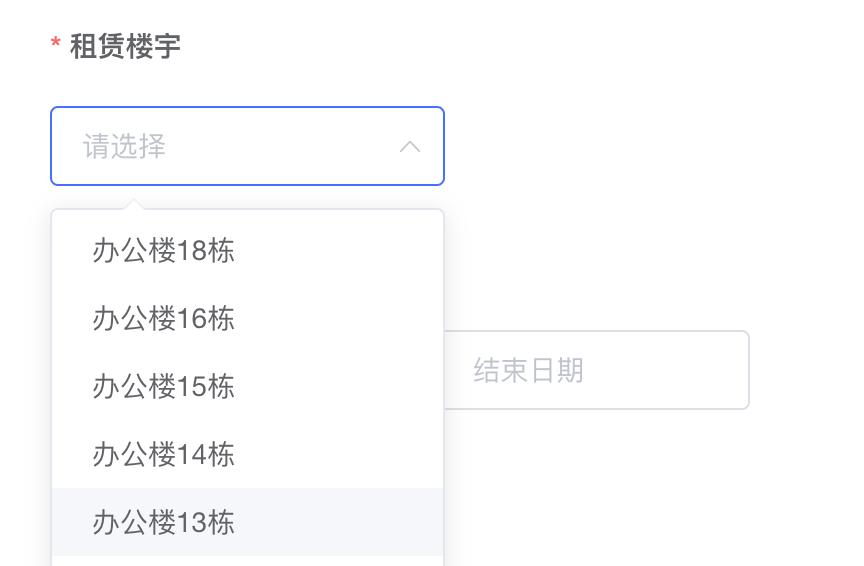
1- 封装获取楼宇列表接口

```javascript
/**
 * 获取楼宇列表
 * @param {*} id
 * @returns
 */
export function getRentBuildListAPI() {
  return request({
    url: '/park/rent/building'
  })
}

```
2- 打开弹框时调用接口
```javascript
import { getRentBuildListAPI } from '@/apis/enterprise'


// 打开弹框
async addRent(enterpriseId) {
  this.rentDialogVisible = true
  // 获取楼宇下拉列表
  const res = await getRentBuildListAPI()
  this.buildList = res.data
}
```
3- 渲染下拉列表视图模版
```html
<el-form-item label="租赁楼宇" prop="buildingId">
  <el-select v-model="rentForm.buildingId" placeholder="请选择">
    <el-option
      v-for="item in buildList"
      :key="item.id"
      :label="item.name"
      :value="item.id"
    />
  </el-select>
</el-form-item>
```
## 上传合同文件
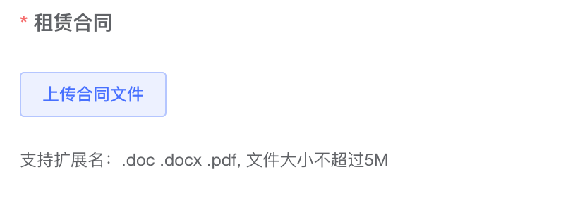
> 1. 把文件处理为FormData类型
> 2. 上传文件并保存返回的合同文件id和url地址
> 3. 单独校验表单字段


```vue
<el-form-item label="租赁合同" prop="contractId">
  <el-upload
    action="#"
    :http-request="uploadHandle"
  >
    <el-button size="small" type="primary" plain>上传合同文件</el-button>
    <div slot="tip" class="el-upload__tip">支持扩展名：.doc .docx .pdf, 文件大小不超过5M</div>
  </el-upload>
</el-form-item


// 上传合同
async uploadHandle(fileData) {
  // 1. 处理FormData
  const { file } = fileData
  const formData = new FormData()
  formData.append('file', file)
  formData.append('type', 'contract')
  // 2. 上传并赋值
  const res = await uploadAPI(formData)
  const { id, url } = res.data
  this.rentForm.contractId = id
  this.rentForm.contractUrl = url
  // 单独校验表单
this.$refs.addForm.validate('contractId')
  
}
```
## 提交表单创建合同
> 重点：按照后端接口要求，处理数据再做提交

1- 封装接口
```javascript
/**
 * 创建合同
 * @param {*}
 * @returns
 */
export function createRentAPI(data) {
  return request({
    url: '/park/enterprise/rent',
    method: 'POST',
    data
  })
}
```
2- 补充企业id参数
```vue
<el-button size="mini" type="text" @click="addRent(row.id)">添加合同</el-button>
  
// 添加合同
addRent(id) {
  this.dialogVisible = true
  // 把企业id存入表单对象
  this.rentForm.enterpriseId = id
}
```
3- 处理参数提交表单
```javascript
 // 确认提交
confirmAdd() {
  this.$refs.addForm.validate(async valid => {
    if (valid) {
      const { buildingId, contractId, contractUrl, enterpriseId, type } = this.rentForm
      await createRentAPI({
        buildingId, contractId, contractUrl, enterpriseId, type,
        startTime: this.rentForm.rentTime[0],
        endTime: this.rentForm.rentTime[1]
      })
      // 更新列表
      this.getExterpriseList()
      // 关闭弹框
      this.rentDialogVisible = false
    }
  })
}
```
# 显示合同列表
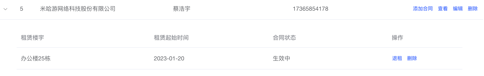
## 准备Table静态结构
> el-table支持嵌套内容，只需要在el-table-column组件上添加type属性，指定值为 `expand`

```vue
<el-table-column type="expand">
  <template #default>
    <el-table>
      <el-table-column label="租赁楼宇" width="320" prop="buildingName" />
      <el-table-column label="租赁起始时间" prop="startTime" />
      <el-table-column label="合同状态" prop="status" />
      <el-table-column label="操作" width="180">
        <template #default="scope">
          <el-button size="mini" type="text">退租</el-button>
          <el-button size="mini" type="text">删除</el-button>
        </template>
      </el-table-column>
    </el-table>
  </template>
</el-table-column>
```

## 获取当前合同列表
1- 封装接口函数
```vue
/**
 * 获取合同列表
 * @param {*} id
 * @returns
 */
export function getRentListAPI(id) {
  return request({
    url: `/park/enterprise/rent/${id}`
  })
}
```
2- 展开时获取合同数据
```vue
// 1. 绑定事件 & 绑定数据
<el-table style="width: 100%" :data="exterpriseList" 
  @expand-change="expandHandle">

<el-table-column type="expand">
  <template #default="{row}">
    <el-table :data="row.rentList">
      <el-table-column label="租赁楼宇" width="320" prop="buildingName" />
      <el-table-column label="租赁起始时间" prop="startTime" />
      <el-table-column label="合同状态" prop="status" />
      <el-table-column label="操作" width="180">
        <template #default="scope">
          <el-button size="mini" type="text">续租</el-button>
          <el-button size="mini" type="text">退租</el-button>
          <el-button size="mini" type="text">删除</el-button>
        </template>
      </el-table-column>
    </el-table>
  </template>
</el-table-column>


// 2. 初始化时增加合同数据默认列表   
async getExterpriseList() {
  const res = await getEnterpriseListAPI(this.params)
  this.exterpriseList = res.data.rows.map((item) => {
    return {
      ...item,
      rentList: [] // 每一行补充存放合同的列表
    }
  })
  this.total = res.data.total
}
    

// 3. 只有展开时获取数据并绑定
async expandHandle(row, rows) {
  console.log('展开或关闭', row, rows)
  const isExpend = rows.find(item => item.id === row.id)
  if (isExpend) {
    const res = await getRentListAPI(row.id)
    // eslint-disable-next-line require-atomic-updates
    row.rentList = res.data
  }
}
```

## 适配合同状态
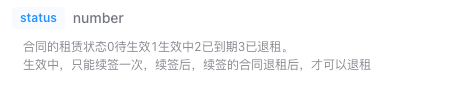
```jsx
// 格式化tag类型
formatInfoType(status) {
  const MAP = {
    0: 'warning',
    1: 'success',
    2: 'info',
    3: 'danger'
  }
  // return 格式化之后的中文显示
  return MAP[status]
}

// 格式化status
formartStatus(type) {
  const TYPEMAP = {
    0: '待生效',
    1: '生效中',
    2: '已到期',
    3: '已退租'
  }
  return TYPEMAP[type]
}

<el-table-column label="合同状态">
  <template #default="scope">
    <el-tag :type="formatInfoType(scope.row.status)"> 
      {{ formatStatus(scope.row.status) }}
    </el-tag>
  </template>
</el-table-column>
```
# 合同退租状态修改
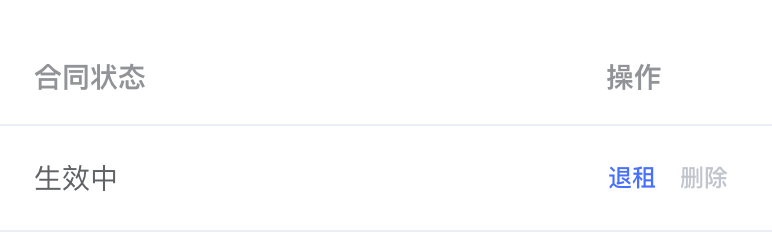


## 封装接口
```javascript
/**
 * 退租
 * @param {合同id} rentId
 * @returns
 */

export function outRentAPI(rentId) {
  return request({
    url: `/park/enterprise/rent/${rentId}`,
    method: 'PUT'
  })
}
```

## 修改状态
```vue
<el-table-column label="操作" width="180" fixed="right">
  <template #default="scope">
    <el-button size="mini" type="text" @click="outRent(scope.row.id)">退租</el-button>
    <el-button size="mini" type="text" >删除</el-button>
  </template>
</el-table-column>


outRent(rentId) {
  this.$confirm('确认退租吗?', '提示', {
    confirmButtonText: '确定',
    cancelButtonText: '取消',
    type: 'warning'
  }).then(async() => {
    // 1. 调用接口
    await outRentAPI(rentId)
    // 2. 重新拉取列表
    this.getEnterpriseListAPI()
    this.$message({
      type: 'success',
      message: '退租成功!'
    })
  }).catch(() => {
    this.$message({
      type: 'info',
      message: '已取消删除'
    })
  })
}
```

## 适配视图状态

```vue
<el-table-column label="操作" width="180" fixed="right">
  <template #default="scope">
    <el-button size="mini" type="text" :disabled="scope.row.status === 3" @click="outRent(scope.row.id)">退租</el-button>
    <el-button size="mini" type="text" :disabled="scope.row.status !== 3">删除</el-button>
  </template>
</el-table-column>
```
# 查看企业
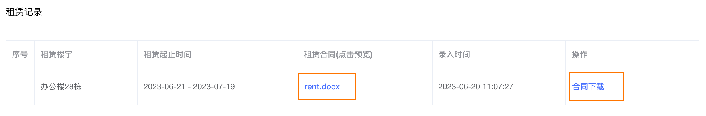
## 准备路由
```typescript
<template>
  <div class="detail-enterprise">
    <header class="add-header">
      <el-page-header content="查看企业" @back="$router.back()" />
    </header>
    <main class="add-main">
      <div class="form-container">
        <div class="title">租赁记录</div>
        <div class="table-container">
          <el-table
            :data="[]"
            style="width: 100%"
            border
          >
            <el-table-column
              prop="index"
              label="序号"
              width="50"
            />
            <el-table-column
              prop="name"
              label="租赁楼宇"
              width="180"
            />
            <el-table-column
              label="租赁起止时间"
              width="280"
            >
              <template #default="{row}">
                {{ row.startTime }} - {{ row.endTime }}
              </template>
            </el-table-column>
            <el-table-column
              label="租赁合同(点击预览)"
            >
              <template #default="{row}">
                <el-button type="text">
                  {{ row.contractName }}
                </el-button>
              </template>
            </el-table-column>
            <el-table-column
              prop="createTime"
              label="录入时间"
            />
            <el-table-column
              prop="address"
              label="操作"
            >
              <template #default="{row}">
                <el-button type="text">合同下载</el-button>
              </template>
            </el-table-column>
          </el-table>
        </div>

      </div>
    </main>

  </div>
</template>

<script>
export default {
  data() {
    return {
      
    }
  }
}
</script>

<style scoped lang="scss">
.detail-enterprise {
  background-color: #f4f6f8;
  height: 100vh;

  .add-header {
    display: flex;
    align-items: center;
    padding: 0 20px;
    height: 64px;
    background-color: #fff;

    .left {
      span {
        margin-right: 4px;
      }
      .arrow{
        cursor: pointer;
      }
    }

    .right {
      text-align: right;
    }
  }

  .add-main {
    background: #f4f6f8;
    padding: 20px 130px;

    .form-container {
      background-color: #fff;
      margin-bottom: 20px;
      .title {
        height: 60px;
        line-height: 60px;
        padding-left: 20px;
      }
    }
    .table-container{
      padding:20px;
    }
    .preview{
      img{
        width: 100px;
      }
    }
  }
}
</style>
```

```javascript
{
    path: '/exterpriseDetail',
    component: () => import('@/views/park/enterprise/Detail')
}
```
## 渲染列表
1- 封装接口
```javascript
/**
 * 获取详情
 * @param {企业id} id
 * @returns
 */

export function getEnterpriseDetail(id) {
  return request({
    url: `/park/enterprise/${id}`,
    method: 'GET'
  })
}
```
2- 渲染数据
```vue
<template>
  <div class="detail-enterprise">
    <header class="add-header">
      <el-page-header content="查看企业" @back="$router.back()" />
    </header>
    <main class="add-main">
      <div class="form-container">
        <div class="title">租赁记录</div>
        <div class="table-container">
          <el-table
            :data="form.rent"
            style="width: 100%"
            border
          >
            <el-table-column
              prop="index"
              label="序号"
              width="50"
            />
            <el-table-column
              prop="name"
              label="租赁楼宇"
              width="180"
            />
            <el-table-column
              label="租赁起止时间"
              width="280"
            >
              <template #default="{row}">
                {{ row.startTime }} - {{ row.endTime }}
              </template>
            </el-table-column>
            <el-table-column
              label="租赁合同(点击预览)"
            >
              <template #default="{row}">
                <el-button type="text">
                  {{ row.contractName }}
                </el-button>
              </template>
            </el-table-column>
            <el-table-column
              prop="createTime"
              label="录入时间"
            />
            <el-table-column
              prop="address"
              label="操作"
            >
              <template #default="{row}">
                <el-button type="text">合同下载</el-button>
              </template>
            </el-table-column>
          </el-table>
        </div>
      </div>
    </main>
  </div>
</template>

<script>
import { getEnterpriseDetail } from '@/apis/enterprise'
export default {
  data() {
    return {
      form: {}
    }
  },
  mounted() {
    this.getDetail()
  },
  methods: {
    async getDetail() {
      const res = await getEnterpriseDetail(this.$route.query.id)
      this.form = res.data
    }
  }
}
</script>
```
## 预览功能实现
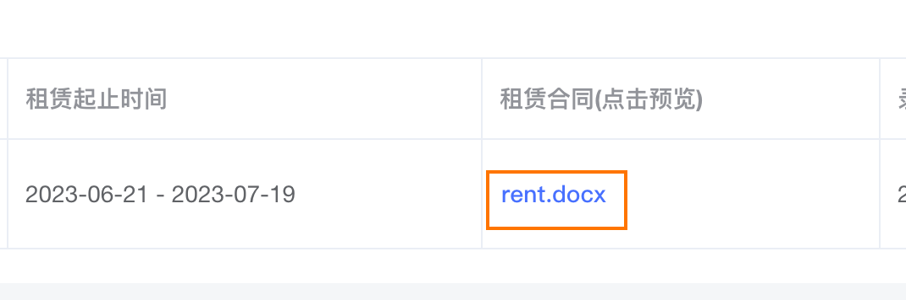
> 预览地址拼接上合同文件链接地址在新窗口打开

```vue
<el-button type="text">
  <a :href="`${previewURL}${row.contractUrl}`" target="_blank">
    {{ row.contractName }}
  </a>
</el-button>

data() {
  return {
    previewURL: 'https://view.officeapps.live.com/op/view.aspx?src=' // 预览地址
  }
}
```
## 下载功能
```vue
<el-table-column
  prop="address"
  label="操作"
>
  <template #default="{row}">
    <el-button type="text"><a :href="row.contractUrl">合同下载</a></el-button>
  </template>
</el-table-column>
```
