# 获取角色列表
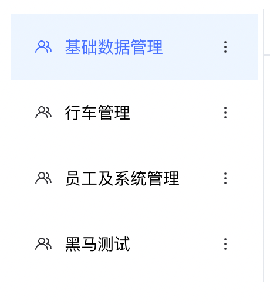
## 准备静态结构
```vue
<template>
  <div class="role-container">
    <div class="left-wrapper">
      <div v-for="item in []" :key="item.roleId" class="role-item">
        <div class="role-info">
          <svg-icon icon-class="user" class="icon" />
          管理员
        </div>
        <div class="more">
          <svg-icon icon-class="more"/>
        </div>
      </div>
       <el-button class="addBtn" size="mini">添加角色</el-button>
    </div>
  </div>
</template>

<script>
export default {
  name: 'Role',
}
</script>

<style scoped lang="scss">
.role-container {
  display: flex;
  font-size: 14px;
  background-color: #fff;
  padding:20px;
  .left-wrapper {
    width: 200px;
    border-right: 1px solid #e4e7ec;
    padding: 4px;
    text-align: center;

    .role-item {
      position: relative;
      height: 56px;
      display: flex;
      align-items: center;
      justify-content: space-between;
      padding: 0 20px;
      cursor: pointer;

      &.active {
        background: #edf5ff;
        color: #4770ff;
      }
    }

    .role-info {
      display: flex;
      align-items: center;

      .icon {
        margin-right: 10px;
      }
    }

    .more {
      display: flex;
      align-items: center;
    }
    .addBtn{
      width: 100%;
      margin-top: 20px;
    }
  }

  .right-wrapper {
    flex: 1;

    .tree-wrapper {
      display: flex;
      justify-content: space-between;

      .tree-item {
        flex: 1;
        border-right: 1px solid #e4e7ec;
        padding: 0px 4px;
        text-align: center;
        .tree-title {
          background: #f5f7fa;
          text-align: center;
          padding: 10px 0;
          margin-bottom: 12px;
        }
      }
    }

    ::v-deep .el-tabs__nav-wrap {
      padding-left: 20px;
    }

    .user-wrapper{
      padding:20px;
    }
  }
}
</style>
```
## 封装接口
```javascript
/**
 * 获取角色列表
 * @param { page, pageSize} params
 * @returns
 */
export function getRoleListAPI(params) {
  return request({
    url: '/park/sys/role',
    params
  })
}
```
## 编写渲染逻辑
```vue
<template>
  <div class="role-container">
    <div class="left-wrapper">
      <div v-for="item in roleList" :key="item.roleId" class="role-item">
        <div class="role-info">
          <svg-icon icon-class="user" class="icon" />
          {{ item.roleName }}
        </div>
        <div class="more">
          <svg-icon name="more" />
        </div>
      </div>
       <el-button class="addBtn" size="mini">添加角色</el-button>
    </div>
  </div>
</template>

<script>
import { getRoleListAPI } from '@/apis/system'
export default {
  name: 'Role',
  data() {
    return {
      roleList: []
    }
  },
  mounted() {
    this.getRoleList()
  },
  methods: {
    async  getRoleList() {
      const res = await getRoleListAPI()
      this.roleList = res.data
    }
  }
}
</script>

<style scoped lang="scss">
.role-container {
  display: flex;
  font-size: 14px;
  background-color: #fff;
  padding:20px;
  .left-wrapper {
    width: 200px;
    border-right: 1px solid #e4e7ec;
    padding: 4px;
    text-align: center;

    .role-item {
      position: relative;
      height: 56px;
      display: flex;
      align-items: center;
      justify-content: space-between;
      padding: 0 20px;
      cursor: pointer;

      &.active {
        background: #edf5ff;
        color: #4770ff;
      }
    }

    .role-info {
      display: flex;
      align-items: center;

      .icon {
        margin-right: 10px;
      }
    }

    .more {
      display: flex;
      align-items: center;
    }
    .addBtn{
      width: 100%;
      margin-top: 20px;
    }
  }

  .right-wrapper {
    flex: 1;

    .tree-wrapper {
      display: flex;
      justify-content: space-between;

      .tree-item {
        flex: 1;
        border-right: 1px solid #e4e7ec;
        padding: 0px 4px;
        text-align: center;
        .tree-title {
          background: #f5f7fa;
          text-align: center;
          padding: 10px 0;
          margin-bottom: 12px;
        }
      }
    }

    ::v-deep .el-tabs__nav-wrap {
      padding-left: 20px;
    }

    .user-wrapper{
      padding:20px;
    }
  }
}
</style>
```
# 角色列表点击激活交互实现
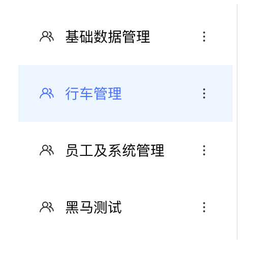
> 核心实现思路：
> 1. 记录当前点击激活项index
> 2. 通过动态类名class控制 `role-item元素的激活类名`
> 3. 通过动态类名class控制 `svg-icon组件的name属性` 

```vue
<template>
  <div
    v-for="(item,index) in roleList"
    :key="item.roleId"
    class="role-item"
    :class="{active: index === activeIndex}"
    @click="changeRole(index)"
  >
    <div class="role-info">
      <svg-icon :icon-class="index === activeIndex ? 'user-active' : 'user'" class="icon" />
      {{ item.roleName }}
    </div>
    <div class="more">
      <svg-icon icon-class="more" />
    </div>
  </div>
</template>

<script>
export default {
  name: 'Role',
  data() {
    return {
      activeIndex: 0
    }
  },
  methods: {
    // 切换角色
    changeRole(idx) {
      this.activeIndex = idx
    }
  }
}
</script>
```
# 功能权限列表渲染
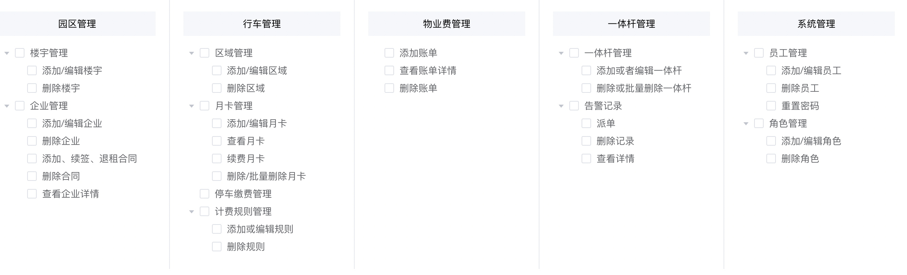
> 核心思路：
> 1. 获取树形数据
> 2. 是用elementUI的tree组件渲染
> 3. 按照业务做细节调整


## 准备模版
```html
<div class="left-wrapper"> 省略代码 </div>

<div class="right-wrapper">
  <div class="tree-wrapper">
    <div v-for="item in []" :key="item.id" class="tree-item">
      <div class="tree-title"> 楼宇管理 </div>
      <el-tree
        :data="[]"
        />
    </div>
  </div>
</div
```
## 封装接口并获取数据
```jsx
/**
 * 获取tree权限列表
 * @returns
 */
export function getTreeListAPI() {
  return request({
    url: '/park/sys/permision/all/tree'
  })
}

// 组件中获取功能权限列表
data() {
  return {
    treeList: [], // 权限树形列表
  }
}

async getTreeList() {
  const res = await getTreeListAPI()
  this.treeList = res.data
}

mounted() {
  this.getTreeList()
}


// 组件中渲染模版
<div v-for="item in treeList" :key="item.id" class="tree-item">
  <div class="tree-title">{{ item.title }}</div>
  <el-tree
    :data="item.children"
    show-checkbox
    default-expand-all
    node-key="id"
  />
</div>
```
##  3. 适配Tree标题
```html
<el-tree
  :props="{ label: 'title' }"
/>
```

## 4. 定制tree样式
> 1. show-checkbox 定制选择框
> 2. default-expand-all 定制默认展开所有

```vue
<!-- 树形结构 -->
<el-tree
  :props="{label:'title'}"
  :data="item.children"
  show-checkbox
  :default-expand-all="true"
/>
```

## 5. 禁用功能实现
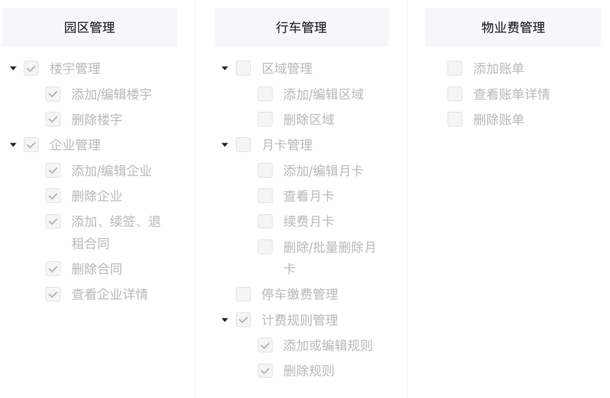
```javascript
// 递归处理函数
function addDisabled(treeList) {
  treeList.forEach(item => {
    item.disabled = true
    // 递归处理
    if (item.children) {
      addDisabled(item.children)
    }
  })
}

// 获取tree数据
async getTreeList() {
  const res = await getTreeListAPI()
  this.treeList = res.data
  // 禁用
  // 目标：treeList里面的每一项以及嵌套的子项都添加一个disabled = true
  addDisabled(this.treeList)
}
```

# 高亮权限点
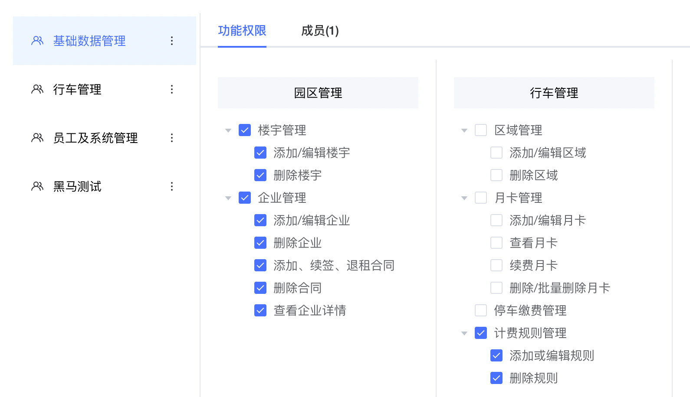

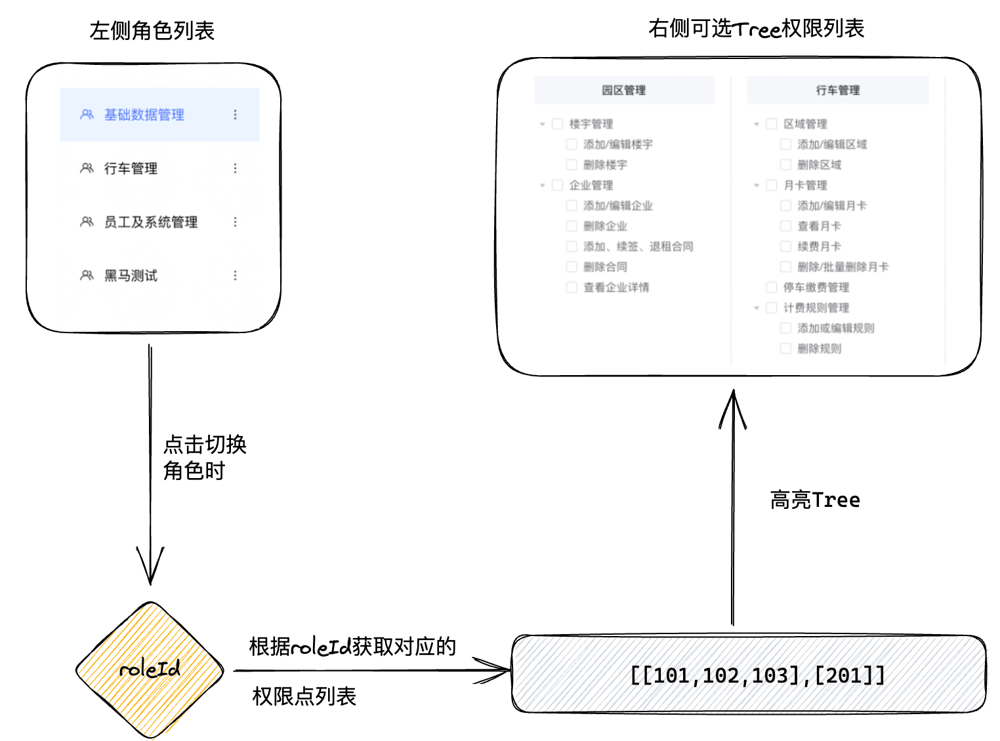

> 核心思路
> 1. 点击左侧角色列表拿到激活角色roleId
> 2. 使用角色roleId获取当前角色对应的权限点数组列表
> 3. 在权限树形组件中完成高亮
> 4. 组件初始化时完成第一个角色对应的Tree高亮


## 1. 点击左侧列表获取roleId
```javascript
// 切换角色是获取roleId
changeRole(idx) {
  this.activeIndex = idx
  // 获取当前角色下的权限点数据列表
  const roleId = this.roleList[idx].roleId
  console.log(roleId)
}
```
## 2. 封装请求接口
```javascript
/**
 * 获取当前角色权限点列表
 * @returns
 */
export function getRoleDetailAPI(roleId) {
  return request({
    url: `/park/sys/role/${roleId}`
  })
}
```
## 3. 根据当前roleId获取权限点列表
```javascript
data() {
  return {
    perms: [] // 当前角色权限点列表
  }
}

// 封装请求方法
async getRoleDetail(roleId) {
  const res = await getRoleDetailAPI(roleId)
  this.perms = res.data.perms
}

// 切换角色
changeRole(idx,roleId) {
  this.activeIndex = idx
  // 获取当前角色下的权限点数据列表
  this.getRoleDetail(roleId)
}
```
## 4. 高亮Tree节点
> 高亮方法：setCheckedKeys 方法

```jsx
<el-tree ref="tree"/>

// 获取当前角色详情
async getRoleDetail(roleId) {
  const res = await getRoleDetailAPI(roleId)
  this.perms = res.data.perms
  // 高亮权限列表
  const treeComponentList = this.$refs.tree
  // 调用setCheckedKeys方法
  treeComponentList.forEach((tree, index) => {
    tree.setCheckedKeys(this.perms[index])
  })
}
```
## 5. 初始化时获取当前角色权限点
> 注意事项：确保roleList和TreeList完成之后，再请求perms

```jsx

// 生命周期里先以第一项roleId获取
async mounted() {
  // 先获取角色列表和可选权限列表
  await this.getRoleList()
  await this.getTreeList()
  // 再获取当前角色下的权限列表
  this.getRoleDetail(this.roleList[0].roleId)   
}
```
# 角色成员列表渲染
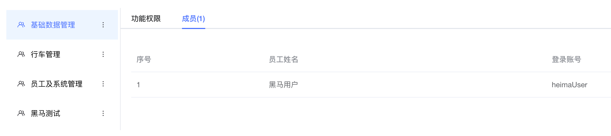
## tabs改造结构
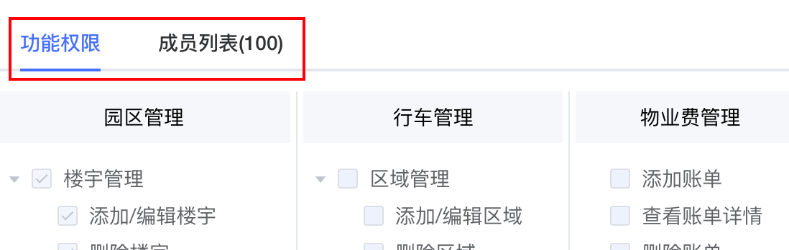
```vue
<el-tabs v-model="activeName">
  <el-tab-pane label="功能权限" name="tree">
    <div class="tree-wrapper">
      <div v-for="item in treeList" :key="item.id" class="tree-item">
        <!-- title -->
        <div class="tree-title">{{ item.title }}</div>
        <!-- 树形结构 -->
        <el-tree
          ref="tree"
          :props="{label:'title'}"
          :data="item.children"
          show-checkbox
          :default-expand-all="true"
          node-key="id"
        />
      </div>
    </div>
  </el-tab-pane>
<el-tab-pane label="成员列表(100)" name="member">成员管理</el-tab-pane>
</el-tabs>


data() {
  return {
    activeName: 'tree' // 默认打开tree
  }
}
```
## 封装接口
```javascript
/**
 * 获取角色成员列表
 * @returns
 */
export function getRoleUserAPI(roleId) {
  return request({
    url: `/park/sys/roleUser/${roleId}`
  })
}
```

## 3. 组件逻辑编写
```jsx
data() {
    return {
      roleUserList: [] // 当前角色下的成员列表
    }
}

// 封装获取当前角色下的成员的方法
async getRoleUserList(roleId) {
  const res = await getRoleUserAPI(roleId)
  this.roleUserList = res.data.rows
}

async mounted() {
  // 获取角色列表（必须加await）
  await this.getRoleList()
  await this.getTreeList()
  this.getRoleDetail(this.roleList[0].roleId)
  this.getRoleUserList(this.roleList[0].roleId)
}

// 切换角色
changeRole(idx) {
    this.activeIndex = idx
    // 1. 获取当前角色下的权限点数据列表
    const roleId = this.roleList[idx].roleId
    this.getRoleDetail(roleId)
    // 2. 获取当前角色下的成员数据列表
    this.getRoleUserList(roleId)
}


// 模版渲染
<el-tab-pane :label="`成员(${roleUserList.length})`" name="user">
  <div class="user-wrapper">
    <el-table
      :data="roleUserList"
      style="width: 100%"
    >
      <el-table-column
        type="index"
        width="250"
        label="序号"
      />
      <el-table-column
        prop="name"
        label="员工姓名"
      />
      <el-table-column
        prop="userName"
        label="登录账号"
      />
    </el-table>
  </div>
</el-tab-pane>
```

# 新增角色
## 准备路由
```vue
<template>
  <div class="add-role">
    <header class="add-header">
      <div class="left">
        <span class="arrow" @click="$router.back()"><i class="el-icon-arrow-left" />返回</span>
        <span>|</span>
        <span>添加角色</span>
      </div>
      <div class="right">
        黑马程序员
      </div>
    </header>
    <main class="add-main">
      <div class="step-container">
        <el-steps direction="vertical" :active="1">
          <el-step title="角色信息" />
          <el-step title="权限信息" />
          <el-step title="检查并完成" />
        </el-steps>
      </div>
      <div class="form-container">
        <div class="title">角色信息</div>
        <div class="form">
          角色信息内容
        </div>
      </div>
      <div class="form-container">
        <div class="title">权限配置</div>
        <div class="form">
          权限配置内容
        </div>
      </div>
      <div class="form-container">
        <div class="title">检查并完成</div>
        <div class="form">
          检查并完成内容
        </div>
      </div>
    </main>
    <footer class="add-footer">
      <div class="btn-container">
        <el-button>上一步</el-button>
        <el-button type="primary">下一步</el-button>
      </div>
    </footer>
  </div>
</template>

<script>
export default {

}
</script>
<style scoped lang="scss">
.add-role {
  background-color: #f4f6f8;
  height: 100vh;

  .add-header {
    display: flex;
    justify-content: space-between;
    padding: 0 20px;
    height: 64px;
    line-height: 64px;
    font-size: 16px;
    font-weight: bold;
    background-color: #fff;

    .left {
      span {
        margin-right: 4px;
      }

      .arrow {
        cursor: pointer;
      }
    }

    .right {
      text-align: right;
    }
  }

  .add-main {
    position: fixed;
    top: 64px;
    bottom: 88px;
    width: 100%;
    overflow-y: auto;
    background: #f4f6f8;
    padding: 20px 230px;
    display: flex;
    .step-container {
      height: 400px;
      width: 200px;
    }
    .form-container {
      flex:1;
      background-color: #fff;
      overflow-y: auto;
      .title {
        height: 60px;
        line-height: 60px;
        padding-left: 20px;
      }
      .form {
        margin-bottom: 20px;
        padding: 20px 65px 24px;
        .el-form {
          display: flex;
          flex-wrap: wrap;
        }
        .info{
          font-size:14px;
          color:#666;
          .form-item{
            margin-bottom:20px;
          }
        }
      }
      .form-box{
        width: 600px;
        display: flex;
        flex-direction: column;
      }
    }
  }

  .add-footer {
    position: fixed;
    bottom: 0;
    width: 100%;
    padding: 24px 50px;
    color: #000000d9;
    font-size: 14px;
    background: #fff;
    text-align: center;
    z-index: 10001;
  }
  .tree-wrapper {
      display: flex;
      justify-content: space-between;
      flex-wrap: wrap;
      .tree-item {
        flex: 1;
        padding: 0px 4px;
        text-align: center;
        .tree-title {
          background: #f5f7fa;
          text-align: center;
          padding: 10px 0;
          margin-bottom: 12px;
        }
      }
    }
}
</style>
```
```javascript
{
  path: '/roleAdd',
  component: () => import('@/views/System/role/AddRole')
}
```

```html
<el-button class="addBtn" size="mini" @click="$router.push('/roleAdd')">
  添加角色
</el-button>
```
## step组件激活控制
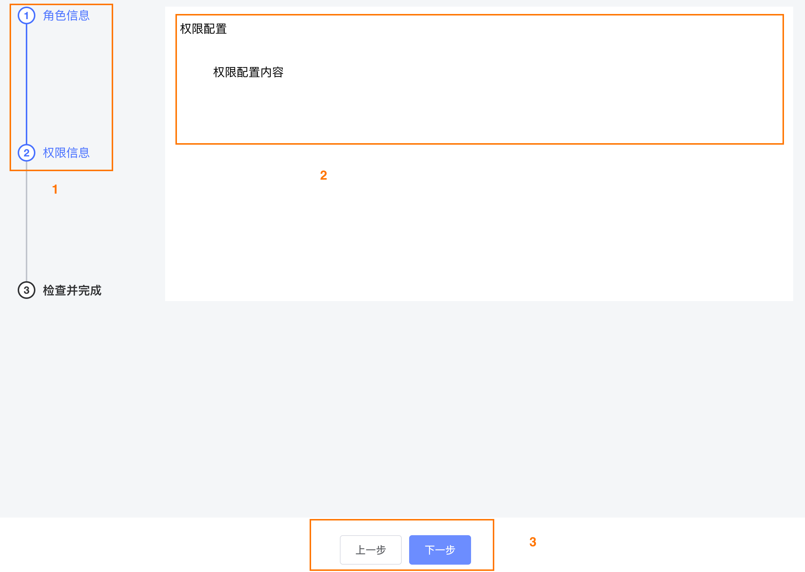
> 核心思路：页面中一共有三种状态，角色信息 -> 权限信息 -> 检查并完成，1-2-3代表着三种状态，我们定义一个状态码activeStep，在上一步和下一步点击的时候操作这个activeStep
> 1. 点击下一步，activeStep++, 到3停下来
> 2. 点击上一步，activeStep--, 到1停下来
> 3. 三种状态的内容区域，通过v-show进行控制显示也隐藏
> 4. 上一步按钮activeStep大于1时才显示，下一步按钮activeStep小于3显示
> 5. 确认添加按钮，activeStep等于3时显示


```vue
<template>
  <div class="add-role">
    <main class="add-main">
      <div class="step-container">
        <el-steps direction="vertical" :active="activeStep">
          <el-step title="角色信息" />
          <el-step title="权限信息" />
          <el-step title="检查并完成" />
        </el-steps>
      </div>
      <div v-show="activeStep === 1" class="form-container">
        <div class="title">角色信息</div>
        <div class="form">
          角色信息内容
        </div>
      </div>
      <div v-show="activeStep === 2" class="form-container">
        <div class="title">权限配置</div>
        <div class="form">
          权限配置内容
        </div>
      </div>
      <div v-show="activeStep === 3" class="form-container">
        <div class="title">检查并完成</div>
        <div class="form">
          检查并完成内容
        </div>
      </div>
    </main>
    <footer class="add-footer">
      <div class="btn-container">
        <el-button v-if="activeStep > 1" @click="decreseStep">上一步</el-button>
        <el-button v-if="activeStep < 3" type="primary" @click="increseStep">下一步</el-button>
        <el-button v-if="activeStep === 3" type="primary">确认添加</el-button>
      </div>
    </footer>
  </div>
</template>
<script>
export default {
  data() {
    return {
      activeStep: 1
    }
  },
  methods: {
    decreseStep() {
      if (this.activeStep === 1) return
      this.activeStep--
    },
    increseStep() {
      if (this.activeStep === 3) return
      this.activeStep++
    }
  }
}
</script>
```
## 角色信息表单校验
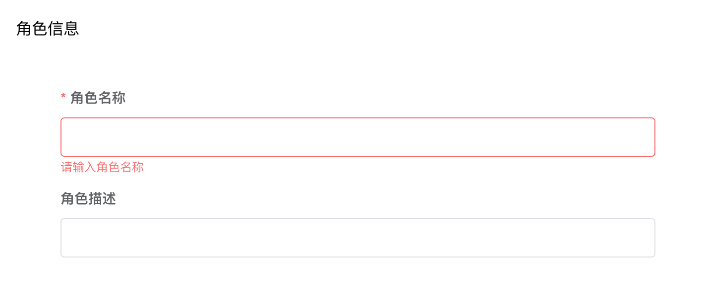
> 核心思路：
> 1. 只有activeStep等于1时，也就是当前处于角色信息状态时才进行校验
> 2. 校验通过之后才能让activeStep++，进入下一个状态

```vue
<div class="form">
  <el-form class="form-box" :model="roleForm" :rules="roleRules">
    <el-form-item label="角色名称" prop="roleName">
      <el-input v-model="roleForm.roleName" />
    </el-form-item>
    <el-form-item label="角色描述">
      <el-input v-model="roleForm.remark" />
    </el-form-item>
  </el-form>
</div>


data() {
  return {
    activeStep: 1,
    roleForm: {
      roleName: '',
      remark: ''
    },
    roleRules: {
      roleName: [
        { required: true, message: '请输入角色名称', trigger: 'blur' }
      ]
    }
  }
}

// 下一步
increseStep() {
  if (this.activeStep === 3) return
  if (this.activeStep === 1) {
    // 当前是角色信息状态，进行表单校验
    this.$refs.roleForm.validate(valid => {
      if (valid) {
        // 校验通过才能进入下一个状态
        this.activeStep++
      }
    })
  }
}
```
## 渲染权限配置初始化Tree列表
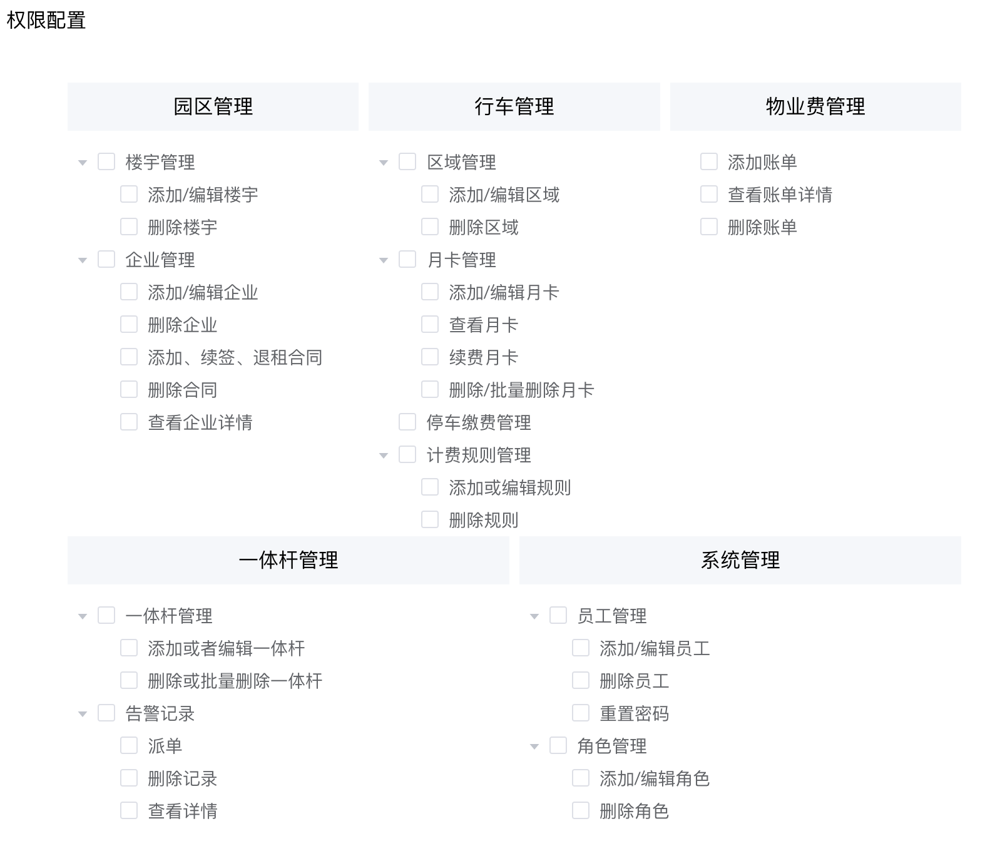
> 核心思路：和列表中所渲染的Tree数据是一样的，选择在组件初始化的时候就渲染到页面中，这样切换到这里的时候体验更好一些

```vue
<template>
   <div class="tree-wrapper">
    <div v-for="item in treeList" :key="item.id" class="tree-item">
      <div class="tree-title">{{ item.title }}</div>
      <el-tree
        ref="tree"
        :data="item.children"
        show-checkbox
        default-expand-all
        node-key="id"
        highlight-current
        :props="{ label: 'title' }"
      />
    </div>
  </div>
</template>

<script>
import { getTreeListAPI } from '@/api/role'
export default {
  data() {
    return {
      treeList: [] // 权限树形列表
    }
  },
  mounted() {
    // 在初始化时候就加载好
    this.getTreeList()
  },
  methods: {
    // 获取功能权限列表
    async getTreeList() {
      const res = await getTreeListAPI()
      this.treeList = res.data
    }
  }
}
</script>
```

## 检查权限配置是否至少选择一项
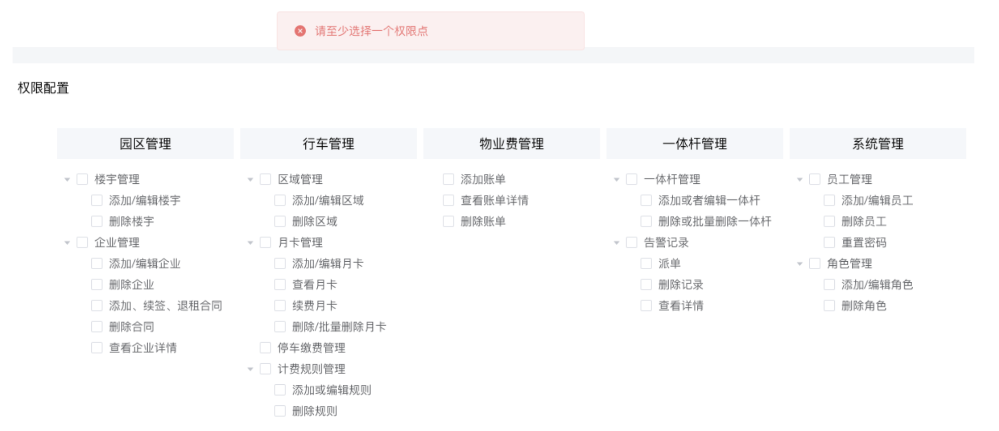
> 核心思路：通过调用Tree实例方法，拿到选中的节点数组，检查数组长度是否为零
> 1. 如果长度为零，代表没有选中任何东西，提示用户，不进入下一步
> 2. 如果长度不为零，代表选中了，直接进入下一步

```vue
 nextStep() {
  if (this.activeStep === 3) return
  if (this.activeStep === 1) {
    // 当前是角色信息状态
  } else if (this.activeStep === 2) {
    // 当前是权限信息状态
    this.roleForm.perms = []
    this.$refs.tree.forEach(tree => {
      this.roleForm.perms.push(tree.getCheckedKeys())
    })
    // 如果长度为零 没有选中任何东西
    if (this.roleForm.perms.flat().length === 0) {
      this.$message({
        type: 'error',
        message: '请至少选择一个权限点'
      })
    } else {
      // 进入到下一页
      this.activeStep++
    }
  }
}
```
## 检查并完成-回填数据
> 核心思路：把前两步用户输入和选择的内容在页面中显示出来，做最后确认，重点是树形数据的回填
> 1. 拿到Tree实例，注意另起一个名字，避免和第二步的tree冲突
> 2. 在成功从状态2进入到状态2时 调用 setCheckedKeys 方法 传入对应的选中节点数组

```jsx
<div v-show="activeStep === 3" class="form-container">
  <div class="title">检查并完成</div>
  <div class="form">
    <div class="info">
      <div class="form-item">角色名称：{{ roleForm.roleName }}</div>
      <div class="form-item">角色描述：{{ roleForm.remark }}</div>
      <div class="form-item">角色权限：</div>
      <div class="tree-wrapper">
        <div v-for="item in diabledTree" :key="item.id" class="tree-item">
          <div class="tree-title">{{ item.title }}</div>
          <el-tree
            ref="diabledTree"
            :data="item.children"
            show-checkbox
            default-expand-all
            node-key="id"
            :highlight-current="false"
            :props="{ label: 'title'}"
          />
        </div>
      </div>
    </div>
  </div>
</div>
  

// 下一步
 nextStep() {
  if (this.activeStep === 3) return
  if (this.activeStep === 1) {
    // 当前是角色信息状态
  } else if (this.activeStep === 2) {
    // 当前是权限信息状态
    this.roleForm.perms = []
    this.$refs.tree.forEach(tree => {
      this.roleForm.perms.push(tree.getCheckedKeys())
    })
    // 如果长度为零 没有选中任何东西
    if (this.roleForm.perms.flat().length === 0) {
      this.$message({
        type: 'error',
        message: '请至少选择一个权限点'
      })
    } else {
      // 如果长度不为零，进入到检查并完成
      this.activeStep++
      // 回填已选择数据
      this.$refs.diabledTree.forEach((tree, index) => {
        tree.setCheckedKeys(this.roleForm.perms[index])
      })
    }
  }
}
```

## 检查并完成-禁用Tree
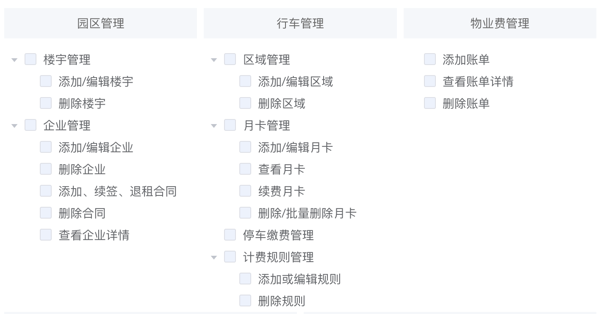
> el-tree组件如果想要全部禁用，需要在每一个Item中都添加一个 disabled 字段 值为true

```vue
<template>
  <div v-for="item in disableTreeList" :key="item.id" class="tree-item">
    <div class="tree-title">{{ item.title }}</div>
    <el-tree
      ref="tree"
      :data="item.children"
      show-checkbox
      default-expand-all
      node-key="id"
      :highlight-current="false"
      :props="{ label: 'title'}"
    />
  </div>
</template>
<script>
// 处理禁用函数
export function addDisabled(treeList) {
  treeList.forEach(item => {
    item.disabled = true
    // 递归处理
    if (item.children && item.children.length > 0) {
      addDisabled(item.children)
    }
  })
}

export default {
  data() {
    return {
      disableTreeList: [] // 禁用的tree列表
    }
  },
  mounted() {
    this.getTreeList()
  },
  methods: {
    async getTreeList() {
      const res = await getTreeListAPI()
      // 分开管理数据(引用类型 一个地方发生变化另一个地方也变 - 深拷贝)
      this.treeList = res.data
      this.disabledTreeList = JSON.parse(JSON.stringify(res.data))
      // 处理禁用
      addDisabled(this.disabledTreeList)
    }
  }
}
</script>
```

## 检查并完成-确认添加


**1-封装接口**
```javascript
/**
 * 创建角色
 * @returns
 */
export function createRoleUserAPI(data) {
  return request({
    url: `/park/sys/role`,
    method: 'POST',
    data
  })
}
```
**2-确认添加**
```vue
import { createRoleUserAPI } from '@/api/system'

async confirmAdd() {
  await createRoleUserAPI(
    this.roleForm
  )
  this.$message({
    type: 'success',
    message: '添加角色成功'
  })
  this.$router.back()
}
```
# 编辑角色
## 准备下拉框
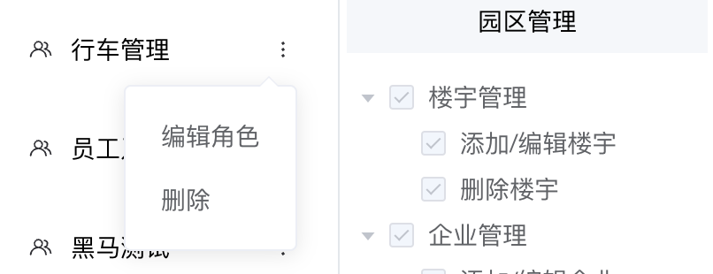
```html
<div class="more">
  <el-dropdown>
    <span class="el-dropdown-link">
      <svg-icon icon-class="more" />
    </span>
    <el-dropdown-menu slot="dropdown">
      <el-dropdown-item>编辑角色</el-dropdown-item>
      <el-dropdown-item>删除</el-dropdown-item>
    </el-dropdown-menu>
  </el-dropdown>
</div>
```
## 1. 跳转编辑携带roleId
```html
 <el-dropdown-item 
   @click.native="$router.push(`/roleAdd?id=${item.roleId}`)">
   编辑角色
 </el-dropdown-item>
```
## 2. 回填当前角色信息
```vue

// 缓存roleId
computed: {
  roleId() {
    return this.$route.query.id
  }
}

// 回填数据
async getRoleDetail() {
  const res = await getRoleDetailAPI(this.roleId)
  const { perms, remark, roleId, roleName } = res.data
  // 回填基础表单
  this.roleForm = { perms, remark, roleId, roleName }
  // 回填Tree
  this.$refs.tree.forEach((tree, index) => {
    tree.setCheckedKeys(this.roleForm.perms[index])
  })
}

mounted() {
  if (this.$route.query.id) {
    this.getRoleDetail()
  }
}
```
## 3. 确认修改
```javascript
/**
 * 更改角色
 * @returns
 */
export function updateRoleAPI(data) {
  return request({
    url: `/park/sys/role`,
    method: 'PUT',
    data
  })
}
```

```vue
 async confirmAdd() {
  // 编辑
  if (this.roleId) {
    await updateRoleAPI(this.roleForm)
  } else {
    // 添加
    await createRoleUserAPI(
      this.roleForm
    )
  }
  this.$message({
    type: 'success',
    message: `${this.roleId ? '编辑' : '新增'}角色成功`
  })
  this.$router.back()
}
```
# 删除角色
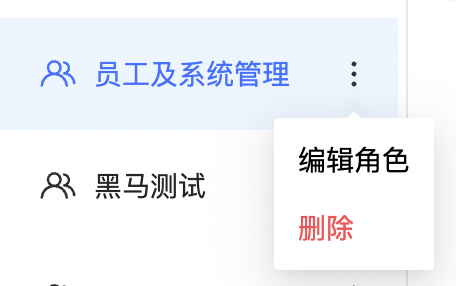
## 1. 封装接口
```javascript
/**
 * 删除角色
 * @returns
 */
export function delRoleUserAPI(roleId) {
  return request({
    url: `/park/sys/role/${roleId}`,
    method: 'DELETE'
  })
}
```
## 2. 编写删除逻辑
```jsx
<div class="more">
  <el-dropdown>
    <span class="el-dropdown-link">
      <svg-icon name="more" />
    </span>
    <el-dropdown-menu slot="dropdown">
      <el-dropdown-item>编辑角色</el-dropdown-item>
      <el-dropdown-item @click.native="delRole(item.roleId)">删除</el-dropdown-item>
    </el-dropdown-menu>
  </el-dropdown>
</div>


delRole(roleId) {
  this.$confirm('是否确认删除当前角色?', '提示', {
    confirmButtonText: '确定',
    cancelButtonText: '取消',
    type: 'warning'
  }).then(async() => {
    await delRoleUserAPI(roleId)
    this.getRoleList()
    this.$message({
      type: 'success',
      message: '删除成功!'
    })
  })
}
```
