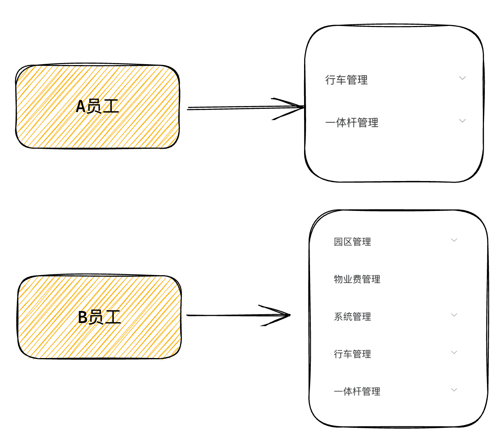
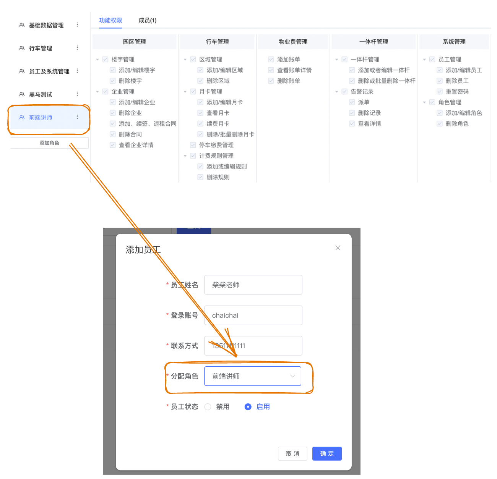
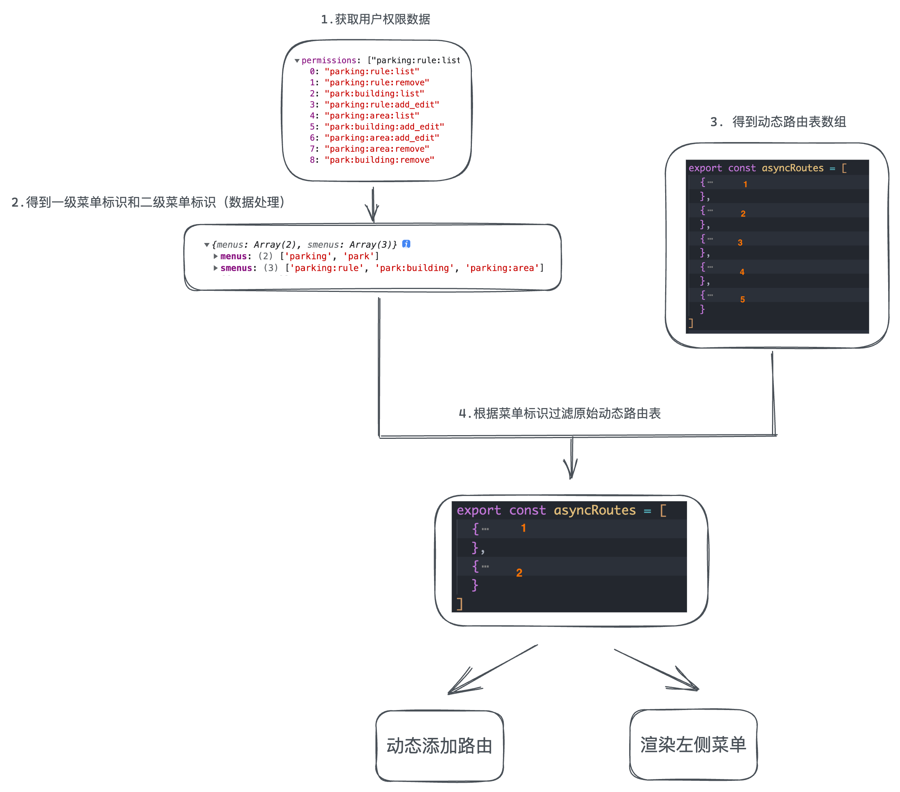

# 什么是菜单路由权限
> 不同角色的员工进入到系统中看到的左侧菜单是不一样的，根据不同的员工登录控制显示与之对应的左侧菜单就叫做菜单路由权限控制




# 基于RBAC的权限解决方案
> RBAC:基于角色的权限控制方案
> 核心思路：给角色分配功能权限，把角色分配给员工，那员工就自动拥有了角色下面的所有功能权限




说明：我们新增了一个前端讲师的角色，给这个角色分配了很多功能权限点，然后在新增员工的时候把前端讲师的角色绑定给了柴柴老师这个员工，那柴柴老师这个员工就有了前端讲师下的所有功能权限点

# 权限控制流程梳理


# 获取用户权限数据
> 权限数据也属于当前用户相关的信息，使用Vuex进行维护

## 封装接口
```javascript
/**
 * @description: 获取用户信息
 * @param {*} data {}
 * @return {*} promise
 */
export function getProfileAPI() {
  return request({
    url: '/park/user/profile',
    method: 'GET'
  })
}
```
## Vuex逻辑编写
```vue
import { getProfileAPI } from '@/apis/user'
export default {
  namespaced: true,
  state: () => {
    return {
      profile: {}
    }
  },
  mutations: {
    setProfile(state, profile) {
      state.profile = profile
    }
  },
  actions: {
    async getProfile(ctx) {
      const res = await getProfileAPI()
      ctx.commit('setProfile', res.data)
    }
  }
}
```
## permission文件触发action
```javascript
async getProfile(ctx) {
  const res = await getProfileAPI()
  ctx.commit('setProfile', res.data)
  return res.data.permissions
}
```

```javascript
// 权限控制
import router from './router'
import { getCookie } from './utils/auth'
import store from './store'

const WHITE_LIST = ['/login', '/404']

router.beforeEach(async(to, from, next) => {
  const token = getCookie('park_token')
  // 有token
  if (token) {
    next()
    // 获取用户信息
    if (!store.state.user.profile.id) {
      // 获取原始权限列表
      const permissions = await store.dispatch('user/getProfile')
      console.log(permissions)
    }
  } else {
    // 没有token
    if (WHITE_LIST.includes(to.path)) {
      next()
    } else {
      next('/login')
    }
  }
})
```
# 处理一级和二级菜单标识
```javascript
// 权限控制
import router from './router'
import { getCookie } from './utils/auth'
import store from './store'

const WHITE_LIST = ['/login', '/404']

// 处理一级路由权限数据
function getFirstRoutePerms(permsArr) {
  const newArr = permsArr.map(item => {
    return item.split(':')[0]
  })
  return [...new Set(newArr)]
}

// 处理二级路由权限数据
function getSecondRoutePerms(permsArr) {
  const newArr = permsArr.map(item => {
    const arr = item.split(':')
    return `${arr[0]}:${arr[1]}`
  })
  return [...new Set(newArr)]
}

router.beforeEach(async(to, from, next) => {
  const token = getCookie('park_token')
  // 有token
  if (token) {
    next()
    // 获取用户信息
    if (!store.state.user.profile.id) {
 // 1. 调用action函数获取用户权限数据
        const perms = await store.dispatch('user/getUserProfile')
        // 2. 把后端的权限数组格式化成我们自己的俩个权限数据
        console.log('当前的权限数据为:', perms)
        const firstRoutePerms = getFirstRoutePerms(perms)
        console.log(firstRoutePerms)
        const secondRoutePerms = getSecondRoutePerms(perms)
        console.log(secondRoutePerms)
    }
  } else {
    // 没有token
    if (WHITE_LIST.includes(to.path)) {
      next()
    } else {
      next('/login')
    }
  }
})
```
# 拆分静态和动态路由表
> 核心思路：把需要做动态权限控制的路由放到一起，把不需要做权限控制的路由放到一起

## 拆分动态路由表导出使用
```javascript
import Layout from '@/layout'

// 1. 动态路由: 需要做权限控制 可以根据不同的权限 数量上的变化
// 2. 静态路由: 不需要做权限控制 每一个用户都可以看到 初始化的时候初始化一次

// 动态路由表
export const asyncRoutes = [
  {
    path: '/park',
    component: Layout,
    permission: 'park',
    meta: { title: '园区管理', icon: 'el-icon-office-building' },
    children: [{
      path: 'building',
      permission: 'park:building',
      meta: { title: '楼宇管理' },
      component: () => import('@/views/Park/Building/index')
    },
    {
      path: 'enterprise',
      permission: 'park:enterprise',
      meta: { title: '企业管理' },
      component: () => import('@/views/Park/Enterprise/index')
    }]
  },

  {
    path: '/parking',
    component: Layout,
    permission: 'parking',
    meta: { title: '行车管理', icon: 'el-icon-guide' },
    children: [{
      path: 'area',
      permission: 'parking:area',
      component: () => import('@/views/Car/CarArea'),
      meta: { title: '区域管理' }
    }, {
      path: 'card',
      permission: 'parking:card',
      component: () => import('@/views/Car/CarCard'),
      meta: { title: '月卡管理' }
    }, {
      path: 'pay',
      permission: 'parking:payment',
      component: () => import('@/views/Car/CarPay'),
      meta: { title: '停车缴费管理' }
    },
    {
      path: 'rule',
      permission: 'parking:rule',
      component: () => import('@/views/Car/CarRule'),
      meta: { title: '计费规则管理' }
    }]
  },
  {
    path: '/pole',
    component: Layout,
    permission: 'pole',
    meta: { title: '一体杆管理', icon: 'el-icon-refrigerator' },
    children: [{
      path: 'info',
      permission: 'pole:info',
      component: () => import('@/views/Rod/RodManage'),
      meta: { title: '一体杆管理' }
    }, {
      path: 'waring',
      permission: 'pole:warning',
      component: () => import('@/views/Rod/RodWarn'),
      meta: { title: '告警记录' }
    }]
  },
  {
    path: '/sys',
    component: Layout,
    permission: 'sys',
    meta: { title: '系统管理', icon: 'el-icon-setting' },
    children: [{
      path: 'role',
      permission: 'sys:role',
      component: () => import('@/views/System/Role/index'),
      meta: { title: '角色管理' }
    }, {
      path: 'user',
      permission: 'sys:user',
      component: () => import('@/views/System/Employee/index'),
      meta: { title: '员工管理' }
    }]
  }
]

```
## 初始化时只处理静态路由表
```javascript
import Vue from 'vue'
import Router from 'vue-router'

Vue.use(Router)

/* Layout */
import Layout from '@/layout'

// 俩种路由

export const routes = [
  {
    path: '/login',
    component: () => import('@/views/Login/index'),
    hidden: true
  },
  {
    path: '/addCard',
    component: () => import('@/views/Car/CarCard/add-card'),
    hidden: true
  },
  {
    path: '/addEnterprise',
    component: () => import('@/views/Park/Enterprise/AddEnterprise'),
    hidden: true
  },
  {
    path: '/enterpriseDetail',
    component: () => import('@/views/Park/Enterprise/EnterpriseDetail'),
    hidden: true
  },
  {
    path: '/addRole',
    component: () => import('@/views/System/Role/AddRole'),
    hidden: true
  },
  {
    path: '/',
    component: Layout,
    redirect: '/workbench'
  },
  // 只有一级路由
  // 一级路由：负责把layout架子渲染出来
  // 二级路由：path为空 会作为默认的二级路由一上来就渲染出来
  {
    path: '/workbench',
    component: Layout,
    children: [{
      path: '',
      component: () => import('@/views/Workbench/index'),
      meta: { title: '工作台', icon: 'el-icon-data-board' }
    }]
  },

  {
    path: '/404',
    component: () => import('@/views/404'),
    hidden: true
  }
]

const createRouter = () => new Router({
  // mode: 'history', // require service support
  mode: 'history',
  scrollBehavior: () => ({ y: 0 }),
  routes: [...routes]
})

const router = createRouter()

// 重置路由方法
export function resetRouter() {
  // 得到一个全新的router实例对象
  const newRouter = createRouter()
  // 使用新的路由记录覆盖掉老的路由记录
  router.matcher = newRouter.matcher
}

export default router

```

# 根据菜单标识过滤动态路由表
> 核心思路：使用一级权限点过滤一级路由，使用二级权限点过滤二级路由

## 编写处理函数
```javascript
// 根据权限标识过滤路由表
function getRoutes(firstRoutePerms, secondRoutePerms, asyncRoutes) {
  // 根据一级和二级对动态路由表做过滤 return出去过滤之后的路由表
  // 1. 根据一级路由对动态路由表做过滤
  return asyncRoutes.filter(route => {
    return firstRoutePerms.includes(route.permission)
  }).map(item => {
    // 2. 对二级路由做过滤
    return {
      ...item,
      children: item.children.filter(item => secondRoutePerms.includes(item.permission))
    }
  })
}
```
## 调用函数获取最终动态路由
```javascript
// 导入原始动态路由表
import { asyncRoutes } from './router/asyncRoute'

router.beforeEach(async(to, from, next) => {
  const token = getCookie('park_token')
  // 有token
  if (token) {
    next()
    // 获取用户信息
    if (!store.state.user.profile.id) {
      // 1. 获取原始权限列表
      const permissions = await store.dispatch('user/getProfile')
      // 2. 数据处理得到一级二级路由菜单标识
      const menuPerms = getMenuList(permissions)
      console.log(menuPerms)
      // 3. 通过菜单权限过滤一级和二级得到权限菜单列表
      const filterRoutes = getFilterRoutes(menuPerms, asyncRoutes)
      console.log(filterRoutes)
    }
  } else {
    // 没有token
    if (WHITE_LIST.includes(to.path)) {
      next()
    } else {
      next('/login')
    }
  }
})
```
# 动态添加路由表
> 核心思路：vue-router插件提供了 `addRoute` 方法可以把处理之后的路由添加到路由系统中，让路由生效

```javascript
router.beforeEach(async(to, from, next) => {
  const token = getCookie('park_token')
  // 有token
  if (token) {
    next()
    // 获取用户信息
    if (!store.state.user.profile.id) {
      // 1. 获取原始权限列表
      const permissions = await store.dispatch('user/getProfile')
      // 2. 获取菜单权限列表
      const menuPerms = getMenuList(permissions)
      console.log(menuPerms)
      // 3. 通过菜单权限过滤一级和二级
      const filterRoutes = getFilterRoutes(menuPerms, asyncRoutes)
      console.log(filterRoutes)
      // 4. addRoute动态添加
      filterRoutes.forEach(route => router.addRoute(route))
    }
  } else {
    // 没有token
    if (WHITE_LIST.includes(to.path)) {
      next()
    } else {
      next('/login')
    }
  }
})
```

# 渲染左侧菜单
> 核心思路：左侧的菜单应该和路由是同步的，使用的同一份数据，因为要动态变化渲染，所以可以通过Vuex进行维护
> 1. vuex新增一个模块，menu模块，先以静态的路由表作为初始值
> 2. 在得到过滤之后的动态路由表之后，和之前的静态做一个结合
> 3. 在组件中结合v-for指令做使用Vuex中的数据做渲染

## 编写vuex逻辑
```javascript
import { contantsRoutes } from '@/router'
export default {
  namespaced: true,
  state: () => {
    return {
      menuList: [...contantsRoutes]
    }
  },
  mutations: {
    setMenuList(state, filterRoutes) {
      state.menuList = [...state.menuList, ...filterRoutes]
    }
  }
}
```
## 触发mutation
```javascript

router.beforeEach(async(to, from, next) => {
  const token = getCookie('park_token')
  // 有token
  if (token) {
    next()
    // 获取用户信息
    if (!store.state.user.profile.id) {
      // 1. 获取原始权限列表
      const permissions = await store.dispatch('user/getProfile')
      // 2. 获取菜单权限列表
      const menuPerms = getMenuList(permissions)
      console.log(menuPerms)
      // 3. 通过菜单权限过滤一级和二级
      const filterRoutes = getFilterRoutes(menuPerms, asyncRoutes)
      console.log(filterRoutes)
      // 4. addRoute动态添加
      filterRoutes.forEach(route => router.addRoute(route))
      // 5. 存入Vuex渲染左侧菜单
      store.commit('menu/setMenuList', filterRoutes)
    }
  } else {
    // 没有token
    if (WHITE_LIST.includes(to.path)) {
      next()
    } else {
      next('/login')
    }
  }
})
```
## 改写组件中的菜单渲染数据
```vue
computed: {
  routes() {
    // return this.$router.options.routes
    return this.$store.state.menu.menuList
  }
}
```

# 退出登录重置
> 业务背景：在切换不同权限的用户时，新用户会直接使用老用户的路由实例，表现效果就是左侧菜单没有发生变化
> 解决方案：在退出登录也就是要切换用户时，清空原本的路由记录

## user模块中清除用户信息
```javascript
clearUserInfo(state) {
    // 清除Token
    state.token = ''
    state.profile = {}
    removeCookie(TOKEN_KEY)
}
```
## menu模块添加重置逻辑
```javascript
import { contantsRoutes, resetRouter } from '@/router'
export default {
  mutations: {
    resetMenu(state) {
      // 重置左侧菜单
      state.menuList = contantsRoutes
      // 重置路由系统
      resetRouter()
    }
  }
}
```
## 退出登录时重置路由
```javascript
logout() {
  // 增加代码
  this.$store.commit('menu/resetMenu')
}
```


**补充权限点对照表**
```xml
添加/编辑楼宇	park:building:add_edit
楼宇管理	park:building:list
删除楼宇	park:building:remove
添加/编辑企业	park:enterprise:add_edit
企业管理	park:enterprise:list
查看企业详情	park:enterprise:query
删除企业	park:enterprise:remove
添加账单	park:propertyFee:add
物业费管理	property:propertyFee:list
查看账单详情	park:propertyFee:query
删除账单	park:propertyFee:remove
添加、续签、退租合同	park:rent:add_surrender
删除合同	park:rent:remove
添加/编辑区域	parking:area:add_edit
区域管理	parking:area:list
删除区域	parking:area:remove
添加/编辑月卡	parking:card:add_edit
月卡管理	parking:card:list
查看月卡	parking:card:query
续费月卡	parking:card:recharge
删除/批量删除月卡	parking:card:remove
停车缴费管理	parking:payment:list
添加或编辑规则	parking:rule:add_edit
计费规则管理	parking:rule:list
删除规则	parking:rule:remove
添加或者编辑一体杆	pole:info:add_edit
一体杆管理	pole:info:list
删除或批量删除一体杆	pole:info:remove
告警记录	pole:warning:list
查看详情	pole:warning:query
删除记录	pole:warning:remove
派单	pole:warning:send
添加/编辑角色	sys:role:add_edit
角色管理	sys:role:list
删除角色	sys:role:remove
添加/编辑员工	sys:user:add_edit
员工管理	sys:user:list
删除员工	sys:user:remove
重置密码	sys:user:resetPwd
```
