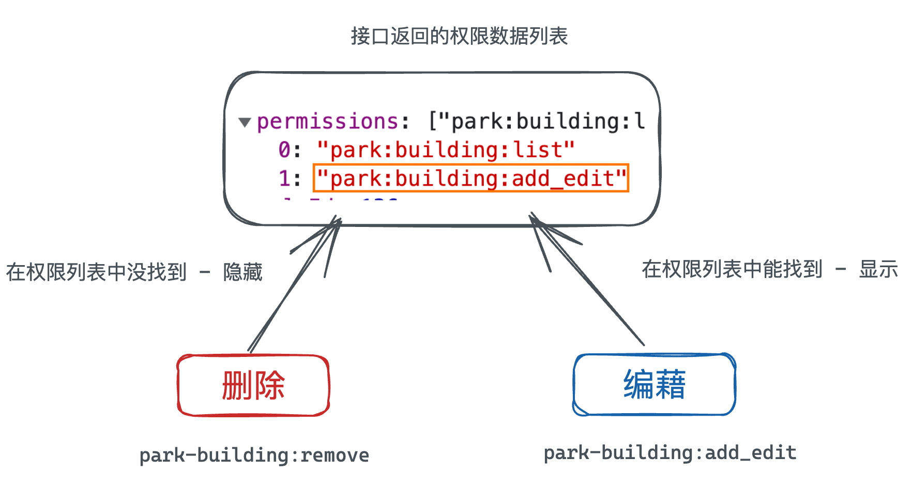
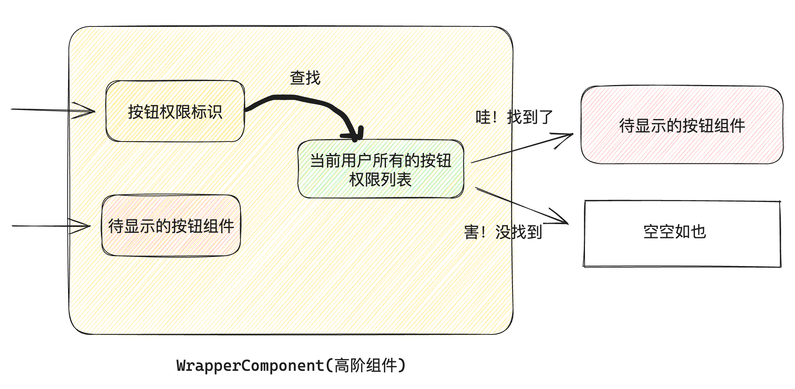

# 什么是按钮权限控制
> 概念：根据当前用户的权限数据控制按钮的显示和隐藏

# 核心思路说明

思路：每一个需要做权限控制的按钮都有一个自己独有的 `标识` , 如果标识可以在权限数据列表中找到，则显示，找不到就隐藏 
方案：应用中可能会有很多按钮需要做权限控制，所以方案一定是全局生效的，我们提供俩种可选的方案

# 全局指令方案
## 定义全局指令
```javascript
// 放置全局指令
import Vue from 'vue'
import store from '@/store'
// 管理员权限特殊处理
const adminPerms = '*:*:*'
Vue.directive('auth-btn', {
  inserted(el, data) {
    console.log(el, data.value)
    const perms = store.state.user.profile.permissions
    if (!perms.includes(data.value) && !perms.includes(adminPerms)) {
      el.remove()
    }
  }
})
```
## 使用指令
```vue
<el-button 
  v-auth-btn="'park:building:add_edit'" 
  type="primary" @click="addBuilding">添加楼宇</el-button>
```

# 高阶组件方案（了解）
## 高阶组件的思路
> 概念：把组件当成参数传给另一个组件，返回一个`包装过的新组件` 



##  定义组件
> 关键点：如何把按钮组件当成参数传入并且在高阶组件内部获取到它，答案就是`插槽和render函数`

```vue
<script>
export default {
  props: {
    btnString: {
      type: String,
      default: ''
    }
  },
  computed: {
    isShow() {
      const perms = this.$store.state.user.profile.permissions
      return perms.includes(this.btnString) || perms.includes('*:*:*')
    }
  },
  render() {
    // this.$slots.default拿到的就是要控制显示和隐藏的按钮组件
    return this.isShow && this.$slots.default
  }
}
</script>
```
## 使用组件
```vue
<auth-button btn-string="park:building:remove">
  <el-button size="mini" type="text" @click="confirmDel(scope.row.id)">删除</el-button>
</auth-button>


<auth-button btn-string="park:building:add_edit">
  <el-button type="primary" @click="addBuilding">添加楼宇</el-button>
</auth-button>
```

