# 业务模块的互相依赖
> 业务模块之间不是孤立存在的，存在一定的依赖关系

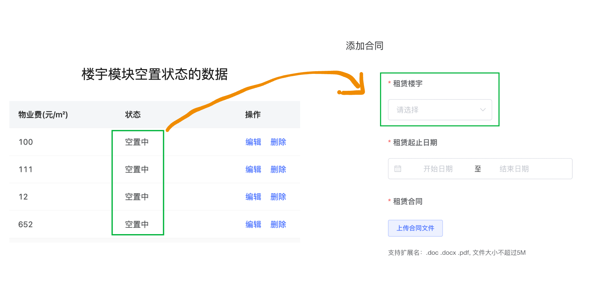
# 业务数据状态的变化
> 有些业务数据存在不同的业务状态，业务状态可以根据不同的操作或者条件发生变化，前端的显示和操作同样会跟随变化

## 企业合同状态
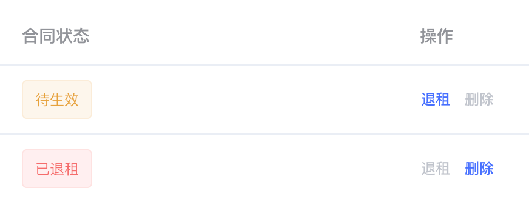

| 条件 | 合同状态码 | 合同状态显示 |
| --- | --- | --- |
| 点击退租按钮 | 3 | 已退租 |
| 合同租赁时间还未开始 | 0 | 待生效 |
| 合同租赁时间已结束，且没有续租 | 2 | 已到期 |
| 在合同租赁时间内，且没有手动退租 | 1 | 生效中 |

## 停车缴费管理
### 车辆入场
> 业务说明：当有车辆从停车场入口进场之后，一体杆硬件会做记录把数据上传到停车缴费管理模块
> 辅助工具网站:  [https://fe-hmzstool.itheima.net/managecar](https://fe-hmzstool.itheima.net/managecar)  模拟车辆入场

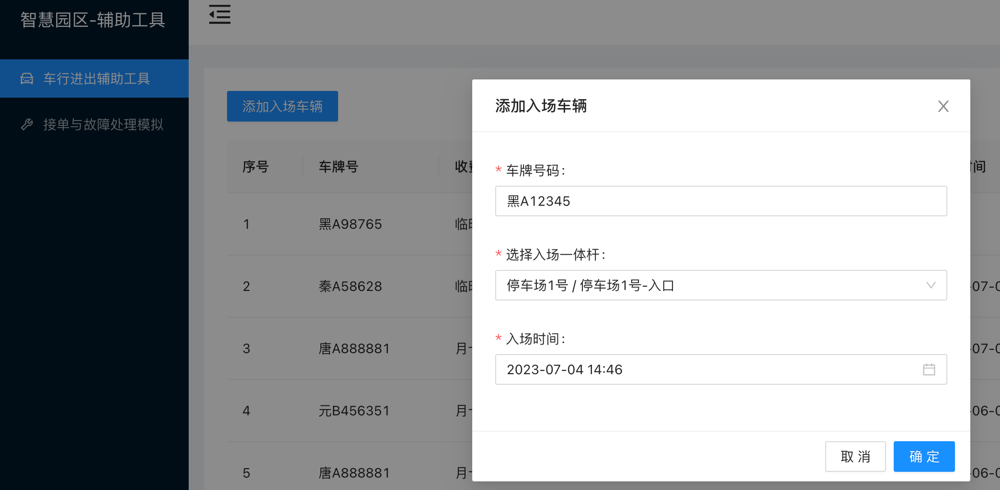

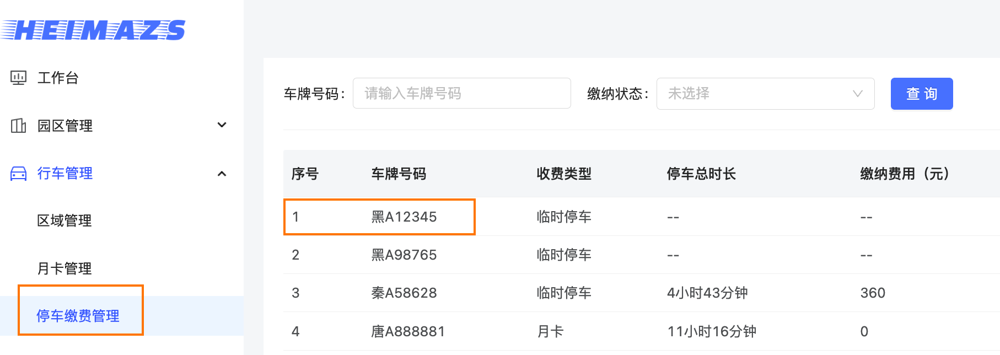
### 车辆出场
> 业务说明：当车辆从停车场出口出去之后，车辆的状态会从未缴纳变为已缴纳，并且显示停车时长以及支付方式等信息

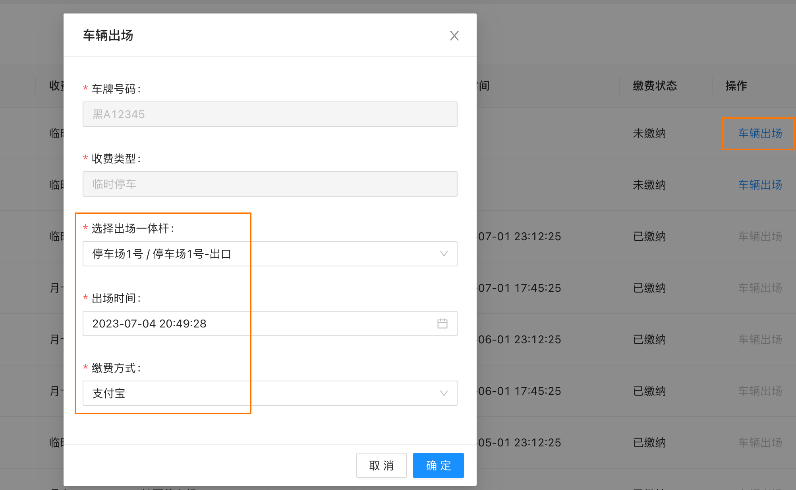

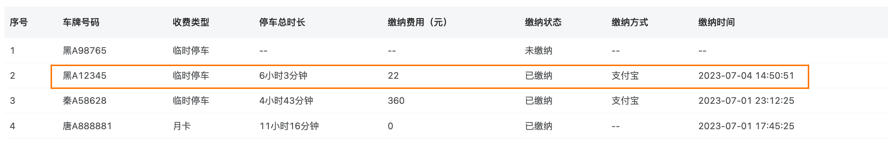

## 告警记录
### 故障上报
> 业务说明：如果停车场管理人员发现一体杆出现了故障，或者一体杆本身就具备上报功能会完成自动故障上报
> 上报完毕之后会在后台管理中的告警记录模块显示记录

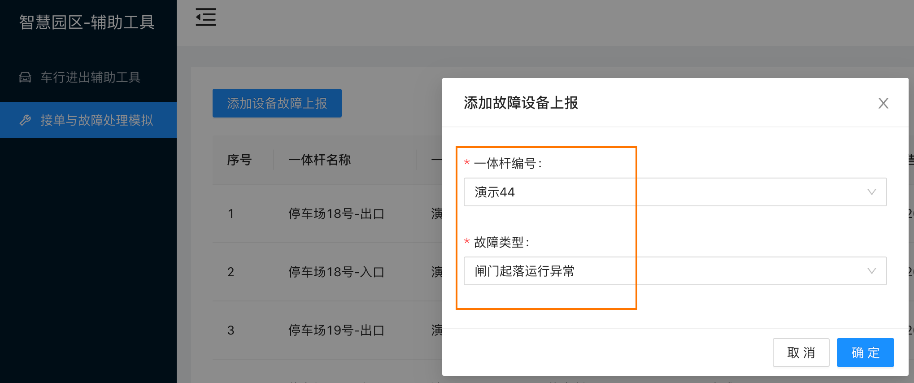

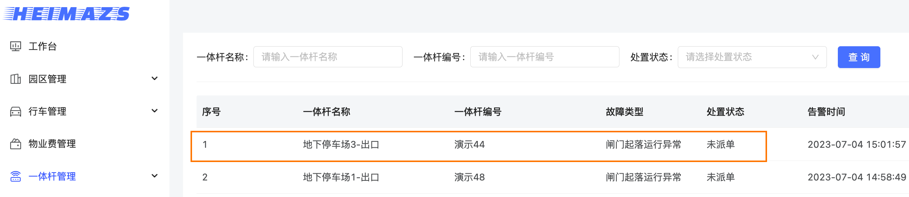

### 派单处理
> 业务说明：把当前的告警记录通过派单操作分配给处理人，派单成功之后，当前记录状态变更为已派单，并且维修人员也会接到通知，可以接单处理

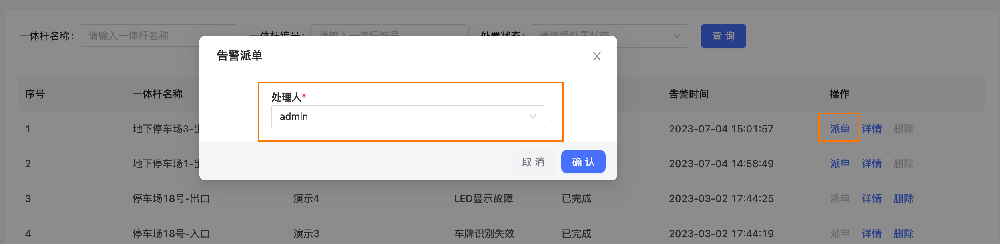

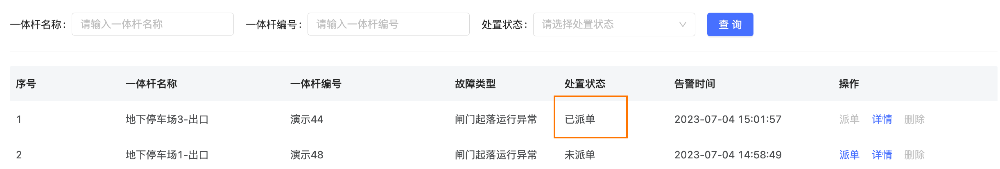

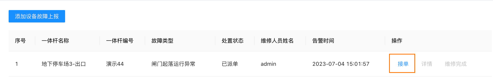

