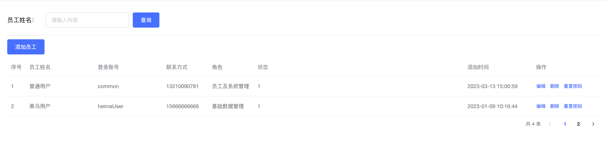
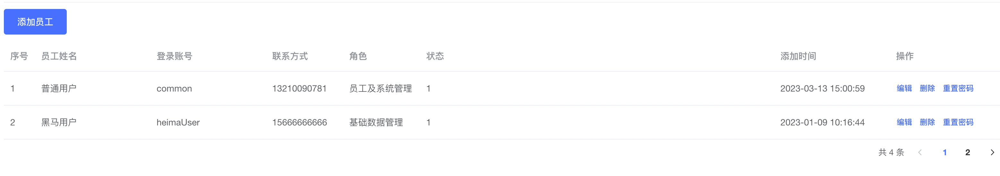
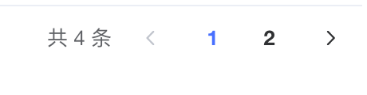
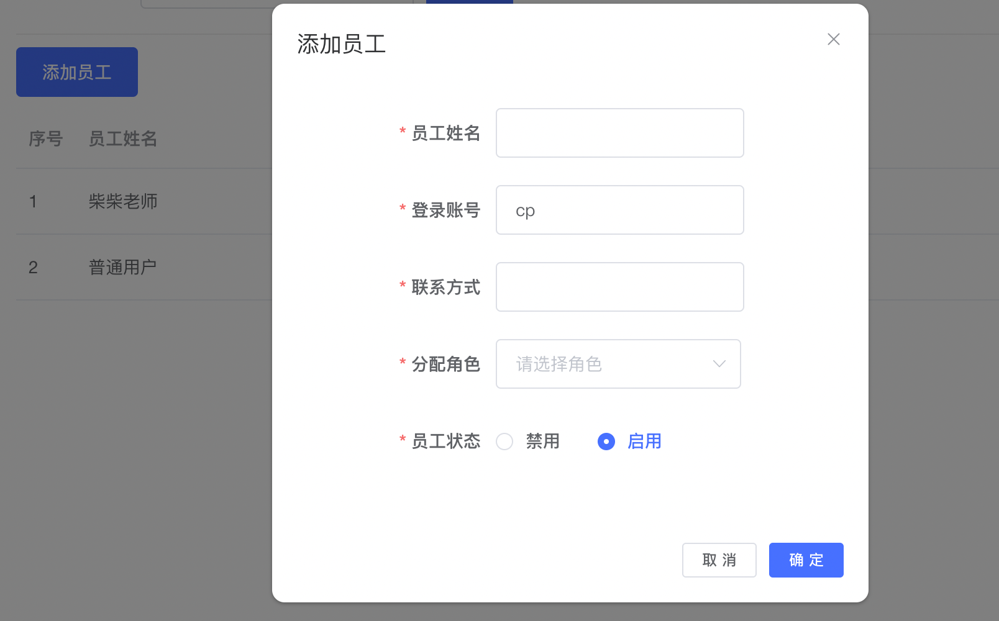
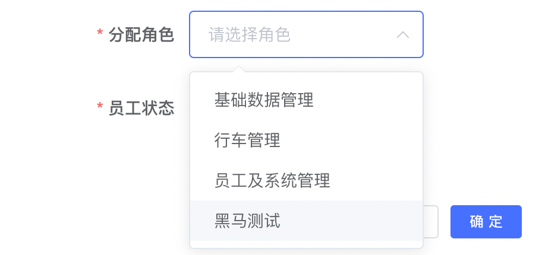
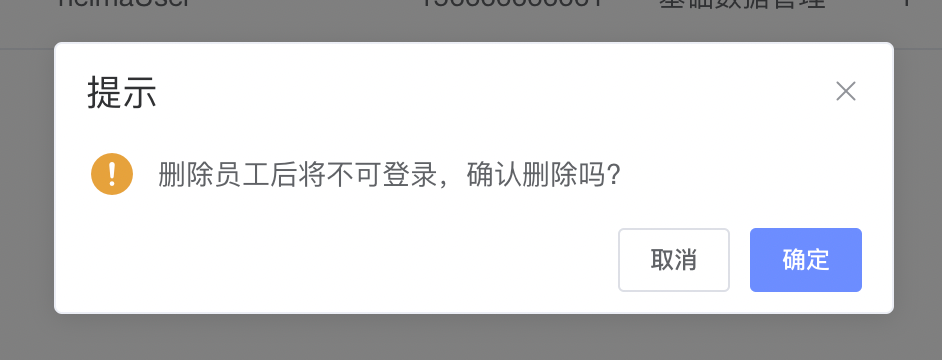
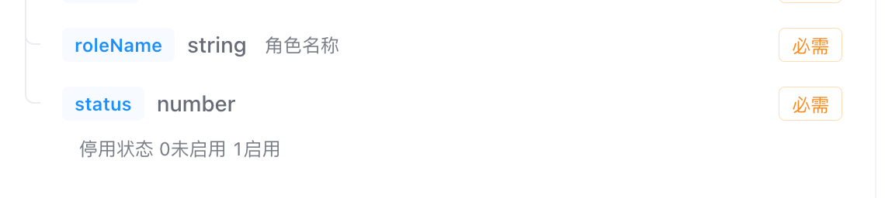

# 功能演示和模板搭建

```vue
<template>
  <div class="employee-container">
    <!-- 搜索区域 -->
    <div class="search-container">
      <div class="search-label">员工姓名：</div>
      <el-input  clearable placeholder="请输入内容" class="search-main" />
      <el-button type="primary">查询</el-button>
    </div>
    <div class="create-container">
      <el-button type="primary">添加员工</el-button>
    </div>
    <!-- 表格区域 -->
    <div class="table">
      <el-table style="width: 100%" :data="employeeList">
        <el-table-column type="index" label="序号" />
        <el-table-column label="员工姓名" width="180" prop="name" />
        <el-table-column label="登录账号" width="180" prop="userName" />
        <el-table-column label="联系方式" width="120" prop="phonenumber" />
        <el-table-column label="角色" width="120" prop="roleName" />
        <el-table-column label="状态">
          <template #default="scope">
            {{ scope.row.status }}
          </template>
        </el-table-column>
        <el-table-column label="添加时间" prop="createTime" />
        <el-table-column label="操作" fixed="right" width="120">
          <template #default="scope">
            <el-button size="mini" type="text">编辑</el-button>
            <el-button size="mini" type="text">删除</el-button>
            <el-button size="mini" type="text">重置密码</el-button>
          </template>
        </el-table-column>
      </el-table>
    </div>
    <div class="page-container">
      <el-pagination
        layout="total, prev, pager, next"
      />
    </div>
    <!-- 添加员工 -->
  </div>
</template>

<script>
export default {
  name: 'Employee',
  data() {
    return {
      employeeList: []
    }
  },
}
</script>

<style lang="scss" scoped>
.employee-container {
  padding: 10px;
}

.search-container {
  display: flex;
  align-items: center;
  border-bottom: 1px solid rgb(237, 237, 237, .9);
  ;
  padding-bottom: 20px;

  .search-label {
    width: 100px;
  }

  .search-main {
    width: 220px;
    margin-right: 10px;
  }
}
.create-container{
  margin: 10px 0px;
}
.page-container{
  padding:4px 0px;
  text-align: right;
}
.form-container{
  padding:0px 80px;
}
</style>
```

# 员工基础列表渲染

## 封装请求接口
```javascript
import request from '@/utils/request'

/**
 * 获取员工列表
 * @param { page, pageSize, name} params
 * @returns
 */
export function getEmployeeListAPI(params) {
  return request({
    url: '/park/sys/user',
    params
  })
}
```
## 编写请求逻辑
```vue
<script>
import { getEmployeeListAPI } from '@/apis/employee'
export default {
  name: 'Employee',
  data() {
    return {
      employeeList: [],
      params: {
        page: 1,
        pageSize: 10,
        name: '' // 员工姓名
      }
    }
  },
  mounted() {
    this.getEmployeeList()
  },
  methods: {
    async getEmployeeList() {
      const res = await getEmployeeListAPI(this.params)
      this.employeeList = res.data.rows
    }
  }
}
</script>
```
## 数据绑定模版
```vue
 <el-table style="width: 100%" :data="employeeList">
    <el-table-column type="index" label="序号" />
    <el-table-column label="员工姓名" width="180" prop="name" />
    <el-table-column label="登录账号" width="180" prop="userName" />
    <el-table-column label="联系方式" width="120" prop="phonenumber" />
    <el-table-column label="角色" width="120" prop="roleName" />
    <el-table-column label="状态">
      <template #default="scope">
        {{ scope.row.status }}
      </template>
    </el-table-column>
    <el-table-column label="添加时间" prop="createTime" />
    <el-table-column label="操作" fixed="right" width="120">
      <template #default="scope">
        <el-button size="mini" type="text">编辑</el-button>
        <el-button size="mini" type="text">删除</el-button>
        <el-button size="mini" type="text">重置密码</el-button>
      </template>
    </el-table-column>
  </el-table>
```
# 员工分页逻辑实现

```vue
 methods: {
    async getEmployeeList() {
      const res = await getEmployeeListAPI(this.params)
      this.employeeList = res.data.rows
      this.total = res.data.total
    },
    pageChange(page) {
      this.params.page = page
      this.getEmployeeList()
    }
}


<el-pagination
  layout="total, prev, pager, next"
  :page-size="params.pageSize"
  :total="total"
  @current-change="pageChange"
/>
```

# 添加员工


## 准备弹框和表单项
```vue
<el-dialog
      title="添加员工"
      width="480px"
    >
  <!-- 表单接口 -->
  <div class="form-container">
    <el-form ref="addForm" :model="addForm" :rules="addFormRules" label-width="80px">
      <el-form-item label="员工姓名" prop="name">
        <el-input v-model="addForm.name" />
      </el-form-item>
      <el-form-item label="登录账号" prop="userName">
        <el-input v-model="addForm.userName" />
      </el-form-item>
      <el-form-item label="联系方式" prop="phonenumber">
        <el-input v-model="addForm.phonenumber" />
      </el-form-item>
      <el-form-item label="分配角色" prop="roleId">
        <el-select v-model="addForm.roleId" placeholder="请选择角色">
          <el-option
            v-for="item in roleList"
            :key="item.id"
            :label="item.name"
            :value="item.id"
          />
        </el-select>
      </el-form-item>
      <el-form-item label="员工状态" prop="status">
        <el-radio-group v-model="addForm.status">
          <el-radio :label="0">禁用</el-radio>
          <el-radio :label="1">启用</el-radio>
        </el-radio-group>
      </el-form-item>
    </el-form>
  </div>
  <template #footer>
    <el-button size="mini" @click="dialogVisible = false">取 消</el-button>
    <el-button size="mini" type="primary">确 定</el-button>
  </template>
</el-dialog>


data(){
  return {
    dialogVisible: true, // 控制弹框打开关闭
    roleList: [], // 角色列表
    addForm: {
      name: '',
      phonenumber: '',
      roleId: '',
      status: 1,
      userName: ''
    },
    addFormRules: {
      name: [
        { required: true, message: '请输入员工姓名', trigger: 'blur' }
      ],
      userName: [
        { required: true, message: '请输入登录账号', trigger: 'blur' }
      ],
      phonenumber: [
        { required: true, message: '请输入联系方式', trigger: 'blur' }
      ],
      roleId: [
        { required: true, message: '请分配角色', trigger: 'blur' }
      ],
      status: [
        { required: true, message: '请选择员工状态', trigger: 'blur' }
      ]
    }
  }
}
```

## 控制弹框打开关闭
```vue
<el-dialog
    title="添加员工"
    :visible="dialogVisible"
    width="480px"
    @close="closeDialog"
>

<el-button type="primary" @click="addEmployee">添加员工</el-button>

 // 关闭弹框
closeDialog() {
  this.dialogVisible = false
}
  
// 打开弹框
addEmployee() {
  this.dialogVisible = true
}
```
## 获取渲染角色列表

```jsx
import { getRoleListAPI } from '@/apis/system'


async openDialog() {
  const res = await getRoleListAPI()
  this.roleList = res.data
}

<el-dialog
  @open="openDialog"
>

<el-form-item label="分配角色" prop="roleId">
  <el-select v-model="addForm.roleId" placeholder="请选择角色">
    <el-option
      v-for="item in roleList"
      :key="item.roleId"
      :label="item.roleName"
      :value="item.roleId"
    />
  </el-select>
</el-form-item>
```
## 确认添加员工
```javascript
/**
 * 添加员工
 * @returns
 */
export function createEmployeeAPI(data) {
  return request({
    url: `/park/sys/user`,
    method: 'POST',
    data
  })
}
```

```vue
  // 确认添加
  async confirmAdd() {
    // 1. 调用接口
    await createEmployeeAPI(this.addForm)
    // 2. 关闭弹框
    this.dialogVisible = false
    // 3. 重新刷新列表
    this.getEmployeeList()
    // 4. 清空表单记录
  }
```

# 删除员工

```javascript
/**
 * 删除员工
 * @returns
 */
export function delEmployeeAPI(id) {
  return request({
    url: `/park/sys/user/${id}`,
    method: 'DELETE'
  })
}
```

```vue
delEmployee(id) {
  this.$confirm('删除员工后将不可登录，确认删除吗?', '提示', {
    confirmButtonText: '确定',
    cancelButtonText: '取消',
    type: 'warning'
  }).then(async() => {
    await delEmployeeAPI(id)
    this.$message({
      type: 'success',
      message: '删除成功'
    })
    this.getEmployeeList()
  })
}
```
# 员工状态适配


```javascript
// 适配员工状态处理函数
formatStatus(status) {
  return status === 1 ? '启用' : '禁用'
}

<template #default="scope">
  {{ formatStatus(scope.row.status) }}
</template>
```

