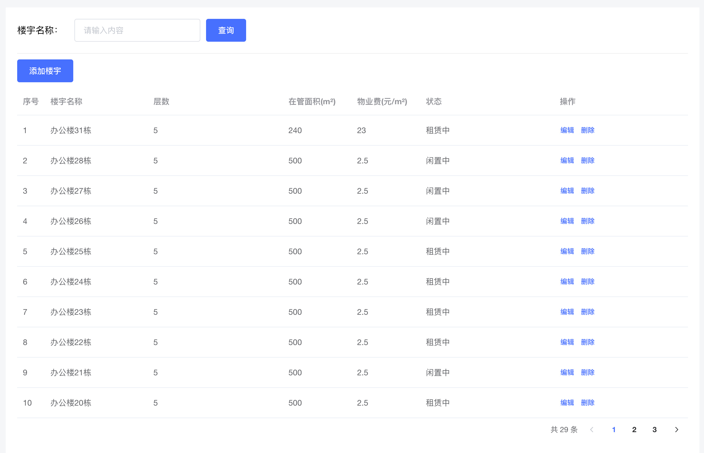
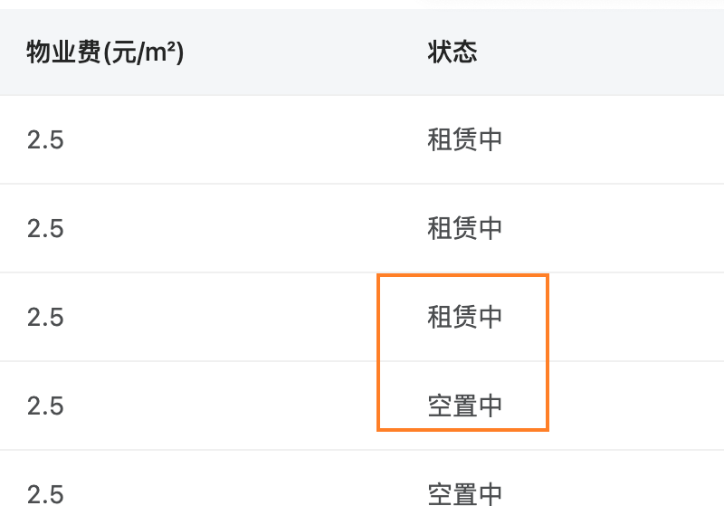
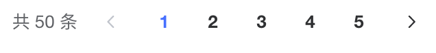
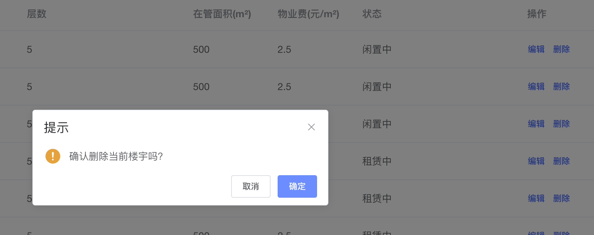
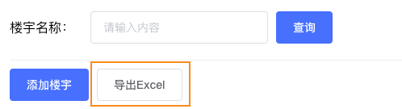

# 功能演示与模版搭建

```vue
<template>
  <div class="building-container">
    <!-- 搜索区域 -->
    <div class="search-container">
      <div class="search-label">楼宇名称：</div>
      <el-input placeholder="请输入内容" class="search-main" />
      <el-button type="primary">查询</el-button>
    </div>
    <!-- 表格区域 -->
    <div class="table">
      <el-table
        style="width: 100%"
      >
        <el-table-column
          prop="index"
          label="序号"
        />
        <el-table-column
          label="楼宇名称"
          width="180"
        />
        <el-table-column
          label="层数"
        />
        <el-table-column
          label="在管面积(m²)"
          width="120"
        />
        <el-table-column
          label="物业费(元/m²)"
          width="120"
        />
        <el-table-column
          label="状态"
        />
        <el-table-column
          label="操作"
        >
          <template #default="scope">
            <el-button
              size="mini"
              type="text"
            >编辑</el-button>
            <el-button
              size="mini"
              type="text"
            >删除</el-button>
          </template>
        </el-table-column>
      </el-table>

    </div>
  </div>
</template>

<script>
export default {
  name: 'Building'
}
</script>

<style lang="scss" scoped>
.department-container{
  padding:10px;
}
.search-container{
  display: flex;
  align-items: center;
  border-bottom: 1px solid rgb(237,237,237,.9);;
  padding-bottom: 20px;
  .search-label{
    width:100px;
  }
  .search-main{
    width: 220px;
    margin-right: 10px;
  }
}
</style>
```
# 渲染基础表格数据
## 1. 封装获取楼宇列表接口
```javascript
import request from '@/utils/request'

/**
 * 获取楼宇列表
 * @param { page, pageSize} params
 * @returns
 */
export function getBuildingListAPI(params) {
  return request({
    url: '/park/building',
    params
  })
}
```
## 2. 组件中获取数据
```vue
<script>
import { getBuildingListAPI } from '@/apis/building'
export default {
  name: 'Building',
  data() {
    return {
      buildingList: [], // table列表
      params: {  // 请求参数
        page: 1,
        pageSize: 10
      }
    }
  },
  mounted() {
    this.getBuildingList()
  },
  methods: {
    async getBuildingList() {
      const res = await getBuildingListAPI(this.params)
      this.buildingList = res.data.rows
    }
  }
}
</script>
```
## 3. 绑定模版
```html
<!-- 表格区域 -->
<div class="table">
<el-table
  style="width: 100%"
  :data="buildingList"
>
  <el-table-column
    type="index"
    label="序号"
  />
  <el-table-column
    label="楼宇名称"
    width="180"
    prop="name"
  />
  <el-table-column
    label="层数"
    prop="floors"
  />
  <el-table-column
    label="在管面积(m²)"
    width="120"
    prop="area"
  />
  <el-table-column
    label="物业费(元/m²)"
    width="120"
    prop="propertyFeePrice"
  />
  <el-table-column
    label="状态"
    prop="status"
  />
  <el-table-column
    label="操作"
    width="120"
  >
    <template #default="scope">
      <el-button
        size="mini"
        type="text"
      >编辑</el-button>
      <el-button
        size="mini"
        type="text"
      >删除</el-button>
    </template>
  </el-table-column>
</el-table>
```

# 租赁状态适配

> 业务背景：status为0表示闲置中，status为1表示租赁中
> 解决思路：通过映射的方式找到状态码和中文的对应关系，然后根据状态码返回对应的中文


```vue
<el-table-column label="状态" prop="status">
  <template #default="scope">
    {{ formatStatus(scope.row.status) }}
  </template>
</el-table-column>

formatStatus(status) {
  const statusMap = {
    0: '租赁中',
    1: '闲置中'
  }
  return statusMap[status]
}
```
# 分页管理

## 1. 分页器结构搭建
```vue
<div class="page-container">
    <el-pagination
      layout="total, prev, pager, next"
      :total="50"
    />
</div>

<style scoped lang="scss">
  .page-container{
    padding:4px 0px;
    text-align: right;
  }
</style>
```
## 2. 渲染分页数据
> 页数 = 总数 / 每页条数（el-pagination组件每页条数默认为10）
> 注意：每页条数的数量需要和传给后端的pagination保持一致

```jsx
data() {
  return {
    total: 0
  }
}


async getBuildingList() {
  const res = await getBuildingListAPI(this.params)
  this.buildingList = res.data.rows
  // 存入总条数
  this.total = res.data.total
}


<el-pagination
  layout="total, prev, pager, next"
  :total="total"
/>
```

## 3. 点击实现分页切换
> 实现思路：
> 1. 通过事件拿到当前页数
> 2. 以当前页数作为参数发送数据请求获取当前页数据
> 3. 重新把列表交给buildingList


```jsx
<el-pagination
  layout="total, prev, pager, next"
  :total="total"
  @current-change="pageChange"
/>

pageChange(page) {
  // 更改参数
  this.params.page = page
  // 重新获取数据渲染
  this.getBuildingList()
}
```
# 查询搜索


> 业务背景：
> 1. 用户输入查询内容之后点击查询按钮以当前输入关键词做为参数获取数据
> 2. 点击清空按钮时复原初始数据
> 
思路：作为查询的name其实也是一个接口参数，通过input双向绑定，然后通过它来获取数据重新渲染列表


```jsx
data() {
  return {
    params: {
      page: 1,
      pageSize: 10,
      name: '' // 增加字段name
    }
  }
}

<div class="search-container">
  <div class="search-label">楼宇名称：</div>
  <el-input v-model="params.name" clearable placeholder="请输入内容" class="search-main" @clear="doSearch" />
  <el-button type="primary" @click="doSearch">查询</el-button>
</div>


doSearch() {
  // 1. 重置page为1
  this.params.page = 1
  // 2. 调用获取列表接口
  this.getBuildingList()
}
```
# 添加楼宇
## 1. 弹框交互实现
```jsx
 <!-- 添加楼宇弹框 -->
<el-dialog
  title="添加楼宇"
  :visible="dialogVisible"
  width="580px"
  @close="closeDialog"
>
  <span>这是一段信息</span>
  <template #footer>
    <el-button size="mini" @click="dialogVisible = false">取 消</el-button>
    <el-button size="mini" type="primary" @click="dialogVisible = false">确 定</el-button>
  </template>
</el-dialog>


<el-button type="primary" @click="addBuilding">添加楼宇</el-button>


addBuilding() {
  this.dialogVisible = true
}
closeDialog() {
  this.dialogVisible = false
}
```

## 2. 表单验证实现
> 业务背景：表单需要做单独校验和点击确认按钮时的统计校验

```jsx
<!-- 表单接口 -->
  <div class="form-container">
    <el-form :model="addForm" :rules="addFormRules">
    <el-form-item label="楼宇名称" prop="name">
      <el-input v-model="addForm.name" />
    </el-form-item>
    <el-form-item label="楼宇层数" prop="floors">
      <el-input v-model="addForm.floors" />
    </el-form-item>
    <el-form-item label="在管面积" prop="area">
      <el-input v-model="addForm.area" />
    </el-form-item>
    <el-form-item label="物业费" prop="propertyFeePrice">
      <el-input v-model="addForm.propertyFeePrice" />
    </el-form-item>
  </el-form>
</div>

  
<el-button size="mini" type="primary" @click="confirmAdd">确 定</el-button>


data() {
  return {
    addForm: {
      name: '',
      floors: null,
      area: null,
      propertyFeePrice: null
    },
    addFormRules: {
      name: [
        { required: true, message: '请输入楼宇名称', trigger: 'blur' }
      ],
      floors: [
        { required: true, message: '请输入楼宇层数', trigger: 'blur' }
      ],
      area: [
        { required: true, message: '请输入楼宇面积', trigger: 'blur' }
      ],
      propertyFeePrice: [
        { required: true, message: '请输入楼宇物业费', trigger: 'blur' }
      ]
    }
  }
}


confirmAdd() {
  this.$refs.addForm.validate((valid) => {
    if (valid) {
      console.log('添加')
    }
  })
}


```

## 3. 收集表单数据提交
```javascript
/**
 * 添加楼宇
 * @param {*} data
 * @returns
 */
export function createBuildingListAPI(data) {
  return request({
    url: '/park/building',
    method: 'POST',
    data
  })
}

```

```vue
 confirmAdd() {
    this.$refs.addForm.validate(async(valid) => {
      if (valid) {
        console.log('添加')
        // 1. 提交接口
        await createBuildingListAPI(this.addForm)
        // 2. 获取列表
        this.getBuildingList()
        // 3. 关闭弹框
        this.dialogVisible = false
      }
    })
  }
```

# 删除楼宇

```javascript
/**
 * 添加楼宇
 * @param {*} data
 * @returns
 */
export function delBuildingListAPI(id) {
  return request({
    url: `/park/building/${id}`,
    method: 'DELETE'
  })
}

```

```jsx
<el-button size="mini" type="text" @click="confirmDel(scope.row.id)">删除</el-button>

async confirmDel(id) {
  this.$confirm('确认删除当前楼宇吗？', '提示', {
    confirmButtonText: '确定',
    cancelButtonText: '取消',
    type: 'warning'
  }).then(async() => {
    await delBuildingListAPI(id)
    this.getBuildingList()
  }).catch(() => {

  })
}
```

# 编辑功能
## 1. 回填数据
> 核心思路：如果表格数据够用，直接使用本地数据回填，如果不够，调用详情接口

```jsx
// 绑定事件传递参数
<el-button size="mini" type="text" @click="edit(scope.row)">编辑</el-button>


// 点击编辑时打开弹框并回显数据
async edit(row) {
  // 1. 打开弹框
  this.dialogVisible = true
  // 2. 解构必要字段
  const { id, area, floors, name, propertyFeePrice } = row
  this.addForm = {
    id, area, floors, name, propertyFeePrice
  }
}
```
## 2. 区分新增和编辑
> 核心思路：如果是编辑状态，addForm有id字段，新增时没有，可以作为判断的依据

```javascript
// 适配新增和编辑模式
confirmAdd() {
  this.$refs.addForm.validate(async(valid) => {
    if (valid) {
      if (this.addForm.id) {
        await editBuildingListAPI(this.addForm)
      } else {
        // 1. 提交接口
        await createBuildingListAPI(this.addForm)
      }
      // 2. 获取列表
      this.getBuildingList()
      // 3. 关闭弹框
      this.dialogVisible = false
    }
  })
}
```
# 导出Excel

## 导出基础表格
[Tutorial | SheetJS Community Edition](https://docs.sheetjs.com/docs/getting-started/example)
```vue
import { utils, writeFileXLSX } from 'xlsx'

exportToExcel() {
  // 创建一个工作表
  const worksheet = utils.json_to_sheet(
    [
      { name: '张三', age: 18 },
      { name: '李四', age: 28 }
    ]
  )
  // 创建一个新的工作簿
  const workbook = utils.book_new()
  // 把工作表添加到工作簿
  utils.book_append_sheet(workbook, worksheet, 'Data')
  // 改写表头
  utils.sheet_add_aoa(worksheet, [['姓名', '年龄']], { origin: 'A1' })
  writeFileXLSX(workbook, 'SheetJSVueAoO.xlsx')
}
```

## 按照业务数据添加excel
```javascript
async exportToExcel() {
  const res = await getBuildingListAPI(this.params)
  const tableHeader = ['name', 'floors', 'area', 'propertyFeePrice', 'status']
  // 处理数据保证
  const sheetData = res.data.rows.map((item) => {
    const _item = {}
    tableHeader.forEach(key => {
      obj[key] = item[key]
    })
    return obj
  })
  // 创建一个工作表
  const worksheet = utils.json_to_sheet(sheetData)
  // 创建一个新的工作簿
  const workbook = utils.book_new()
  // 把工作表添加到工作簿
  utils.book_append_sheet(workbook, worksheet, 'Data')
  // 改写表头
  utils.sheet_add_aoa(worksheet, [['楼宇名称', '层数', '在管面积(㎡)', '物业费(㎡)', '状态']], { origin: 'A1' })
  writeFileXLSX(workbook, 'SheetJSVueAoO.xlsx')
}
```

